Документ **"Заказ клиента"** отражает потребность клиента на поставку ему товаров. Они расположены в разделе **"Заказы"**.

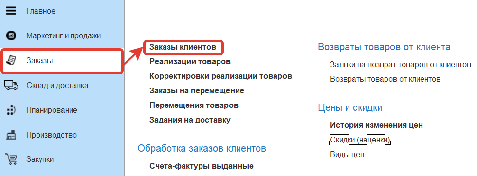

Для пользователей, которые занимаются созданием заказов клиентов в системе создан поставляемый профиль доступа *"Создание заказов клиента"*.

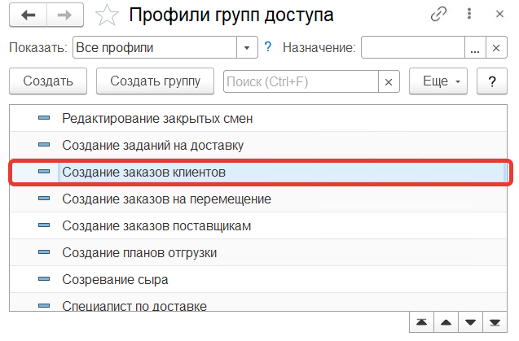

!!! attention ""
    В данном профиле нет роли **"Разрешено изменять цены в документах"**, которая позволяет вручную изменять цены в заказе на отличные от установленных по соглашению.

!!! attention ""
    Чтобы предоставить пользователю, создающему заказы возможность изменения цен нужно создать профиль, включающий роль **"Разрешено изменять цены в документах"** и добавить его для пользователя.

При создании документа указываются:

**Вкладка "Основное"**

- Номер - заполняется автоматически
- Дата
- [Организация](https://konstanta-it.github.io/erp4food/CommonInformation/Organization)
- [Подразделение](https://konstanta-it.github.io/erp4food/CommonInformation/Department)
- [Холдинг](https://konstanta-it.github.io/erp4food/CommonInformation/Holding)
- [Контрагент](https://konstanta-it.github.io/erp4food/CommonInformation/Contractor)
- [Соглашение об условиях продаж](https://konstanta-it.github.io/erp4food/CRM/CustomerService/Pricing/AgreementsWithContractors)
- [Бизнес-регион](https://konstanta-it.github.io/erp4food/CommonInformation/BusinessRegion) - указывается из соглашения
- [Точка доставки](https://konstanta-it.github.io/erp4food/CommonInformation/DeliveryPoint)
- Тип доставки - заполняется из точки доставки, можно заполнить вручную (Самовывоз, Доставка сторонней транспортной компанией, Доставка нашей транспортной компанией)
- Информация о цене - заполняется из соглашения
- Дата отгрузки
- Дата доставки

**Вкладка "Товары"**

Список заказываемой номенклатуры. Заполняется номенклатура, её характеристика, количество, упаковка, цены рассчитываются автоматически на основании соглашения об условиях продаж, из точки доставки автоматически устанавливается склад отгрузки.

В нижней части формы документа заполняется комментарий, рассчитываются: скидка, процент скидки, сумма НДС, итоговая сумма заказа.

Создадим заказ клиента, заполнив его данными:

- Дата - 29.05.2020
- Организация - Молочный мир
- Контрагент - ООО "АШАН"
- Соглашение об условиях продаж - АШАН. Соглашение об условии продаж
- Точка доставки - АШАН, Родионова, 187
- Тип доставки - Доставка нашей транспортной компанией
- Дата отгрузки - 29.05.2020
- Дата доставки - 29.05.2020

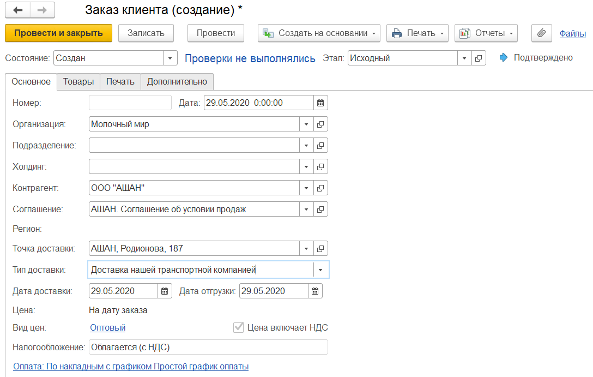

Далее переходим к табличной части товары и заполняем её:

- Сыр Адыгейский, количество - 10, упак - 1 кг
- Сыр Костромской, количество - 10, упак - 1 кг
- Сыр Пошехонский, количество - 10, упак - 1 кг

Остальные поля будут заполнены автоматически.

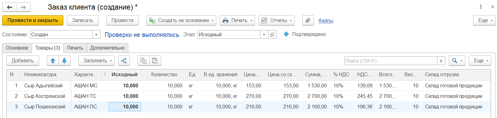

Сохраняем документ, для этого нажимаем кнопку **"Провести и закрыть"**.

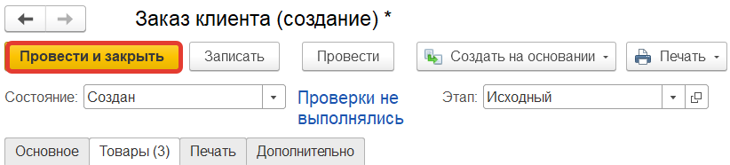

Для документа **"Заказ клиента"** используются печатные формы: *"Заказ клиента"*, *"Счет на оплату (выводить скидки)"*, *"Счет на оплату (не выводить скидки)"*.

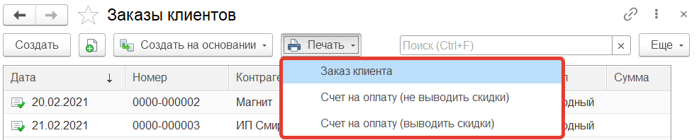

Заказы клиентов могут быть загружены из exel - из файла или из бланка.

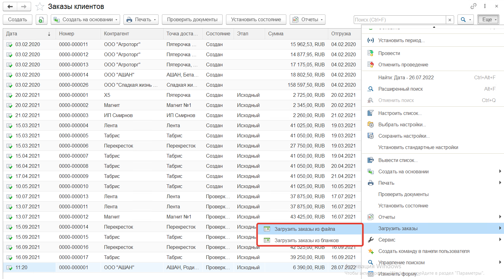

Регламентированным вводом заказов является их загрузка из бланка. Для проектов создаются стандартные бланки, которые выгружаются и отправляются клиентам. Клиенты указывают количество заказываемых товаров в бланке и возвращают обратно. Полученный от клиента бланк заказа загружается в систему.

Для выгрузки бланков создаются **"Настройки выгрузки заказов"**, которые расположены в разделе **Заказы** в подсистеме **"Сервис"** - **"Настройки исполнения заказов"**

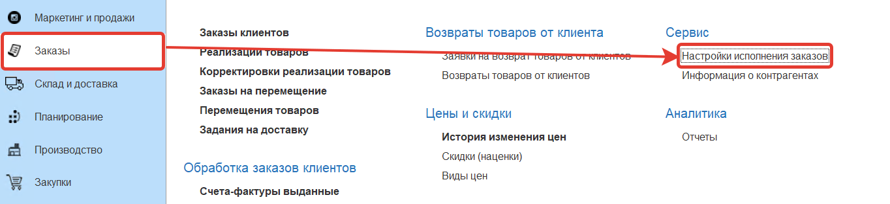

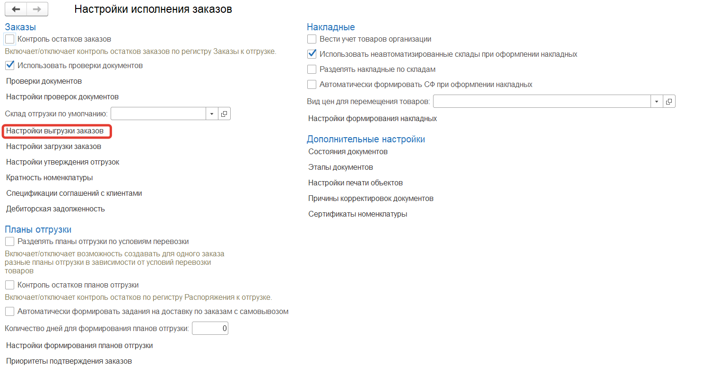

Для **"Настроек выгрузки заказов"** заполняются:

- Наименование
- Признак отправки на почту

В табличной части заполняются:

- [Точки доставки](https://konstanta-it.github.io/erp4food/CommonInformation/DeliveryPoint)
- Каталоги в которые выгружаются бланки
- Почта - заполняется из карточки [контрагента](https://konstanta-it.github.io/erp4food/CommonInformation/Contractor)

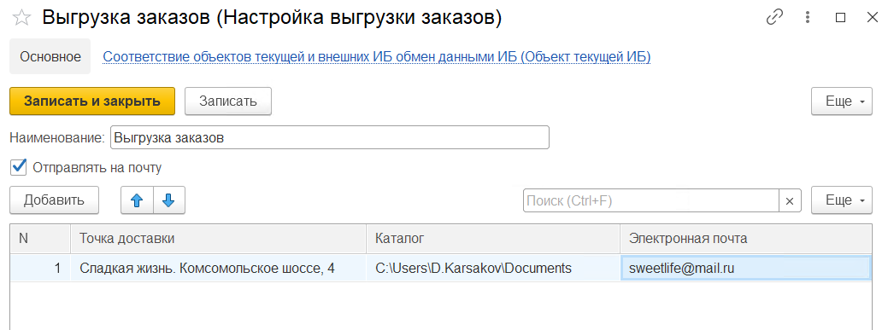

Бланки для заказов создаются в АРМе *"Создание бланков заказов"*, который расположен в разделе **"Заказы"**.

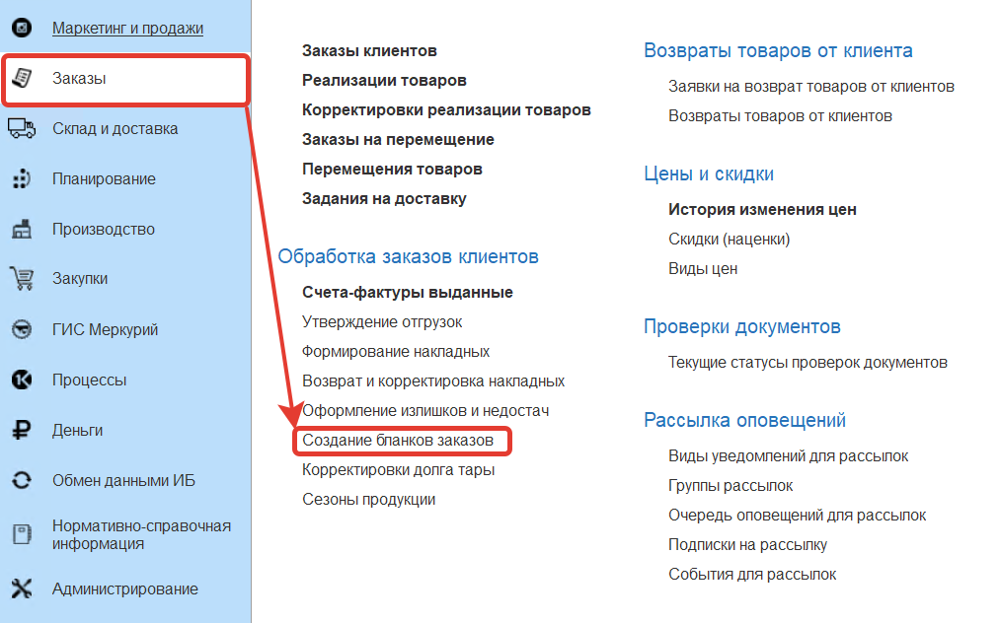

На вкладке **"Настройки"** заполняются дата (дата доставки), организация, подразделение, признак - защищать бланки, настройки каталога товаров.

Признак **защищать бланки** позволяет защитить от редактирования все колонки таблицы товаров выгружаемого бланка кроме количества.

Настройки каталога товаров включают в себя условия на товары, которые будут указаны в бланке:

- Только с ценой (в бланке будут указаны только те товары на которые установлена цена на дату отгрузки по виду цены из соглашения с контрагентом, для заказов на перемещение действует цена указанная для перемещений в настройках исполнения заказов клиентов)
- Доступные по сезонам (в бланке будут указаны товары для которых не установлен сезон или для которых дата отгрузки попадает в сезон)
- Только из спецификации (в бланке будут указаны товары, которые указаны в регистре "Спецификации соглашений с клиентами" для соглашения с контрагентом)
- Доступные для продажи (в бланке окажется номенклатура для которой дата отгрузки попадает в диапазон между датами ввода в продажу и вывода из продажи)

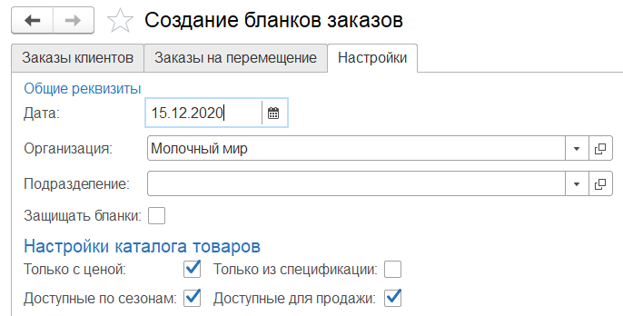

На вкладке **"Заказы клиентов"** по кнопке **"Подобрать настройки"** выбираются настройки выгрузки заказов. По настройкам заполняются точка доставки, соглашение с контрагентом и каталог куда будет выгружен бланк. Так же эти данные могут быть заполнены вручную.

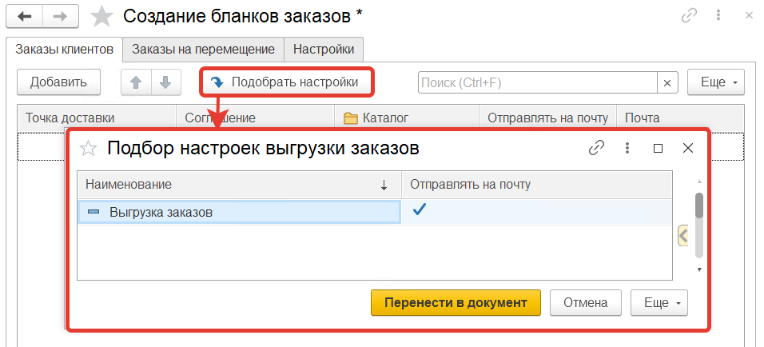

Нажимаем кнопку **"Сформировать бланки"**, в выбранном каталоге появится бланк с названием в котором указаны соглашение и дата отгрузки.

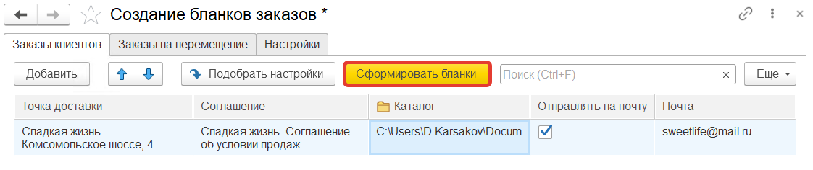

На вкладке **"Заказы на перемещение"** формируются бланки для заказов на перемещение товаров.

В таблице товаров указывается количество заказываемых товаров.

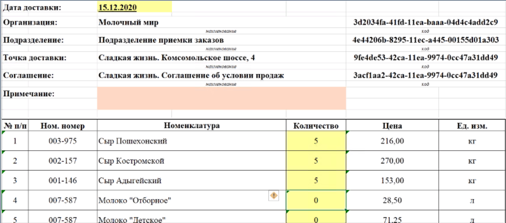

При загрузке бланка указывается каталог из которого будет загружен бланк и каталог в который этот бланк будет перемещен после загрузки.

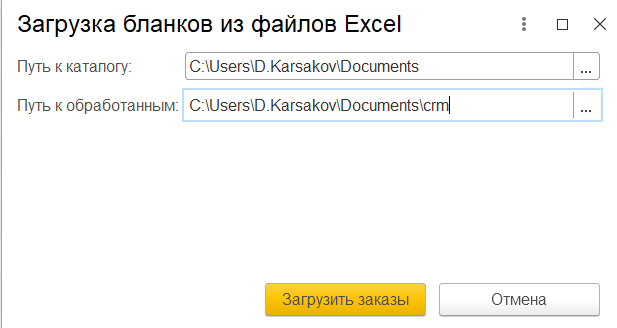

При загрузке создается заказ клиента.

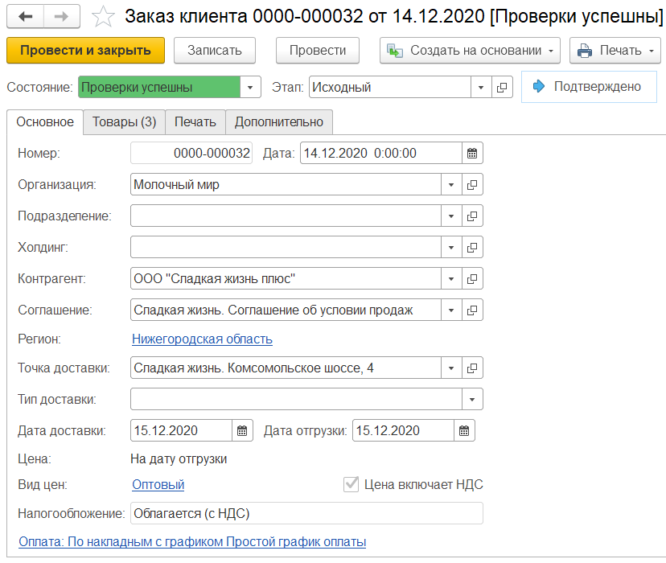

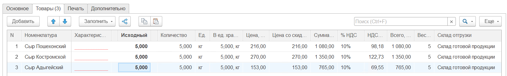

Характеристика номенклатуры заполняется автоматически только для контрагентов для которых созданы характеристики.

При загрузке бланка с той же датой отгрузки, точкой доставки и соглашением повторно данные в старом заказе будут изменены на загружаемые.

Заказы клиентов могут быть загружены регламентным заданием **"Загрузка заказов из бланков"**

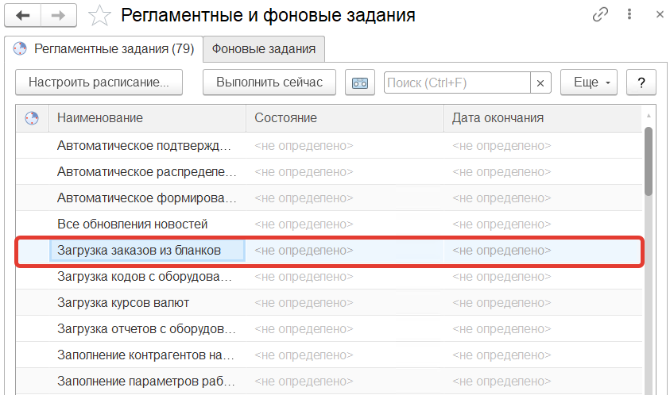

Для этого нужно заполнить **"Настройки загрузки заказов"**, которые расположены в разделе **Заказы** в подсистеме **"Сервис"** - **"Настройки исполнения заказов"**

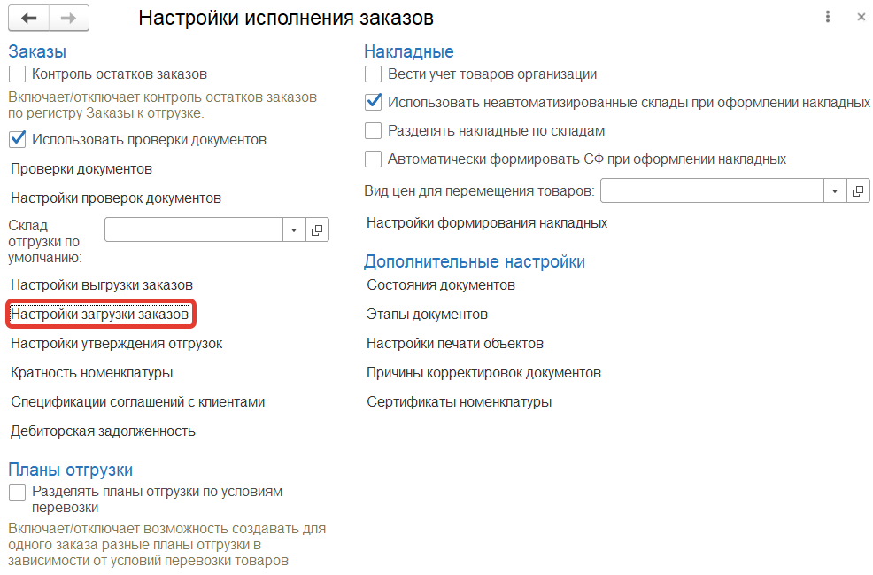

Для **"Настроек загрузки заказов"** заполняются:

- Наименование
- Признак автоматической загрузки
- Признак создания одного заказа на дату
- Путь к папке загрузки
- Путь к папке обработанных бланков

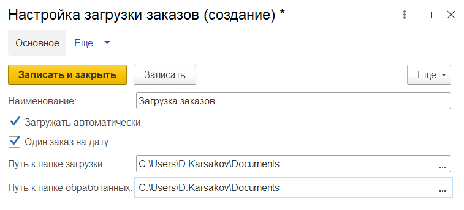

**"Настройки загрузки заказов"** указываются для контрагента:

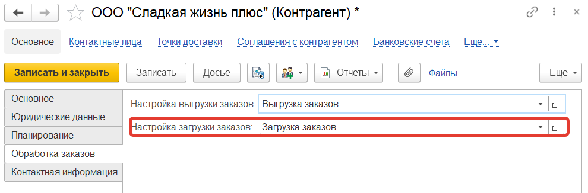

При запуске регламентного задания **"Загрузка заказов из бланков"** в систему загружаются заказы клиентов согласно настройкам.

Для заказов клиентов можно включить **"Контроль остатков заказов"** в разделе **Заказы** в подсистеме **"Сервис"** - **"Настройки исполнения заказов"**

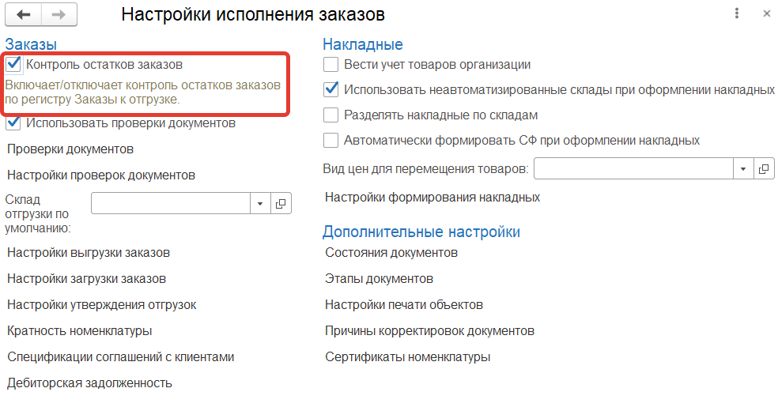

Данная настройка не позволяет после оформления по заказу [плана отгрузки](https://konstanta-it.github.io/erp4food/CRM/CustomerService/FormationOfShipments/PlanningOfShipments/CreationOfPlansForShipment) сделать количество товаров в заказе клиента меньше чем в плане:

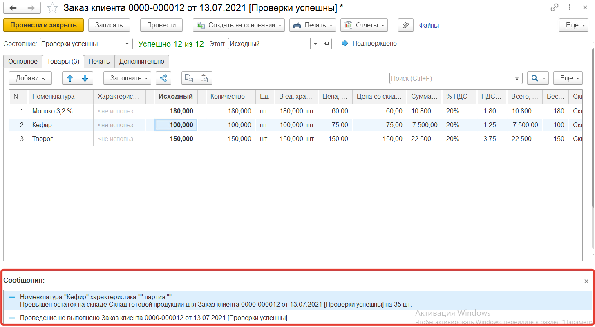

При этом количество в плане отгрузки нельзя сделать больше чем в заказе:

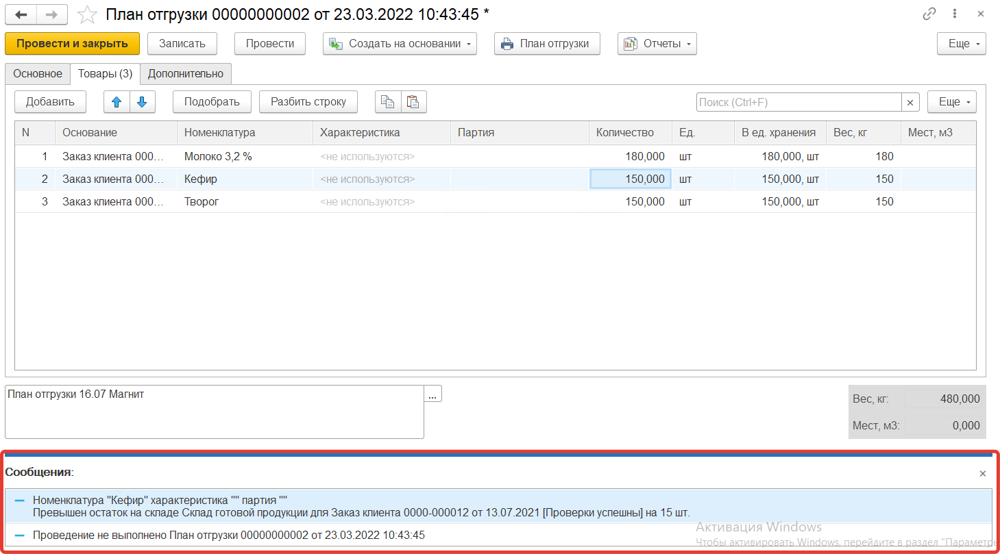
