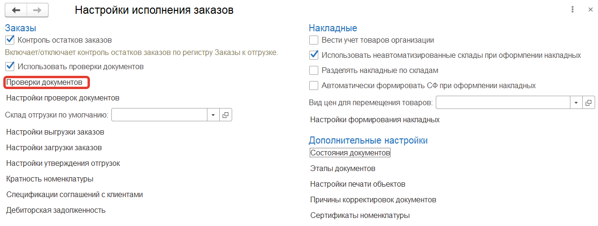
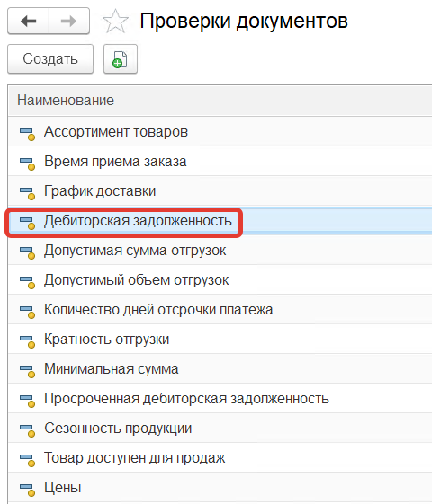
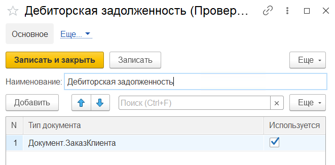
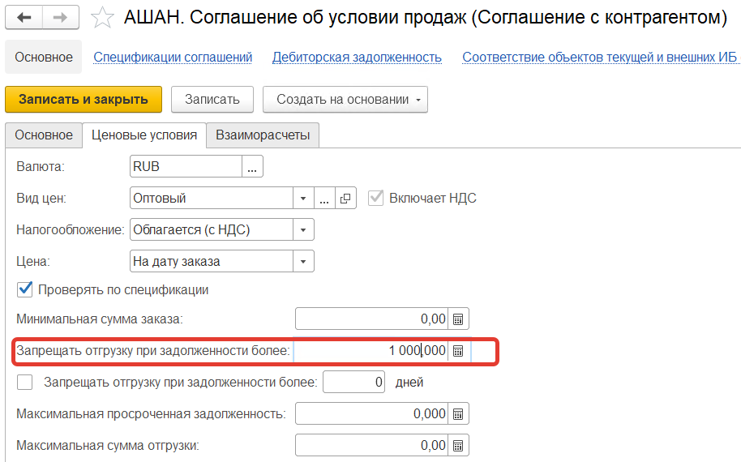
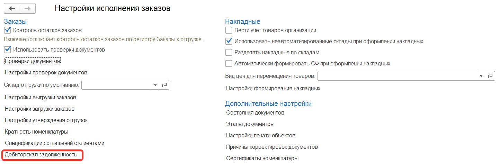
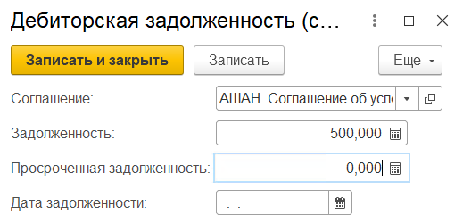
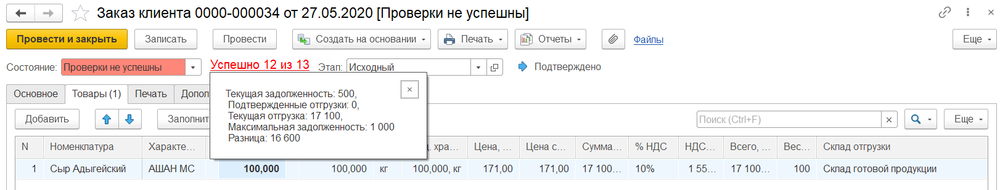

В разделе **"Заказы"** в **"Настройках исполнения заказов"** в **"Проверках документов"** устанавливаем проверку - **"Дебиторская задолженность"** для документов **Заказ клиента**.

Переходим к соглашениям с контрагентами и устанавливаем для соглашения "АШАН. Соглашение об условии продаж" на вкладке *"Ценовые условия"* сумму максимальной задолженности - 1000.

В регистре **"Дебиторская задолженность"** фиксируем для соглашения "АШАН. Соглашение об условии продаж" задолженность 500.

Создаем [заказ клиента](https://konstanta-it.github.io/erp4food/CRM/CustomerService/FormationOfOrders/CustomerOrder) с параметрами:

- Дата - 27.05.2020
- Организация - Молочный мир
- Контрагент - ООО "АШАН"
- Соглашение об условиях продаж - АШАН. Соглашение об условии продаж
- Точка доставки - АШАН, Родионова, 187
- Дата отгрузки - 27.05.2020
- Дата доставки - 27.05.2020

Товары:

- Сыр Адыгейский, количество - 100

Нажимаем кнопку **"Провести"**, установится статус заказа - **Проверки не успешны**.

Проверка по дебиторской задолженности не пройдет, потому что текущая задолженность: 500 + текущая отгрузка: 17100 = 17600, а максимальная задолженность: 1 000, превышение максимальной задолженности на 16 600. Об этом будет написано в сообщении при нажатии на гиперссылку *"Успешно 12 из 13"* (13 - количество включенных проверок, 12 - количество пройденных проверок).

Для сравнения с максимальной задолженностью с текущей задолженностью и суммой текущего заказа ещё суммируются все заказы у которых дата заказа больше или равна дате отгрузки текущего заказа.