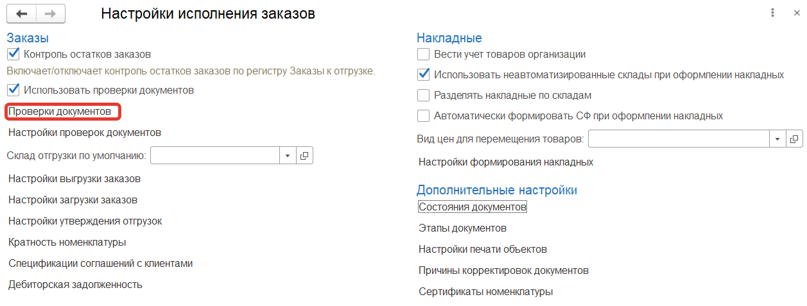
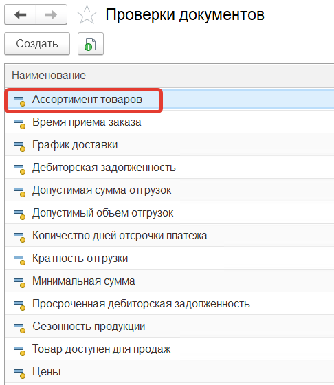
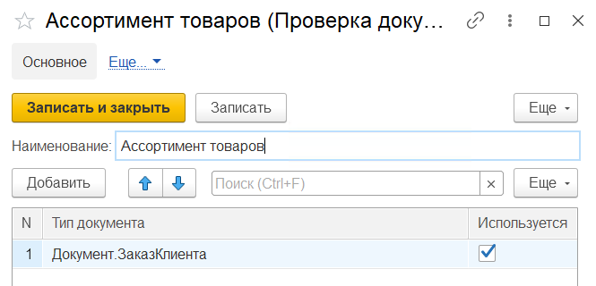
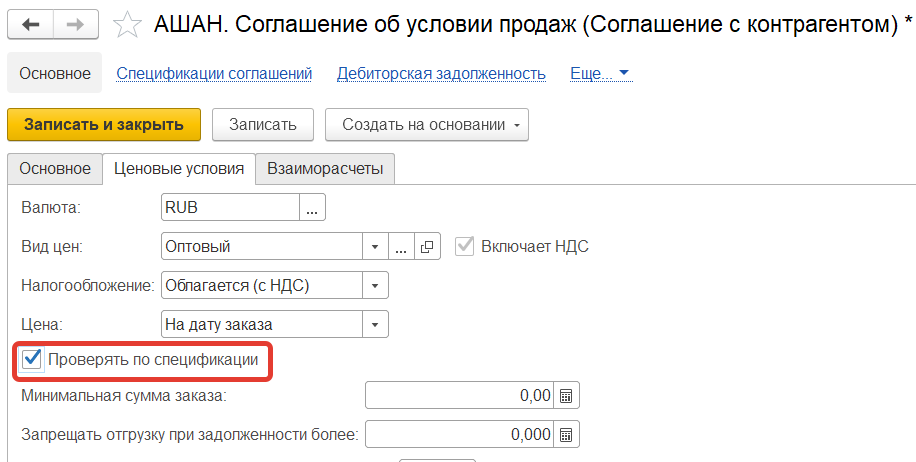
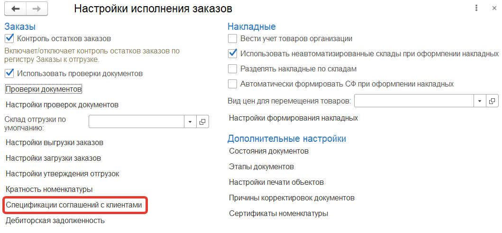
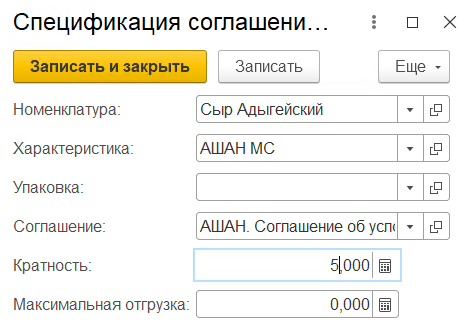
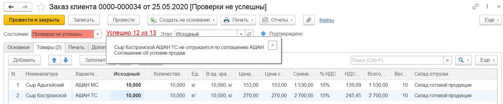

В разделе **"Заказы"** в **"Настройках исполнения заказов"** в **"Проверках документов"** устанавливаем проверку - **"Ассортимент товаров"** для документов **"Заказ клиента"**.

Переходим к соглашениям с контрагентами и устанавливаем для соглашения "АШАН. Соглашение об условии продаж" на вкладке *"Ценовые условия"* флаг **"Проверять по спецификации"**.

В регистре **"Спецификации соглашений с клиентами"** создаем запись для Сыра Адыгейского с характеристикой АШАН МС, соглашение - АШАН. Соглашение об условии продаж, кратность - 5,000

Создаем [заказ клиента](https://konstanta-it.github.io/erp4food/CRM/CustomerService/FormationOfOrders/CustomerOrder) с параметрами:

- Дата - 25.05.2020
- Организация - Молочный мир
- Контрагент - ООО "АШАН"
- Соглашение об условиях продаж - АШАН. Соглашение об условии продаж
- Точка доставки - АШАН, Родионова, 187
- Дата отгрузки - 25.05.2020
- Дата доставки - 25.05.2020

Товары:

- Сыр Адыгейский, количество - 10
- Сыр Костромской, количество - 10

Нажимаем кнопку **"Провести"**, установится статус заказа - **Проверки не успешны**.

Проверка по ассортименту товаров не пройдет, потому что Сыр Костромской АШАН ТС не добавлен по соглашению "АШАН. Соглашение об условии продаж" в регистр *"Спецификации соглашений с клиентами"*, об этом будет написано в сообщении при нажатии на гиперссылку *"Успешно 12 из 13"* (13 - количество включенных проверок, 12 - количество пройденных проверок).

