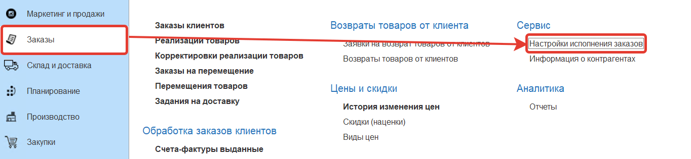

Для контроля заказов клиента используются проверки:

- [Проверка ассортимента товаров](https://konstanta-it.github.io/erp4food/crm/customerservice/formationoforders/orderprocessing/checkingorders/checkingforproductassortment/) - проверяется ассортимент отгружаемых по соглашению товаров
- [Проверка графика доставки](https://konstanta-it.github.io/erp4food/crm/customerservice/formationoforders/orderprocessing/checkingthedeliveryschedule) - проверяется соответствие даты доставки заказа графику доставки
- [Проверка дебиторской задолженности](https://konstanta-it.github.io/erp4food/crm/customerservice/formationoforders/orderprocessing/CheckingAccountsReceivable) - проверка того, что не превышена дебиторская задолженность
- [Проверка кратности отгрузки](https://konstanta-it.github.io/erp4food/crm/customerservice/formationoforders/orderprocessing/CheckingTheMultiplicityOfShipments) - проверка того, что номенклатура в заказе соответствует кратности
- [Проверка минимальной суммы](https://konstanta-it.github.io/erp4food/crm/customerservice/formationoforders/orderprocessing/CheckingTheMinimumAmount) - проверка того, что заказ был сделан на сумму больше минимальной
- [Проверка просроченной дебиторской задолженности](https://konstanta-it.github.io/erp4food/crm/customerservice/formationoforders/orderprocessing/CheckingOverdueAccountsReceivable) - проверка того что у контрагента по соглашению просроченная дебиторская задолженность меньше допустимого значения
- [Проверка сезонности продукции](https://konstanta-it.github.io/erp4food/crm/customerservice/formationoforders/orderprocessing/CheckingTheSeasonalityOfProducts) - продажа сезонного товара осуществляется в установленный сезон
- [Проверка доступности товара для продаж](https://konstanta-it.github.io/erp4food/crm/customerservice/formationoforders/orderprocessing/CheckingProductAvailabilityForSales) - проверка, что товар доступен к продаже, могут быть ситуации, что он ещё не поступил в продажу, или снят с продажи с определенной даты
- [Проверка допустимой суммы отгрузок](https://konstanta-it.github.io/erp4food/crm/customerservice/formationoforders/orderprocessing/CheckingTheAllowableAmountOfShipments) - проверка того, что клиенту отгружается количество товара за день на сумму меньше допустимой суммы отгрузок
- [Проверка допустимого объема отгрузок](https://konstanta-it.github.io/erp4food/crm/customerservice/formationoforders/orderprocessing/CheckingTheAllowedVolumeOfShipments) - проверка того, что клиенту отгружается количество товара меньше допустимого объема отгрузок
- [Проверка количества дней отсрочки платежа](https://konstanta-it.github.io/erp4food/crm/customerservice/formationoforders/orderprocessing/CheckingTheNumberOfDaysOfDeferredPayment) - проверка на наличие задолженности более установленного количества дней от даты последней оплаты
- [Проверка времени приема заказа](https://konstanta-it.github.io/erp4food/crm/customerservice/formationoforders/orderprocessing/CheckingTheOrderAcceptanceTime) - проверка соответствия времени даты заказа с разрешенным временем заказов для складов
- [Проверка цен](https://konstanta-it.github.io/erp4food/crm/customerservice/formationoforders/orderprocessing/CheckingThePrice) - проверка соответствия цен из заказа действующим ценам по прайс-листу

Настроим в системе ведение проверок, переходим к **"Настройкам исполнения заказов"**, настройкой занимается Администратор:

Устанавливаем использование проверок:

Затем переходим в **Настройки проверок документов**:

Создаем настройку для заказов клиентов:

Для пользователей, которые занимаются проверками заказов клиентов в системе создан поставляемый профиль доступа *"Проверка заказов клиентов"*.

Далее для состояний заказов клиентов **Проверки успешны**, **Проверки не успешны** и **Создан** устанавливаем настройки.

У состояния заказа **Проверки успешны** устанавливаем флаг формирования плана отгрузки:

У состояния заказа **Проверки не успешны** снимаем флаг формирования плана отгрузки, устанавливаем запрет отгрузки и использование проверок (если заказ находится в этом статусе, то он подвергается проверкам)

В состоянии **Создан** устанавливаем флаг использования проверок и флаг формирования плана отгрузки

Поле тип документа для предопределенных состояний заполнять не требуется. Состояния будут распространяться на все типы документов для которых установлены проверки.

На форме списка заказов в панели отборов отображаются ссылки, которые информируют сколько проверок к заказу применялось и сколько из них были успешны. При нажатии выводится сообщение о том какие проверки и почему не были пройдены. Гиперссылки отображаются при использовании роли **к2ВидимостьПроверокНаФормеСписка**.

