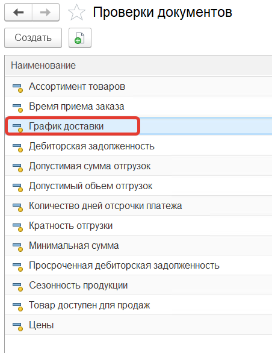
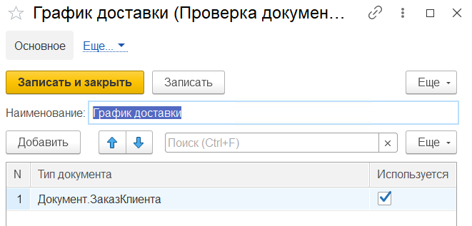
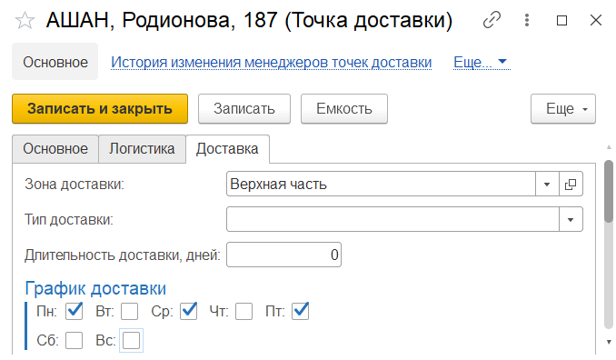
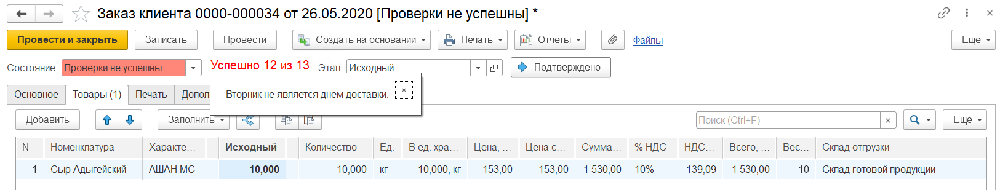

В разделе **"Заказы"** в **"Настройках исполнения заказов"** в **"Проверках документов"** устанавливаем проверку - **"График доставки"** для документов **Заказ клиента**.

Переходим к [точке доставки](https://konstanta-it.github.io/erp4food/CommonInformation/DeliveryPoint) "АШАН, Родионова, 187" и на вкладке *"Доставка"* настраиваем график доставки:

Можно добавить уточнения по доставке по товарной категории, тогда проверка будет работать на доставку заказа конкретной товарной категории.

Создаем [заказ клиента](https://konstanta-it.github.io/erp4food/CRM/CustomerService/FormationOfOrders/CustomerOrder) с параметрами:

- Дата - 26.05.2020
- Организация - Молочный мир
- Контрагент - ООО "АШАН"
- Соглашение об условиях продаж - АШАН. Соглашение об условии продаж
- Точка доставки - АШАН, Родионова, 187
- Дата отгрузки - 26.05.2020
- Дата доставки - 26.05.2020

Товары:

- Сыр Адыгейский, количество - 10

Нажимаем кнопку **"Провести"**, установится статус заказа - **Проверки не успешны**.

Проверка по графику доставки не пройдет, потому что вторник не является днем доставки для точки доставки АШАН, Родионова, 187. Об этом будет написано в сообщении при нажатии на гиперссылку *"Успешно 12 из 13"* (13 - количество включенных проверок, 12 - количество пройденных проверок).

