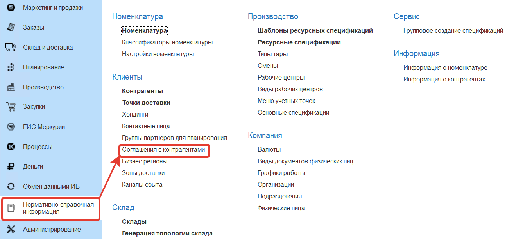
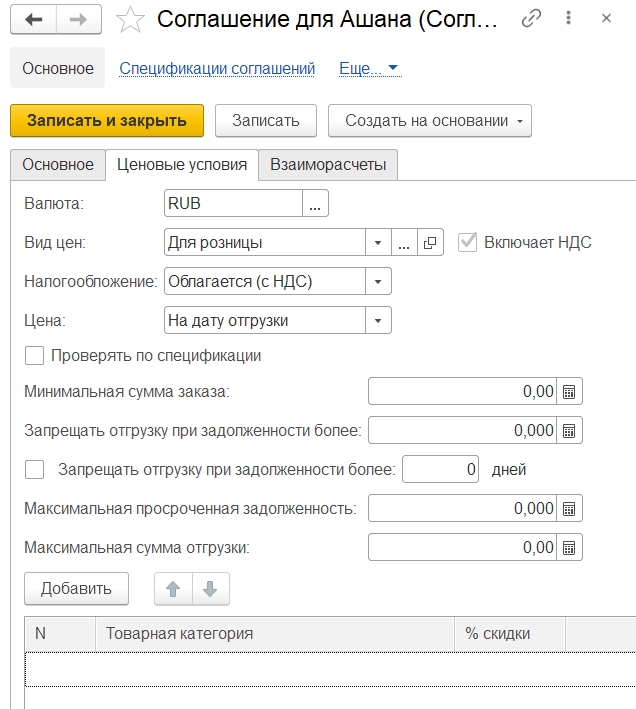

Для ведения взаиморасчетов с контрагентами используются документы **"Соглашения об условиях продаж"**, которые расположены в разделе **"Нормативно-справочная информация"** в подсистеме **"Клиенты"**.

**Вкладка "Основное"**

- Дата и номер соглашения
- Наименование
- Наименование для печати
- [Контрагент](https://konstanta-it.github.io/erp4food/CommonInformation/Contractor)
- [Регион](https://konstanta-it.github.io/erp4food/CommonInformation/BusinessRegion)
- [Огранизация](https://konstanta-it.github.io/erp4food/CommonInformation/Organization)
- Ответственный
- Статус: не согласовано, действует, закрыто
- Дата начала и окончания действия соглашения
- Вид соглашения: с покупателем, с поставщиком

**Вкладка "Ценовые условия"**

- Валюта
- [Вид цен](https://konstanta-it.github.io/erp4food/CRM/CustomerService/Pricing/TypesOfPrices)
- Включение НДС (заполняется автоматически при заполнении вида цен)
- Налогообложение: облагается (с НДС), не облагается (без НДС), облагается НДС у покупателя
- Цена:

    - На дату заказа
    - На дату отгрузки
    - Накладные из заказа, Заказ на дату создания
    - Накладные из заказа, Заказ на дату отгрузки

Цены в [заказах клиента](https://konstanta-it.github.io/erp4food/CRM/CustomerService/FormationOfOrders/CustomerOrder), [заказах поставщику](https://konstanta-it.github.io/erp4food/Purchases/OrderToSupplier), [реализациях товаров](https://konstanta-it.github.io/erp4food/CRM/CustomerService/FormationOfShipments/FormationOfTheAccompanyingDocuments/FormationOfTheImplementationsOfProducts) и [поступлениях](https://konstanta-it.github.io/erp4food/Purchases/ReceiptOfProducts) определяются в зависимости от момента определения цены:

1.  **Цена на дату заказа**

    В заказах клиентов и заказах поставщику цены на товары устанавливаются согласно тем значениям цен, которые действуют на дату заказа.

    В накладных (реализациях товаров или поступлениях товаров) цены устанавливаются следующим образом:

    - если накладная создана на основании заказа, то цены устанавливаются согласно тем значениям цен, которые действуют на дату заказа
    - если в основании заказа нет - цены устанавливаются согласно тем значениям цен, которые действуют на дату накладной.

2.  **Цена на дату отгрузки**

    В заказах клиентов цены на товары устанавливаются согласно тем значениям цен, которые действуют на дату отгрузки, а в заказах поставщику - на дату доставки.

    В накладных (реализациях товаров или поступлениях товаров) цены устанавливаются следующим образом:

    - если накладная создана на основании заказа, то цены устанавливаются согласно тем значениям цен, которые действуют на дату отгрузки/доставки
    - если в основании заказа нет - цены устанавливаются согласно тем значениям цен, которые действуют на дату накладной

3.  **Накладные из заказа, Заказ на дату создания**

    В заказах клиентов и заказах поставщику цены на товары устанавливаются согласно тем значениям цен, которые действуют на дату заказа.

    В накладных (реализациях товаров или поступлениях товаров) цены устанавливаются следующим образом:

    - если накладная создана на основании заказа, то цены устанавливаются согласно тем значениям цен, которые были в заказе. При этом если на один и тот же товар с одинаковыми характеристиками было установлено несколько разных цен, то будет действовать наибольшая. При добавлении новых товаров в накладную, которых не было в заказе установятся цены, действующие на дату заказа
    - если в основании заказа нет - цены устанавливаются согласно тем значениям цен, которые действуют на дату накладной

4.  **Накладные из заказа, Заказ на дату отгрузки**

    В заказах клиентов и заказах поставщику цены на товары устанавливаются согласно тем значениям цен, которые действуют на дату отгрузки.

    В накладных (реализациях товаров или поступлениях товаров) цены устанавливаются следующим образом:

    - если накладная создана на основании заказа, то цены устанавливаются согласно тем значениям цен, которые были в заказе. При этом если на один и тот же товар с одинаковыми характеристиками было установлено несколько разных цен, то будет действовать наибольшая. При добавлении новых товаров в накладную, которых не было в заказе установятся цены, действующие на дату отгрузки
    - если в основании заказа нет - цены устанавливаются согласно тем значениям цен, которые действуют на дату накладной

Для соглашений с видом **"С покупателем"** на вкладке **"Ценовые условия"** дополнительно отображаются и заполняются поля:

- Проверка по спецификации
- Минимальная сумма заказа
- Сумма задолженности для запрета отгрузки
- Количество дней задолженности для запрета отгрузки
- Максимальная просроченная задолженность
- Максимальная сумма отгрузки
- Таблица уточнения скидок по товарным категориям

Для соглашений с видом **"С поставщиком"** появляется вкладка **"Условия поставки"** на которой заполняется способ учета отклонений при приемке.

Создаем соглашение для контрагента Ашан, регион - Нижегородская область, организация - Молочный Мир, статус - действует, даты: 27.05.2020 - 27.07.2020, вид соглашения - с покупателем

Заполняем вкладку "Ценовые условия" данными: валюта - RUB, вид цен - Для розницы, налогообложение - Облагается (с НДС), цена - на дату отгрузки

Сохраняем соглашение, для этого нажимаем кнопку **"Записать и закрыть"**.

