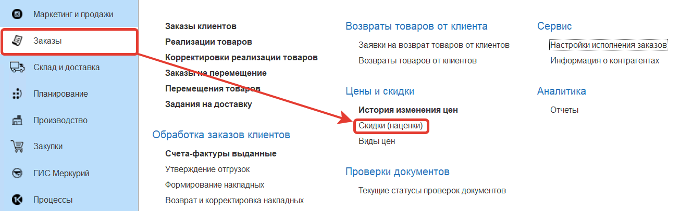
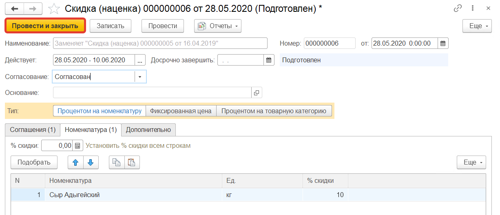

Документы **"Скидки (наценки)"** предназначены для описания скидок/наценок применяемых к [Соглашениям с контрагентами](AgreementsWithContractors.md). Они расположены в разделе **"Заказы"** в подсистеме **"Цены и скидки"**.

При создании документа **"Скидка (наценка)"** указываются:

- Наименование
- Номер (заполняется автоматически)
- Дата
- Дата начала и окончания действия скидки
- Дата досрочного завершения скидки
- Статус: черновик, ожидает согласования, согласован, отменен
- Тип: процентом на номенклатуру, фиксированная цена, процентом на товарную категорию

**Вкладка "Соглашения"** 

Указываются соглашения с контрагентами к которым будет применяться скидка/наценка.

Создаем документ скидки: дата - 28.05.2020, дата начала и окончания действия скидки - 28.05.2020 - 10.06.2020, статус - Согласован, соглашение - Соглашение для Ашана, созданное ранее

Следующая вкладка заполняется в зависимости от выбранного типа скидки/наценки:

Если был выбран тип **"Процентом на номенклатуру"** то определяется список номенклатур на которые назначаются скидки, а так же размер скидки для каждой номенклатуры в процентах (в случае наценки задается отрицательное число).

Если был выбран тип **"Фиксированная цена"** то определяется список номенклатур на которые будут назначаться цены, а так же устанавливаются цены в выбранной валюте.

Если был выбран тип **"Процентом на товарную категорию"** то определяется список товарных категорий на которые назначаются скидки, а так же размер скидки для каждой товарной категории в процентах (в случае наценки задается отрицательное число).

Устанавливаем скидку *"Процентом на номенклатуру"* на Сыр Адыгейский - 10%.

Сохраняем документ, для этого нажимаем кнопку **"Провести и закрыть"**.

