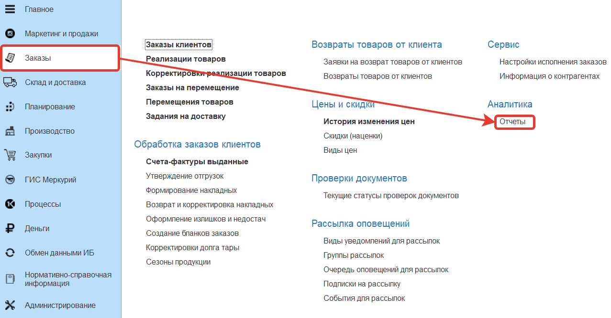
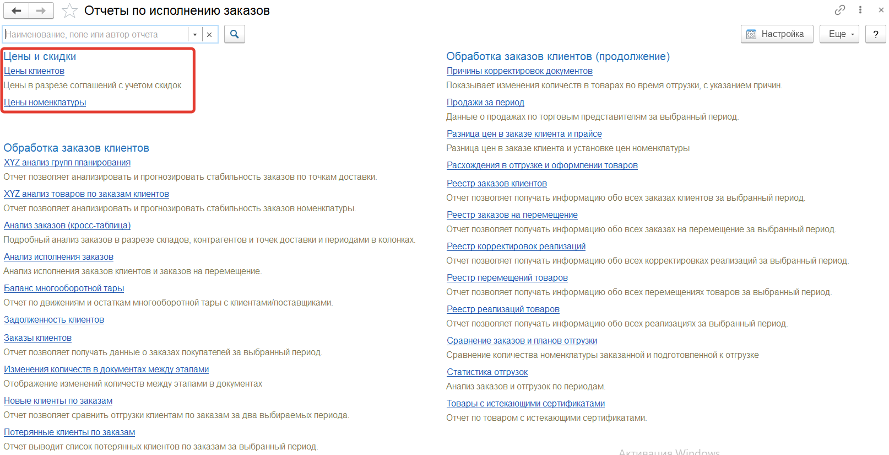
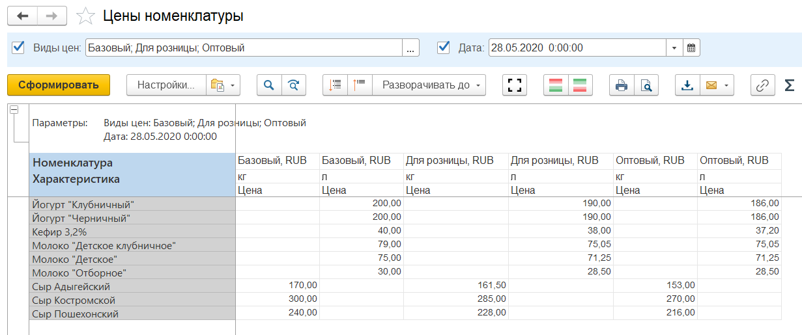
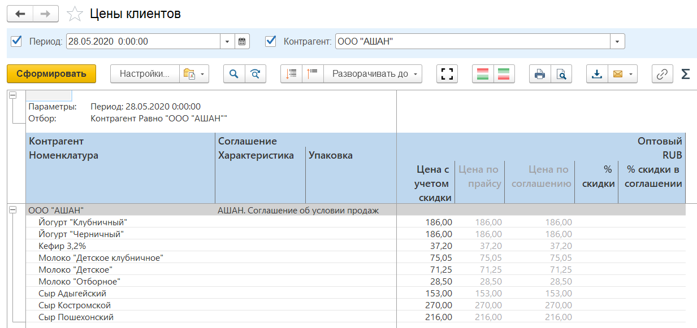

В разделе **"Цены и скидки"** для мониторинга цен предусмотрены отчеты. Они расположены в разделе **"Заказы"** в подсистеме **"Аналитика"** - **"Отчеты"**.

Отчет **"Цены номенклатуры"** - характеризует цены, установленные на номенклатуру. В отборах указываются виды цен по которым формируется отчет и дата на которую требуется узнать актуальную цену.

Сформируем отчет для Базового, Для розницы и Оптового видов цен на 28.05.2020

Отчет **"Цены клиентов"** - характеризует цены в разрезе соглашений с учетом скидок. В отборах указываются контрагент и дата.

Сформируем отчет для контрагента Ашан на 28.05.2020

