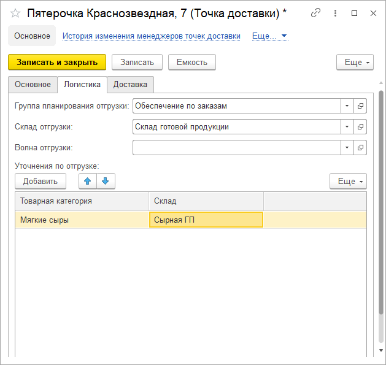

В справочнике **"Точки доставки"** указываются торговые точки клиента, до которых будет осуществляться доставка.

**Вкладка "Основное"**

- Наименование
- Дополнительная информация
- [Контрагент](http://konstanta-it.github.io/erp4food/commoninformation/contractor/)
- [Регион](http://konstanta-it.github.io/erp4food/commoninformation/businessregion/)
- КПП
- Менеджер
- Контактная информация (адрес и телефон)

**Вкладка "Логистика"**

- Группа планирования отгрузки
- [Склад отгрузки](http://konstanta-it.github.io/erp4food/commoninformation/businessregion/Warehouse/)
- Волна отгрузки
- Уточнения по отгрузке (можно уточнять склад отгрузки для товарной категории)

**Вкладка "Доставка"**

- [Зона доставки](http://konstanta-it.github.io/erp4food/commoninformation/businessregion/ZoneOfDelivery/)
- Тип доставки

    - Самовывоз
    - Доставка сторонней транспортной компанией
    - Доставка нашей транспортной компанией

- Длительность доставки в днях
- График доставки
- Уточнения по доставке (можно уточнять дни доставки для товарной категории)
