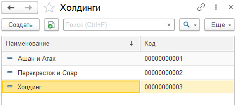

Справочник **"Холдинги"** содержит информацию о крупных компаниях, которые имеют несколько дочерних компаний, и предназначен для хранения иерархии партнеров. Подробная информация о дочерних компаниях холдинга указывается в справочнике ["Контрагенты"](http://konstanta-it.github.io/erp4food/commoninformation/Сontractor/).

