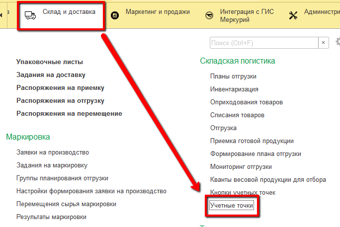
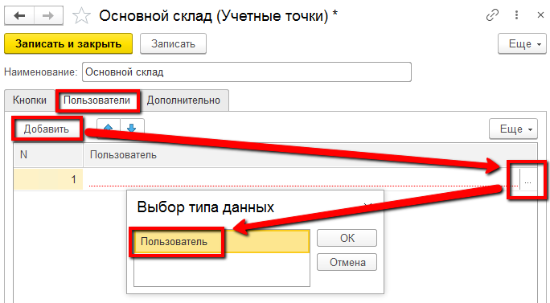

Данный справочник используется для того, чтобы отделить наборы операций, выполняемых на разных участках склада. Например, можно отделить операции отгрузки и приемки, если фактически за это отвечают разные люди.

Для создания учетной точки необходимо:

- Открыть справочник **"Учетные точки"** и перейти к созданию нового элемента:

- Указать **наименование**:

- Указать **список пользователей**, у которых будет доступ к этой учетной точке (т.е. только они смогут выполнять операции, относящиеся к этой учетной точке):

- Нажать **"Записать и закрыть"**
