**Версионирование** позволяет хранить в базе данные об изменениях различных объектов, например документов.
Подключить **версионирование** можно в разделе **"Администрирование"**.

-   Открыть **"Общие настройки"**:

    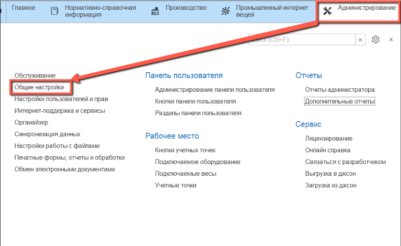
    
-   В разделе **"История изменений"** установить флаг **"Хранить историю изменений"** и перейти по гиперссылке **"Настроить"**:

    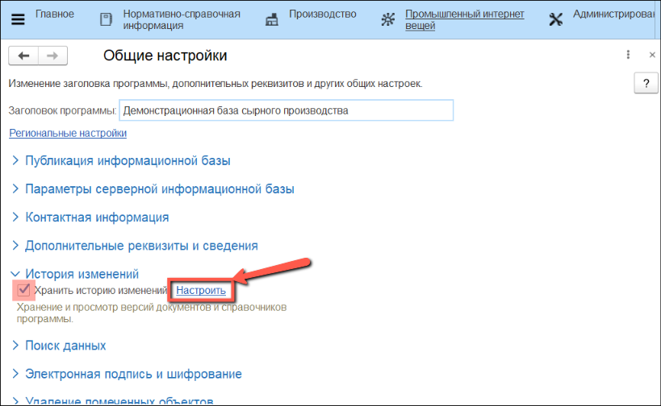

-   В открывшейся форме можно настроить версионирование для нужных объектов, рассмотрим на примере документа **"Переработка"**:
  
    -   Находим строку с нужным объектом.
  
    -   В колонке **"Когда сохранять версии"** нужно указать момент, в который создается версия объекта.
  
    -   В колонке **"Срок хранения версий"** нужно указать период, по истечении которого созданные версии будут удаляться.
  
    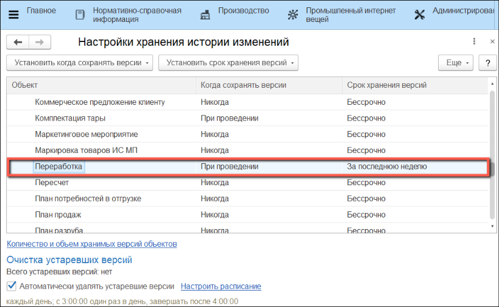
    
-   Настроить **момент сохранения** и **срок хранения** версий можно сразу для нескольких объектов. Для этого нужно выделить несколько **строк объектов** и нажать на соответствующую кнопку в **командной панели**:

    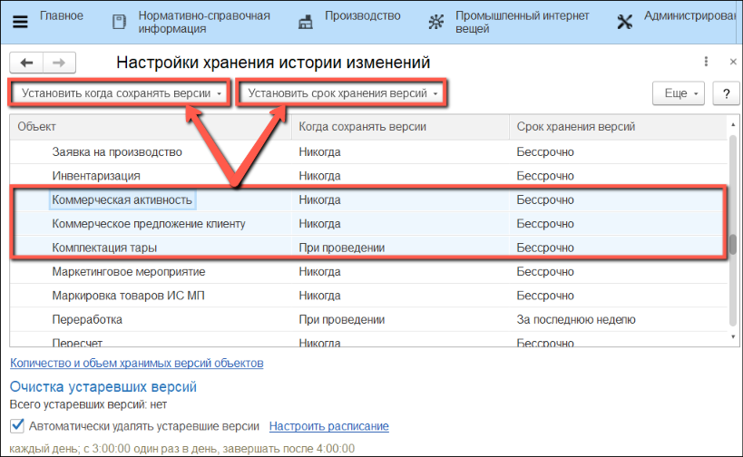
    
-   При настройке **момента сохранения версии**, предлагается выбрать варианты, соответствующие данному типу объекта:
    
    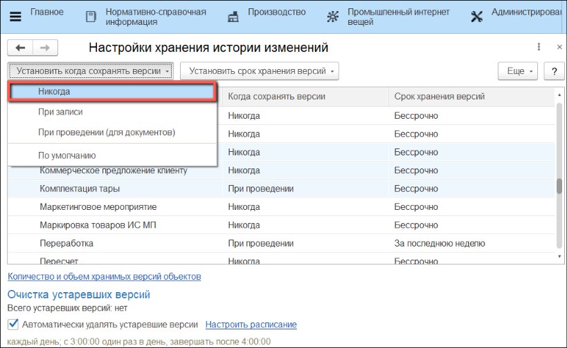
    
-   При настройке **срока хранения версии**, предлагается выбрать период:

    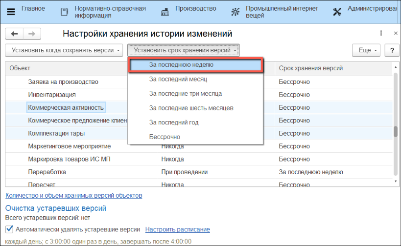

-   При наличии устаревших версий, в разделе **"Очистка устаревших версий"** будет показан текущий объем этих версий, а рядом появится кнопка **"Очистить"**:

    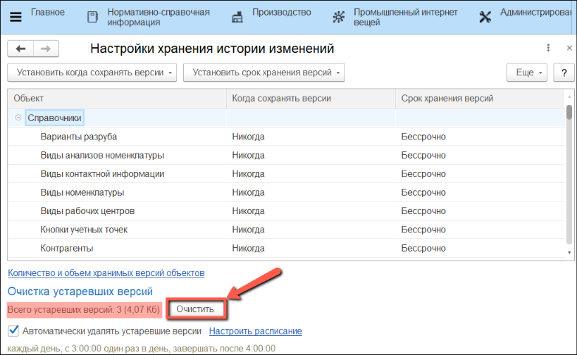

-   Так же можно включить автоматическое удаление версий, для этого нужно установить флаг **"Автоматическое удаление устаревших версий"** и **"Настроить расписание"**:

    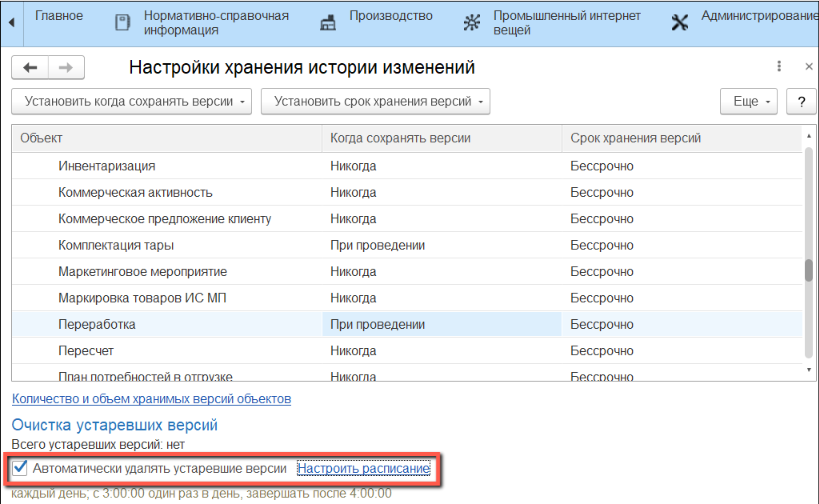

??? Info "Теперь версии объектов будут создаваться и удаляться автоматически, согласно нашим настройкам"
    
-   Посмотреть отчет о текущих версиях объектов можно, нажав на гиперссылку **"Количество и объем хранимых версий объектов"**:
    
    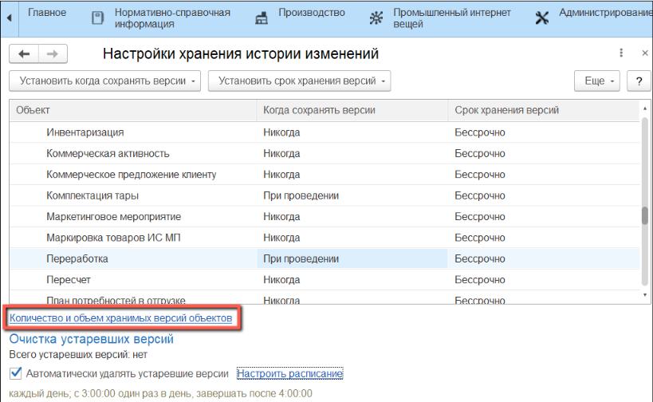
    
-   Чтобы посмотреть **историю изменений** объектов в форме списка, нужно выбрать **строку** и нажать на соответствующую кнопку в **командной панели**:

    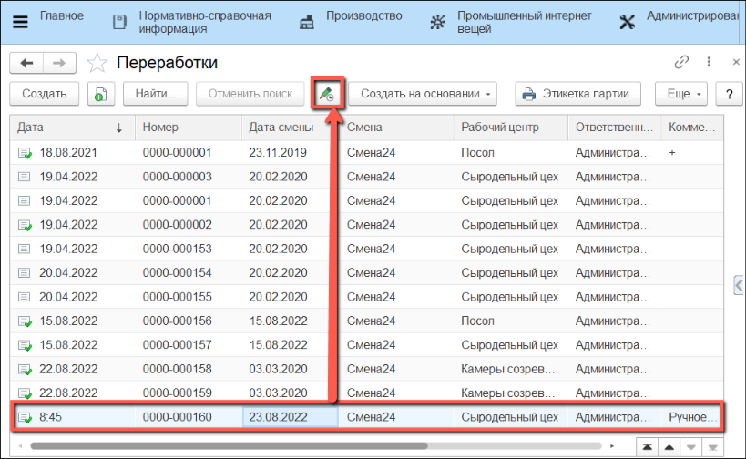
        
-   Чтобы посмотреть **историю изменений** объекта в форме элемента, нужно нажать на соответствующую кнопку в **командной панели**:

    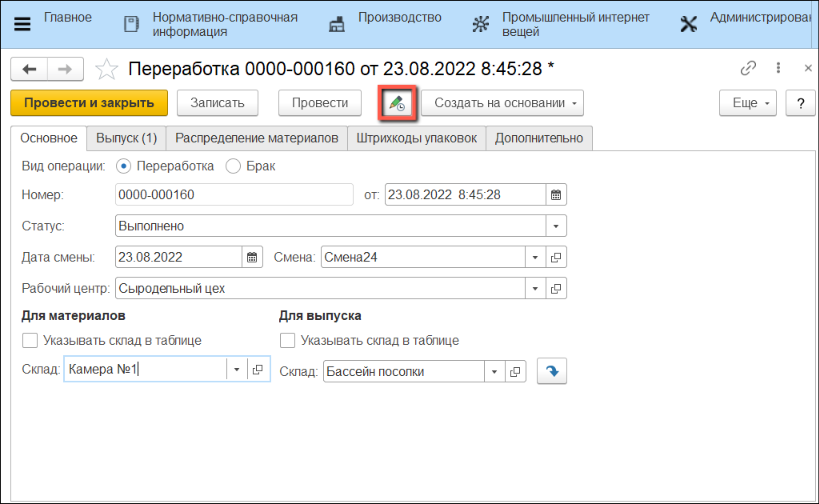
    
-   В открывшейся форме можно уставновить **отбор**, по которому в таблице будет отображаться **список версий**:

    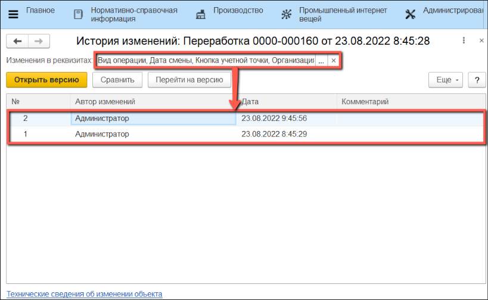

-   Посмотреть **версию объекта** можно нажав на кнопку **"Открыть версию"**:

    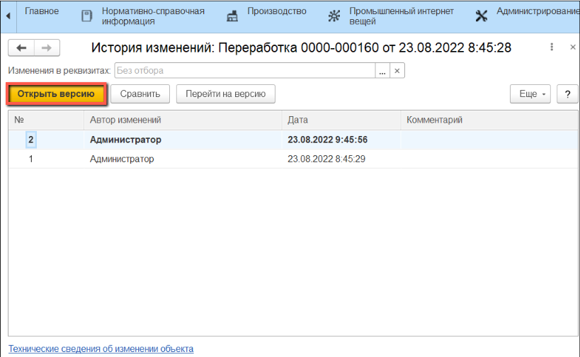
    
-   В открывшейся форме содержится вся информация о **версии объекта**:

    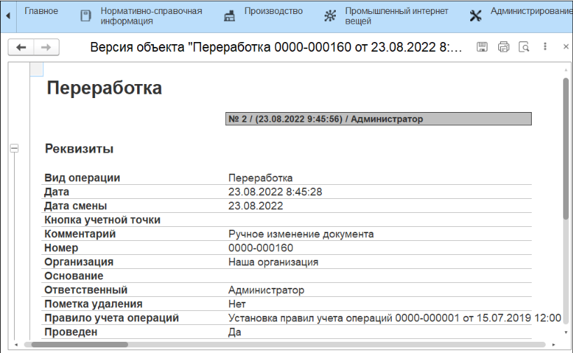

-   Чтобы **сравнить** между собой несколько **версий объекта**, нужно выделить их в таблице и нажать на кнопку **"Сравнить"**:
   
    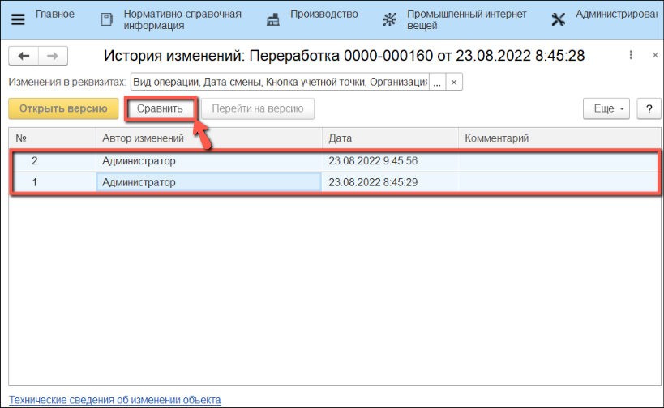

-   В открывшейся форме содержатся только различия в **версиях объекта** (в **колонках** перечислены **версии объекта**, в **строках** значение реквизита или строки табличной части):

    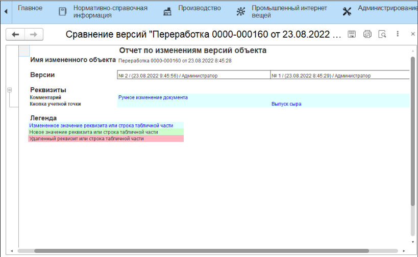

-   Чтобы вернуть **состояние** объекта до нужной версии, необходимо выбрать **искомую версию** в таблице и нажать на кнопку **"Перейти на версию"**. В результате **состояние** объекта будет получено из **выбранной версии**, а в таблице появится **новая версия** содержащая **комментарий** о переходе к **выбранной версии**:

    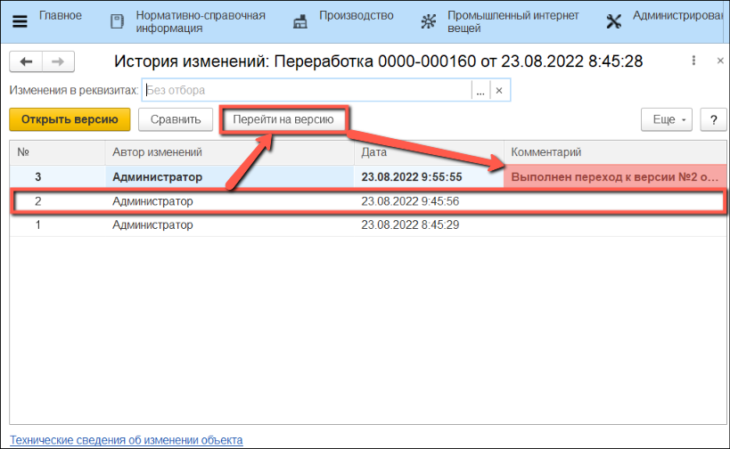
