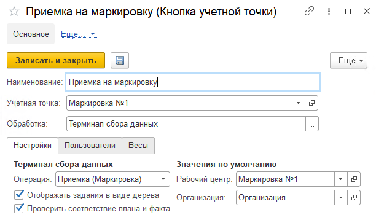

Кнопка **"Приемка на маркировку"** используется для приемки сырья на маркировку.

При создании кнопки учетной точки **"Приемка на маркировку"** указываются:

- Наименование
- Учетная точка
- Обработка - Терминал сбора данных

На вкладке **"Настройки"** заполняются:

- Операция - Приемка (Маркировка)
- Рабочий центр
- Организация

На вкладке **"Пользователи"** можно настраивать индивидуальные права доступа.
