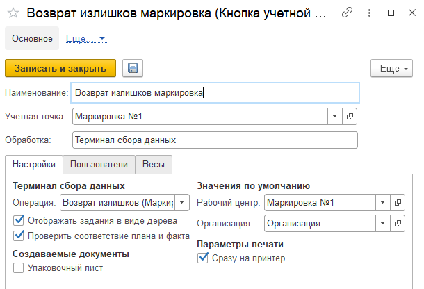

Кнопка **"Возврат излишков маркировка"** используется для возврата излишков сырья.

При создании кнопки учетной точки **"Возврат излишков маркировка"** указываются:

- Наименование
- Учетная точка
- Обработка - Терминал сбора данных

На вкладке **"Настройки"** заполняются:

- Операция - Возврат излишков (Маркировка)
- Рабочий центр
- Организация

На вкладке **"Пользователи"** можно настраивать индивидуальные права доступа.
