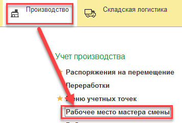

Транзакции НЗП по истечении времени их использования нужно закрывать.

Такой механизм есть в Рабочем месте мастера смены.

- Открыть "Рабочее место мастера смены":

- Выбрать участок, к которому принадлежит закрываемая транзакция (или несколько):

- Перейти в мониторинг обмена:

- Перейти на вкладку "Производство НЗП":

- Выбрать в списке закрываемую транзакцию (или несколько) и нажать "Завершить транзакцию":

- Создадутся документы подготовки закрытия транзакции:

- Если включено рег.задание на отправку данных, то спустя период его выполнения, данные отправятся, транзакция закроется и в контуре Меркурия:

- Если не включено рег.задание, то по кнопке "Подготовить партии" отправить данные вручную:

Транзакция закрыта.
