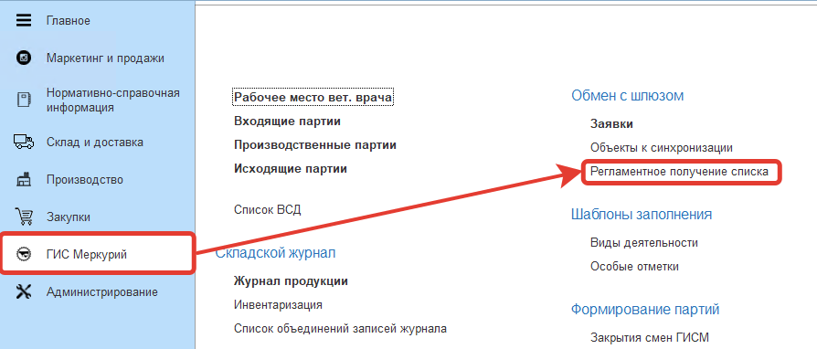
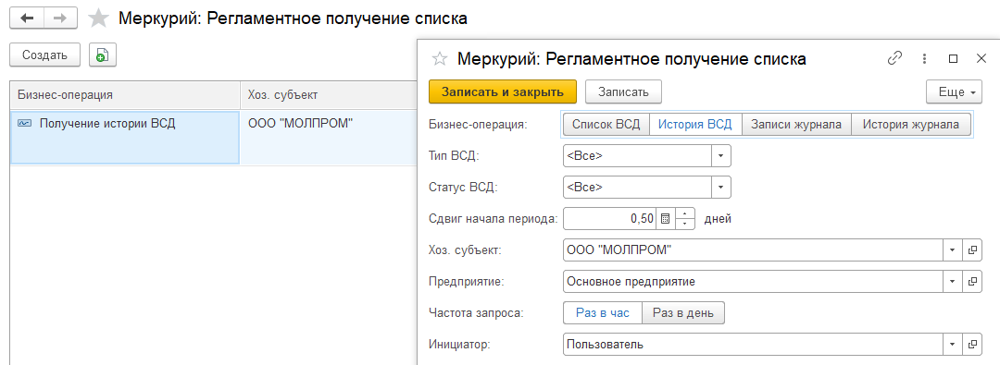

---
title: "Настройка оперативной подгрузки ВСД"
draft: false
weight: 1
---

??? Info "В систему обязательно должны быть подгружены все ВСД на поступающее сырье"

Для автоматического обновления и загрузки ВСД есть регламентное задание «Получение истории ВСД». Настроить его и запустить выполнение.

- Открыть настройки получения:

- Среди списка найти "Получение истории ВСД" для своего предприятия. Открыть его и настроить частоту запроса:

- Нажать "Записать и закрыть".
