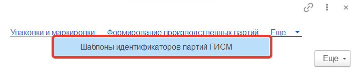

Чтобы в Меркурий партии приходили с понятными идентификаторами, можно задать для каждой продукции шаблон, по которому они будет формироваться. При этом можно задать шаблон на уровне вида продукции, а можно переопределить его на уровне продукции.

## Шаблон для вида продукции

- Открыть справочник "Виды продукции" (можно открыть из Наименования продукции)

- Открыть нужный вид:

  

  

- Перейти по ссылке "Шаблоны идентификаторов партий ГИСМ":

  

- Нажать "Создать". После этого появится окно, в нем нажать кнопку редактирования:

  

- Создать шаблон, используя данные, представленные таблице слева, и операторы, представленные в таблице справа:

  

- поле формулы ввести новую. Например, при использовании такой формулы:

`Прав(Формат([ДатаВыработки] , "ДФ='dd.MM.yy'"),2) + Лев(Прав(Формат([ДатаВыработки] , "ДФ='dd.MM.yy'"),5),2) + Лев(Формат([ДатаВыработки] , "ДФ='dd.MM.yy'"),2) + [НаименованиеПродукции.Артикул]`

наименования партий будут выглядеть так **20070235135135**, где 35135135 - Артикул продукции.

- Нажать "Сохранить и закрыть".

- Нажать "Записать и закрыть":

  

## Шаблон для продукции

- Открыть справочник "Наименование продукции":

- Открыть нужную продукцию:

- Перейти по ссылке "Шаблоны идентификаторов партий ГИСМ":

- В открывшемся окне нажать "Создать". После этого появится окно, в нем нажать кнопку редактирования:

- Создать шаблон, используя данные, представленные таблице слева, и операторы, представленные в таблице справа:

- В поле формулы ввести новую. Например, при использовании такой формулы: 

`Прав(Формат([ДатаВыработки] , "ДФ='dd.MM.yy'"),2) + Лев(Прав(Формат([ДатаВыработки] , "ДФ='dd.MM.yy'"),5),2) + Лев(Формат([ДатаВыработки] , "ДФ='dd.MM.yy'"),2) + [НаименованиеПродукции.Артикул]`

наименования партий будут выглядеть так **20070235135135**, где 35135135 - Артикул продукции.

- Нажать "Сохранить и закрыть".
- Нажать "Записать и закрыть":

