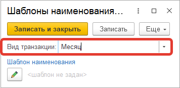

Для транзакций также можно установить шаблон, по которому это наименование будет формироваться и отображаться пользователю.

- Открыть регистр "Шаблоны наименований транзакций ГИСМ":

- Нажать "Создать".
- Указать тип транзакции, для которой задается шаблон:

- Нажать кнопку редактирования шаблона:

- Задать формулу шаблона, используя доступные поля и операторы:

Например, при таком шаблоне `[РабочийЦентр]+"/"+[ВидТранзакции]` имена месячных транзакций будут иметь вид "ПАЦ/Месяц".

- Нажать "Сохранить и закрыть".
- Нажать "Записать и закрыть":

