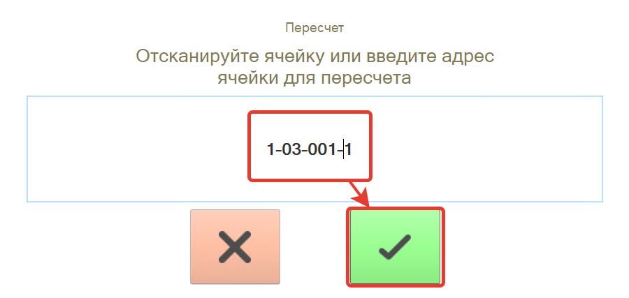
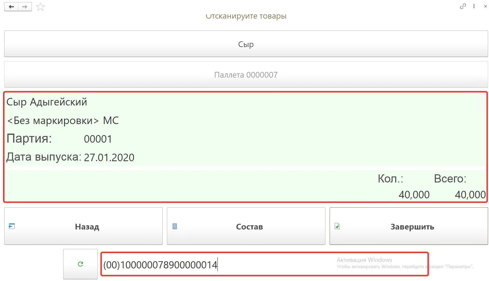

На первом этапе необходимо провести подсчет остатков продукции на складе и занести эти данные в документ **"Пересчет"**, который расположен в разделе **"Склад и доставка"** в подсистеме **"Складская логистика"**.

На адресом складе с использованием ТСД пересчет производится непосредственно на ТСД с помощью кнопки **"Пересчет"**.

После открытия формы обработки **"Меню учетных точек"** заполняем поля:

- Дата
- Смена
- Учетная точка

На форме обработки появятся кнопки выбранной учетной точки, выбираем кнопку **"Пересчет"**.

Сканируем ячейку для пересчета, нажимаем на кнопку **"V"**.

Далее сканируем штрихкоды коробов продукции, которая находится на складе в этой ячейке, номенклатура появится на форме.

Посмотреть состав отсканированной номенклатуры можно по кнопке **"Состав"**. На форме появится список номенклатуры, можно удалить строку с помощью кнопки **"Удалить строку"**.

Для перехода к следующей ячейке или завершения работы по пересчету нажимаем кнопку **"Завершить"**.

После снова откроется форма ввода ячейки. Вводим ее адрес и затем короба номенклатуры в этой ячейки.

После пересчета во всех ячейках на форме ввода ячейки нажимаем кнопку **"Х"**.

В результате будет создан документ **"Пересчет"**.

Мы умышленно создаем отклонения от текущих остатков по учету, предполагая, что на складе произошли ошибки при фактическом движении товаров.

Для реализации нашего примера будем считать, что в  ячейках хранится следующее количество товара:

- Ячейка "101-001-2" Сыр Сулугуни характеристика "Ашан", упаковка 0,5кг 20 шт
- Ячейка "2-01-001-3" Сыр Сулугуни характеристика "Ашан", упаковка 0,5кг 2 шт
- Ячейка "2-01-001-3" Сыр Адыгейский характеристика "Ашан", упаковка 0,5кг 3 шт

Для каждой ячейки необходимо создать упаковочные листы и использовать их при пересчете.

## Создание документа "Инвентаризация"

Далее переходим к документу **Инвентаризации**.
Документ **"Инвентаризация"**  расположен в разделе **"Склад и доставка"** в подсистеме **"Складская логистика"**.

При создании документа указываются:

На вкладке **"Основное"**:

- Статус
- Номер - заполняется автоматически
- Дата
- Склад

На вкладке **"Товары"** нажатием кнопки **"Заполнить по учету"**.
Откроется форма выбора **"Складские ячейки"**. Выбираем ячейки и нажимаем на кнопку **"Перенести в документ"**.

Табличная часть будет заполнена товарами, которые имеются на складе по документации.

Далее нажимаем на кнопку **"Заполнить по пересчету"**, откроется форма выбора документов **"Пересчет"**, выбираем на ней нужный документ. В результате в табличной части заполнится поле **"Количество факт"** :

Затем для склада с адресным хранением надо нажать на кнопку **"Переместить на ячейку пересчета"**. Количество по учету в ячейках станет равным количеству по факту, а вся разница будет записана на ячейку пересчета.

Для документа "Инвентаризация" используется печатная форма: **"Инвентаризационная опись (ИНВ-3)"**

По товарам у которых обнаружена разница между количеством по учету и количеством по факту создаются документы (с помощью команды "Создать на основании"):

**"Списание товаров"** - в случае, когда разница имеет знак минус (т.е. на складе нет данного товара, а по документам он имеется)

Для документа "Списание товаров" используются печатные формы: **"Акт о порче, бое, ломе ТМЦ (ТОРГ-15)"** и **"Акт о списании товаров (ТОРГ-16)"**

**"Оприходование товаров"** - в случае, когда разница со знаком плюс (т.е. товар на складе имеется, а в документах это не отражено).

