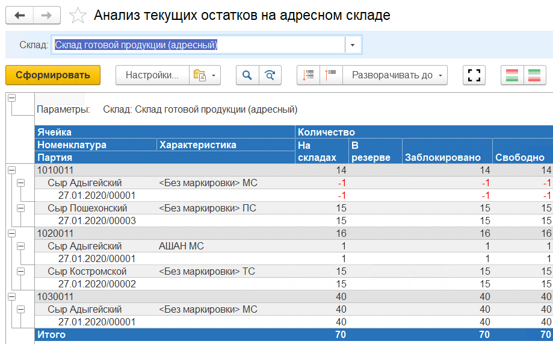
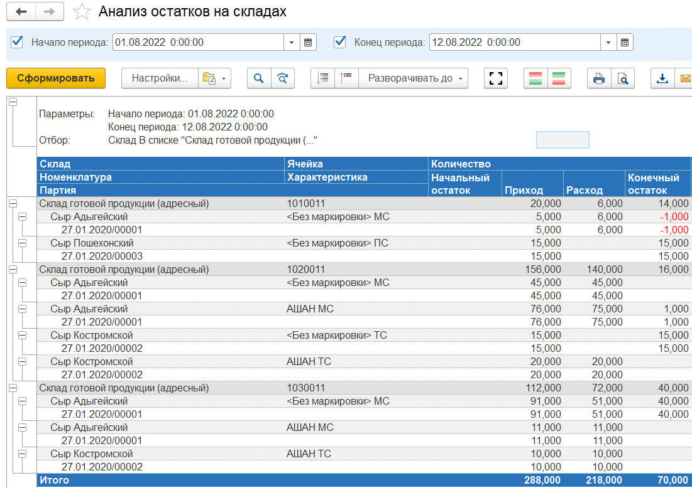

Для анализа ситуации на складе предусмотрен отчет **"Анализ текущих остатков на адресном склад"**. Он расположен в разделе **"Склад и доставка"** в подсистеме **"Аналитика"** - **"Отчеты"**.

Данный отчет показывает текущие остатки товаров на складе в разрезе Номенклатуры, Характеристики и Серии.

Для анализа движения товаров на складе предусмотрен отчет **"Анализ остатков на складах"**. Он расположен в разделе **"Склад и доставка"** в подсистеме **"Аналитика"** - **"Отчеты"**.

Данный отчет показывает движение товаров на складе в разрезе Номенклатуры, Характеристики и Серии.

