Перемещение продукции между складами осуществляется в 4 этапа:

1. Создание документа **"Распоряжение на перемещение"** с типом **"Перемещение"** - фиксируем плановое количество продукции необходимое для перемещения
2. Создание документа **"Распоряжение на перемещение"** с типом **"Отбор"** - фиксируем необходимое количество для отбора на складе
3. Перемещение продукции в ячейку отгрузки на ТСД
4. Отгрузка продукции на другой склад на ТСД

<h2> Создание документа "Распоряжение на перемещение" с типом "Перемещение" </h2>

Первым шагом при перемещении продукции между складами является создание документа **"Распоряжение на перемещение"** с типом **"Перемещение"** и заполнением в нем табличной части **"План"**.

При создании указываем:

- Статус. Для того, что бы распоряжение попало в работу, необходимо изменить статус на "К выполнению"
- Склад отправитель
- Склад получатель
- Тип перемещения - Перемещение

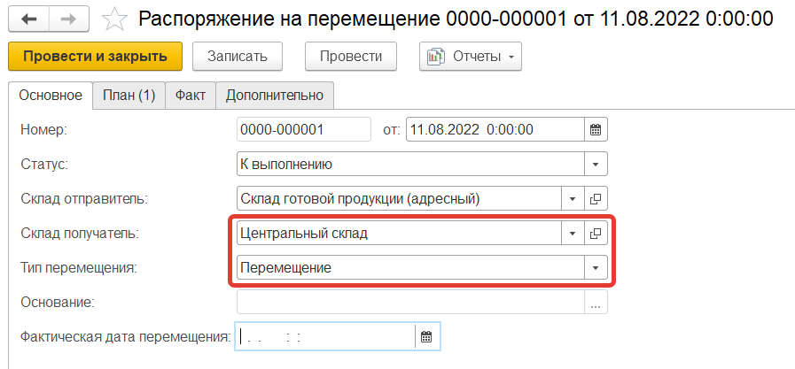

На вкладке **"План"** указываем:

- Номенклатура
- Характеристика
- Серия
- Количество
- Упаковка
- Ячейка отправитель - указывается ячейка отгрузки из карточки склада
- Ячейка получатель (указывается ячейка приемки склада получателя, если на нем используется адресная схема хранения)

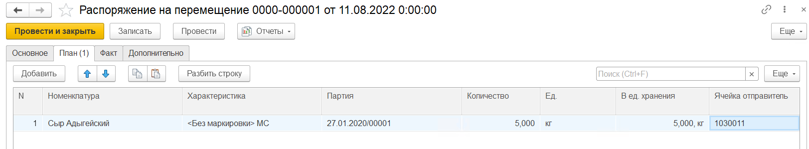

Сохраняем и проводим документ.

<h2> Создание документа "Распоряжение на перемещение" с типом "Отбор" </h2>

Если на ячейки отгрузки нет необходимой номенклатуры, то необходимо сначала переместить ее из зоны хранения. Для этого формируем документ  **"Распоряжение на перемещение"** с типом **"Отбор"**

При создании указываем:

- Статус. Для того, что бы распоряжение попало в работу, необходимо изменить статус на "К выполнению"
- Склад отправитель
- Склад получатель - указывается один и тот же склад
- Тип перемещения - Отбор

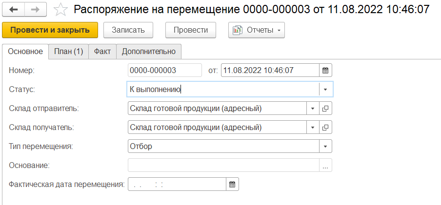

На вкладке **"План"** указываем:

- Номенклатура
- Характеристика
- Серия
- Количество
- Упаковка
- Ячейка отправитель - указывается ячейка из которой планово будет перемещаться продукция
- Ячейка получатель - указывается ячейка отгрузки из карточки склада

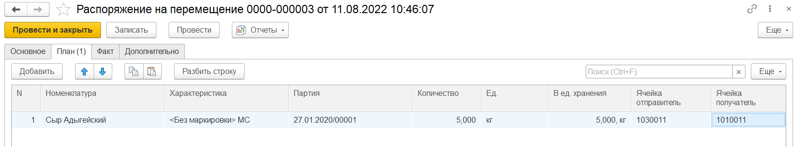

Сохраняем и проводим документ.

<h2> Перемещение продукции в ячейку отгрузки на ТСД </h2>

Для перемещения продукции на ячейку отгрузки воспользуемся кнопкой **"Перемещение на ячейку Отгрузки"**.

После открытия формы обработки **"Меню учетных точек"** заполняем поля:

- Дата
- Смена
- Учетная точка

На форме обработки появятся кнопки выбранной учетной точки, выбираем кнопку **"Перемещение на ячейку Отгрузки"**.

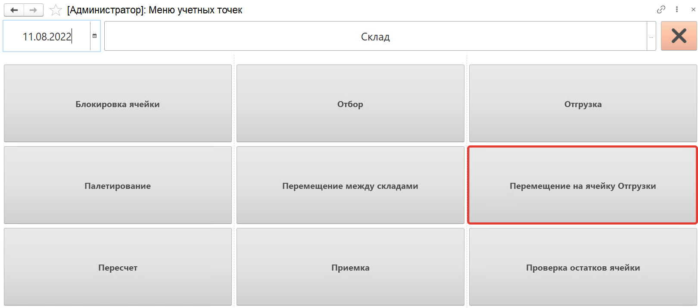

На открывшейся форме надо нажать кнопку **"Обновить"**, будут выведены **"Распоряжения на перемещения"** с типом **"Отбор"** в статусе **"К выполнению"**. В списке при помощи кнопок **"Вверх"** и **"Вниз"** переходим к распоряжению по которому будем делать перемещение, нажимаем кнопку **"Выбрать"**.  С помощью кнопки **"Создать"** можно создавать новые распоряжения на перемещение.

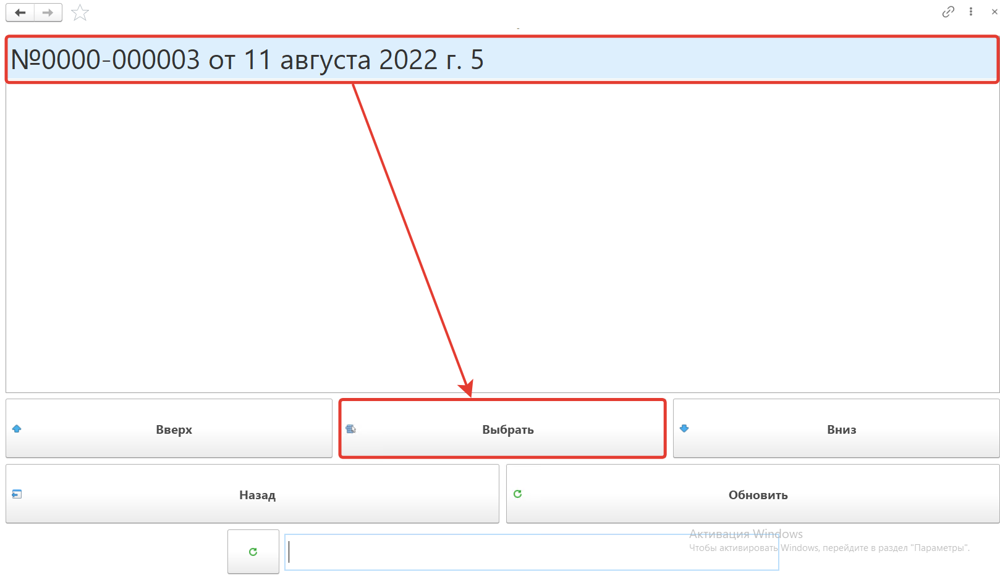

Сканируем **ячейку** из которой перемещаем номенклатуру.

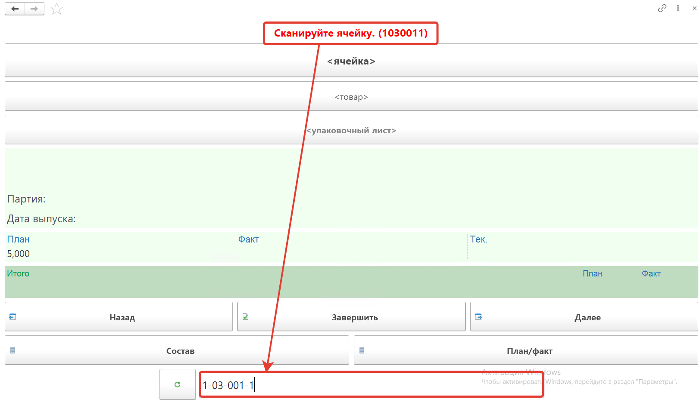

Далее сканируем **штрихкод перемещаемого короба**, номенклатура появится на форме. Появится количество отгружаемого товара по плану и по факту.

Создадим для этого паллет в составе которого "Сыр Сулугуни" с характеристикой Ашан, в упаковке 0,5кг в количестве 2,5 кг.

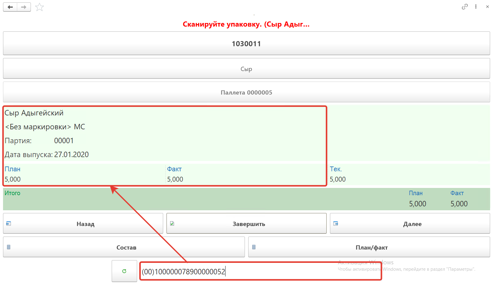

По нажатию кнопки **"План/факт"** на форме появится таблица перемещаемой номенклатуры.

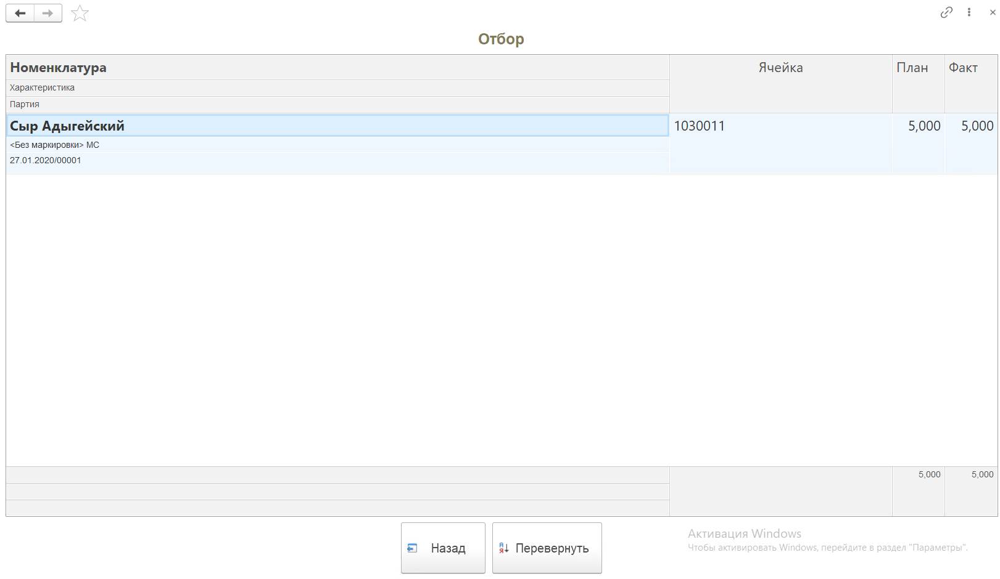

Для завершения перемещения нажимаем кнопку **"Завершить"**.

В  **"Распоряжении на перемещение"** заполнится вкладка **"Факт"** и документ будет переведен в статус **"Выполнено"**.

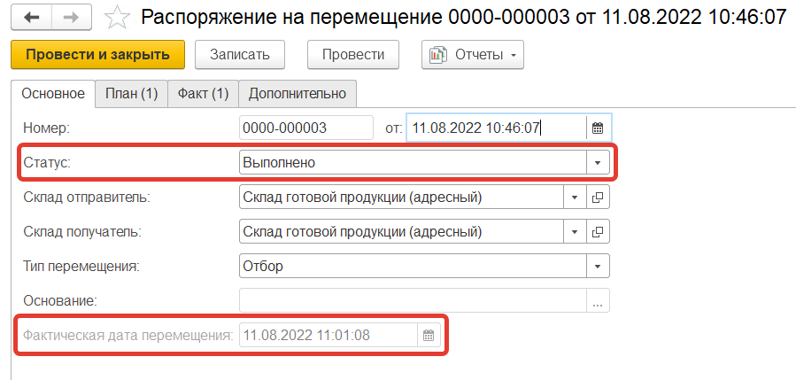

<h2> Перемещение продукции из ячейки отгрузки на другой склад на ТСД </h2>

Для перемещения готовой продукции со склада на другой склад воспользуемся кнопкой **"Перемещение между складами"**

После открытия формы обработки **"Меню учетных точек"** заполняем поля:

- Дата
- Смена
- Учетная точка

На форме обработки появятся кнопки выбранной учетной точки, выбираем кнопку **"Перемещение между складами"**.

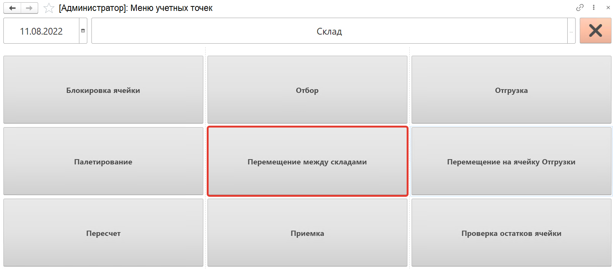

На открывшейся форме выбираем **"Склад-получатель"**, это поле может быть заполнено автоматически, если кнопка была создана для перемещения продукции на конкретный склад.

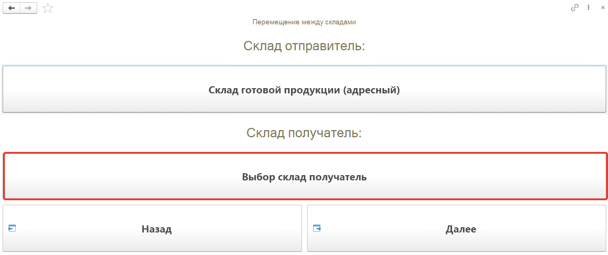

Выбираем из списка склад на который будет происходить перемещение и нажимаем на кнопку **"V"**.

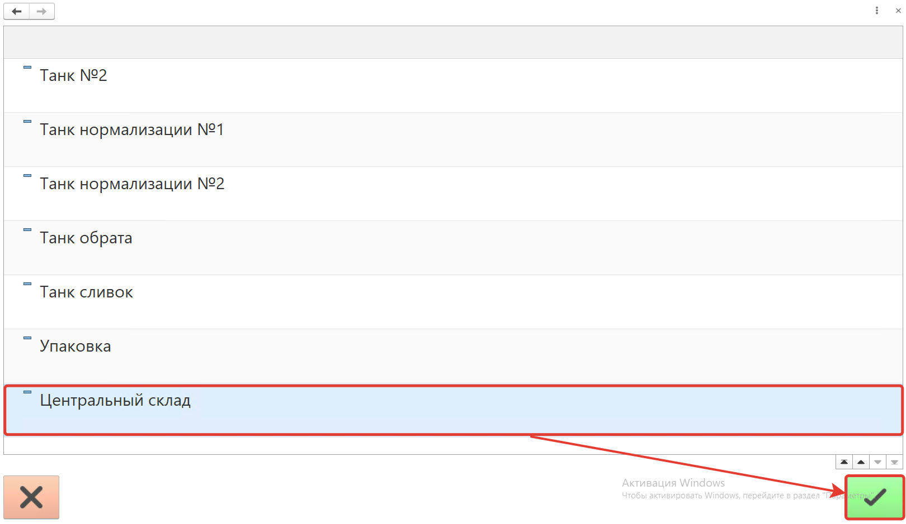

Нажимаем кнопку **"Далее"**.

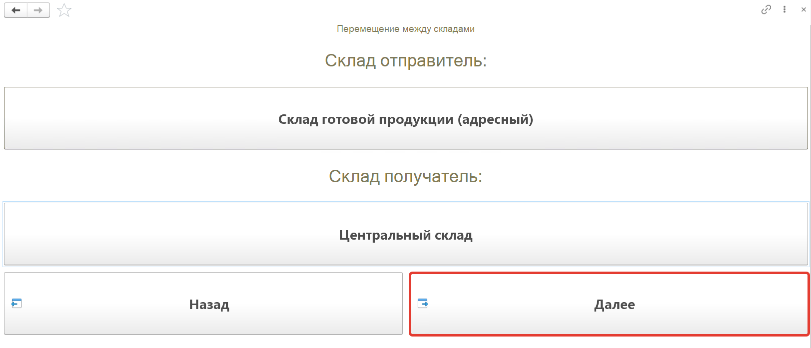

На открывшейся форме надо нажать кнопку **"Обновить"**, будут выведены **"Распоряжения на перемещения"** с типом **"Перемещение"** в статусе **"К выполнению"** для выбранных складов. В списке при помощи кнопок **"Вверх"** и **"Вниз"** переходим к распоряжению по которому будем делать перемещение, нажимаем кнопку **"Выбрать"**.  С помощью кнопки **"Создать"** можно создавать новые распоряжения на перемещение.

Выбираем созданное ранее перемещение.

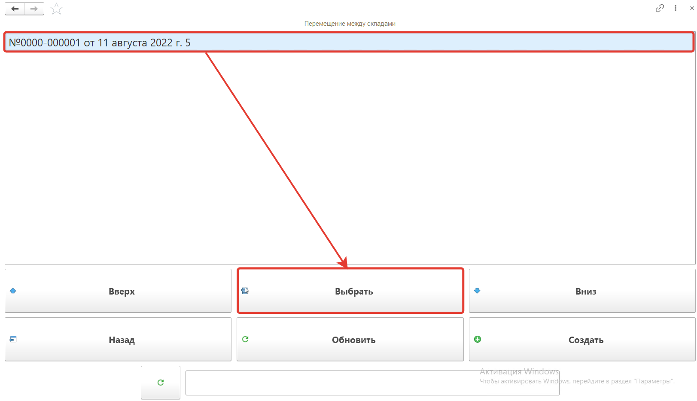

Далее сканируем штрихкод перемещаемого короба, номенклатура появится на форме. Появится количество отгружаемого товара по плану и по факту.

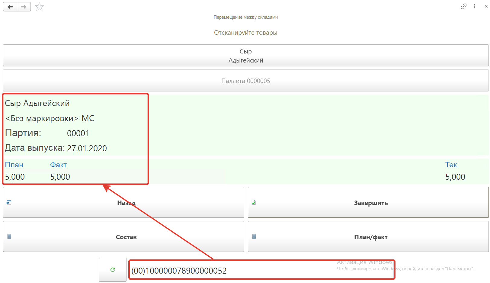

Для завершения перемещения нажимаем кнопку **"Завершить"**.

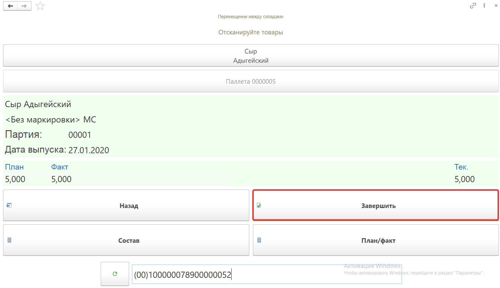

Нажимаем кнопку **"V"**

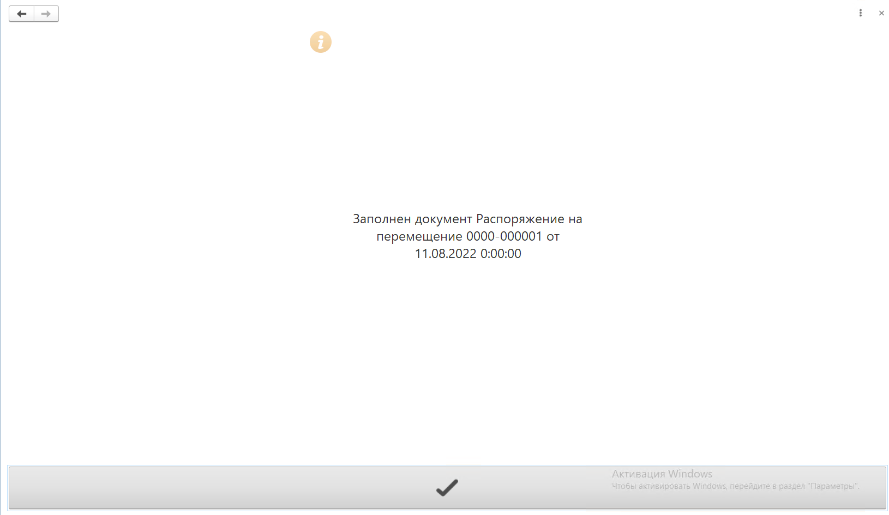

В  **"Распоряжении на перемещение"** заполнится вкладка **"Факт"** и документ будет переведен в статус **"Выполнено"**.

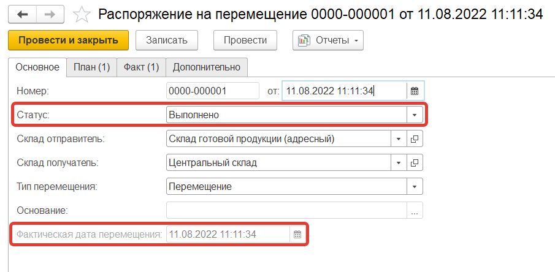

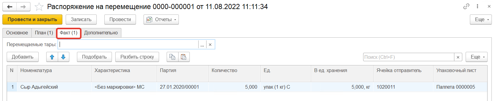
