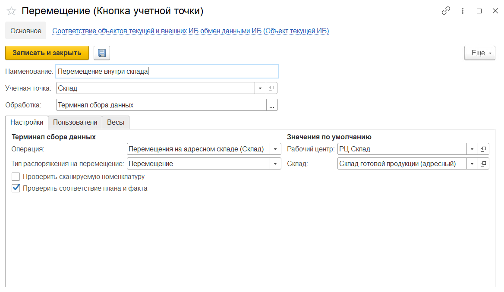

Кнопка **"Перемещение внутри склада"** используется только на складах с адресной системой хранения. Применяется для перемещения продукции между произвольными ячейками.

При создании кнопки учетной точки **"Перемещение внутри склада"** указываются:

- Наименование
- Учетная точка
- Обработка -Терминал сбора данных

На вкладке **"Настройки"** заполняются:

- Операция - Перемещения на адресном складе (Склад)
- Тип распоряжения на перемещение - Перемещение
- Рабочий центр
- Склад

 Так же настраиваются проверки:

- Проверка сканируемой номенклатуру (проверка соответствия заявленной и сканируемой номенклатуры)
- Проверка соответствия плана и факта

На вкладке **"Пользователи"** можно настраивать индивидуальные права доступа.
