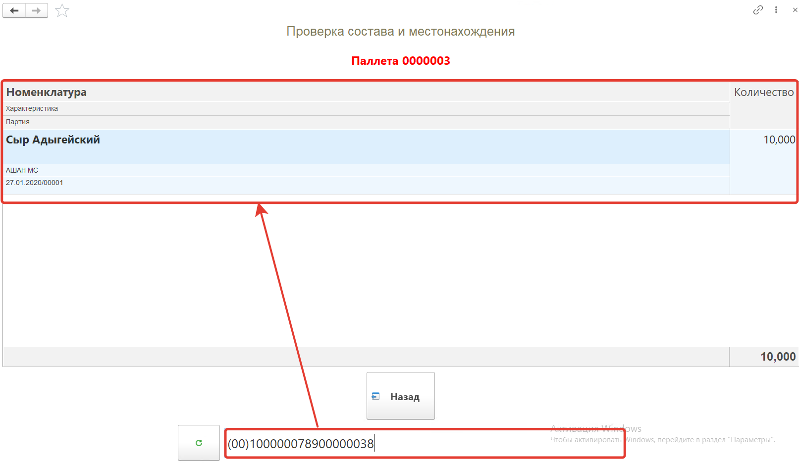

Кнопка **"Проверка состава и местонахождения"** может применяться для проверки состава и определения местонахождения упаковочных листов.

После открытия формы обработки **"Меню учетных точек"** заполняем поля:

- Дата
- Смена
- Учетная точка

На форме обработки появятся кнопки выбранной учетной точки, выбираем кнопку **"Проверка состава и местонахождения"**.

Сканируем упак. лист состав и местоположение которого хотим посмотреть, номенклатура и ячейка склада появятся на форме.

