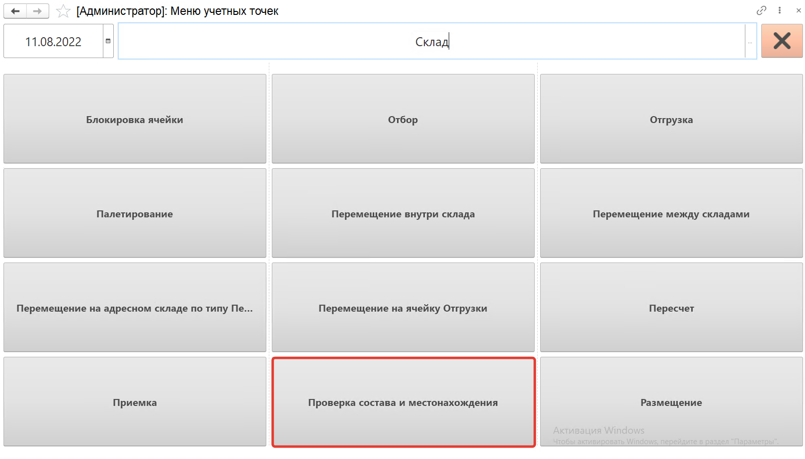
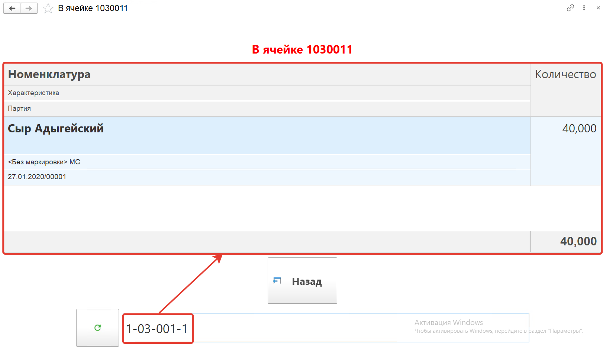

Кнопка **"Проверка состава и местонахождения"** может применяться для проверки остатков в ячейке.

После открытия формы обработки **"Меню учетных точек"** заполняем поля:

- Дата
- Смена
- Учетная точка

На форме обработки появятся кнопки выбранной учетной точки, выбираем кнопку **"Проверка состава и местонахождения"**.

Сканируем ячейку остатки которой хотим увидеть, номенклатура появится на форме.

