Для отражения отгрузок товара со склада используется обработка **"Отгрузка"**, которая расположена в разделе "Склад и доставка" в подсистеме "Складская логистика".

После открытия обработки в верхней части рабочей области выбирается **"Задание на доставку"** в котором содержится информацию о том какой машиной будет отгружаться товар со склада. Затем выбираем **"План отгрузки"** по которому будем отгружать товары.

Для реализации примера заранее создадим "Заказ клиента" с параметрами:

- Контрагента: Ашан
- ТЧ Номенклатура:
  - Номенклатура "Сыр Адыгейский"
  - Характеристика "Ашан"
  - Упаковка: Упак(0,5 кг)
  - Количество: 50 шт

По данному заказу сформируем "План отгрузки" и распределим данный план в Задание на доставку. 

Выбираем созданное нами "Задание на доставку":

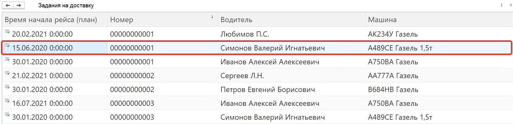

Выбираем "План отгрузки":

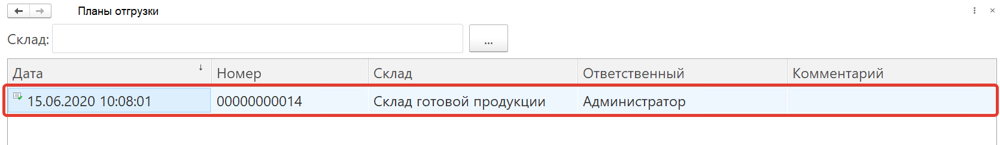

На форме обработки появится информация о том какой товар согласно **"Плану отгрузки"** должен быть отгружен.

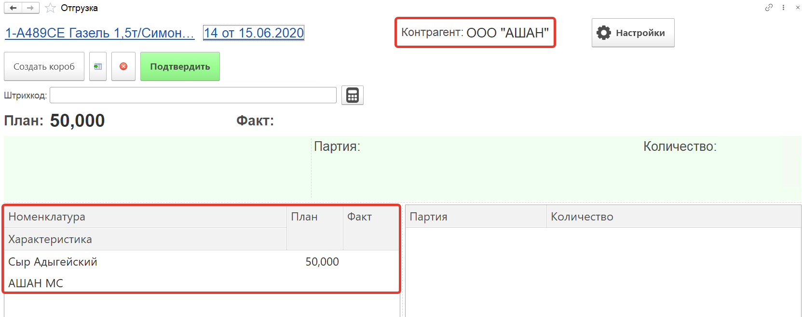

По кнопке **"Создать короб"** упаковываем короб:

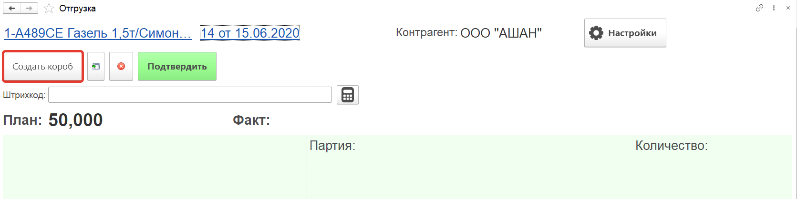

Далее в списке номенклатур позиционируемся на той, что будем добавлять в короб и нажимаем кнопку **"Добавить номенклатуру"**. В открывшемся окне выбираем серию номенклатуры (список серий автоматически подбирается для нашей номенклатуры).

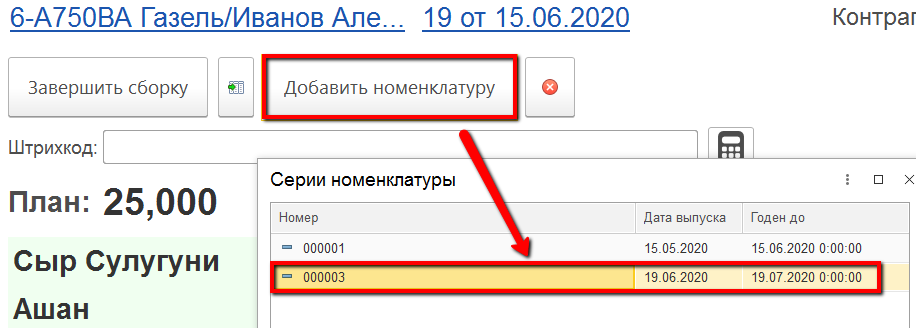

Далее используя виртуальную клавиатуру вводим **Вес** отгружаемой продукции.

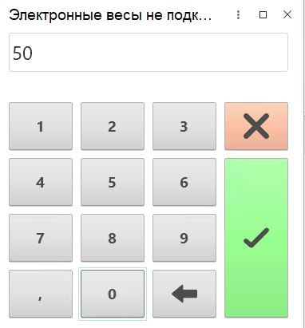

В результате будет заполнено фактическое количество отгружаемой продукции.

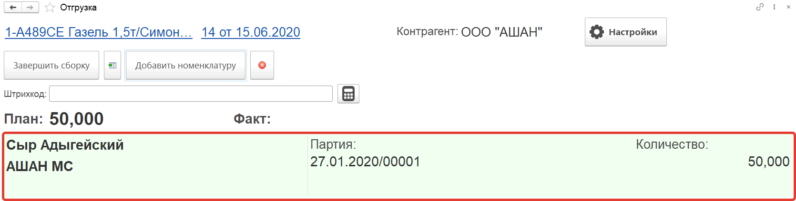

Аналогично добавляем оставшуюся номенклатуру, в случае отгрузки нескольких позиций.

Для просмотра и изменения состава короба необходимо нажать кнопку 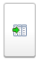. И при необходимости удалить лишние строки.

После добавления номенклатуры нажимаем кнопку **"Завершить сборку"**

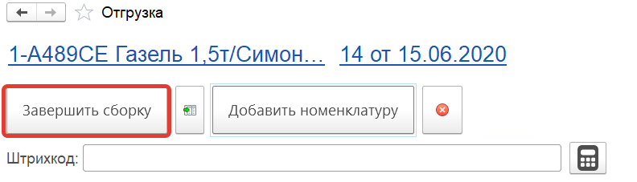

В результате на форме обработки отражается факт:

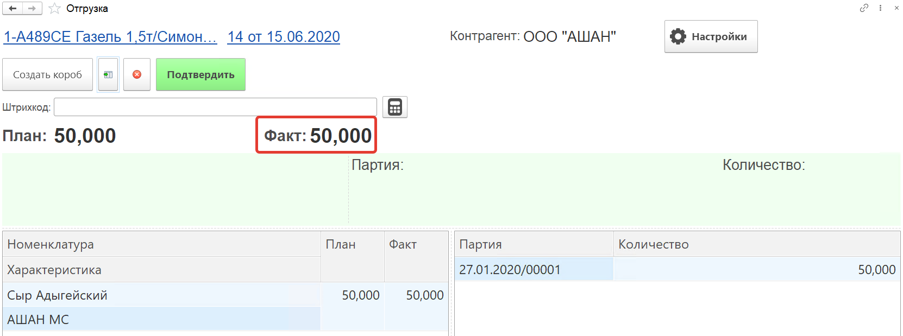

Если паллетный лист создали заранее, то достаточно ввести его SSCC код в поле штрихкод.

Для завершения кнопки отгрузки нажимаем кнопку **"Подтвердить"**

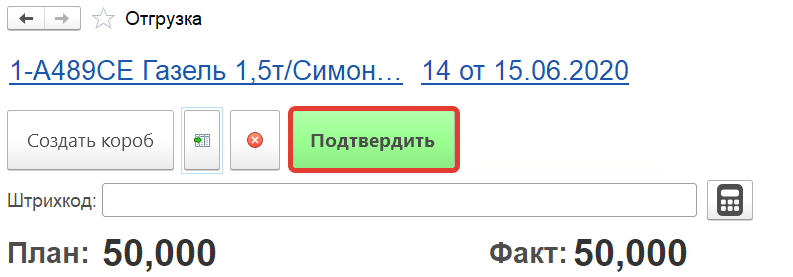

В результате сформируется документ **"Распоряжение на отгрузку"**

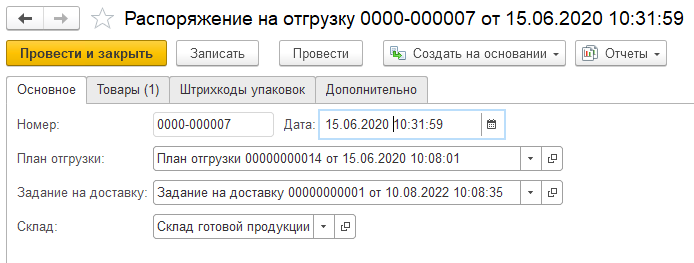

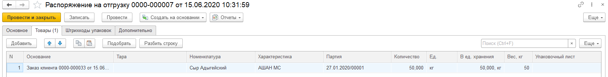
