Для оформления поступления готовой продукции на склад используется обработка **"Приемка готовой продукции"**, которая расположена в разделе "Склад и доставка" в подсистеме "Складская логистика".

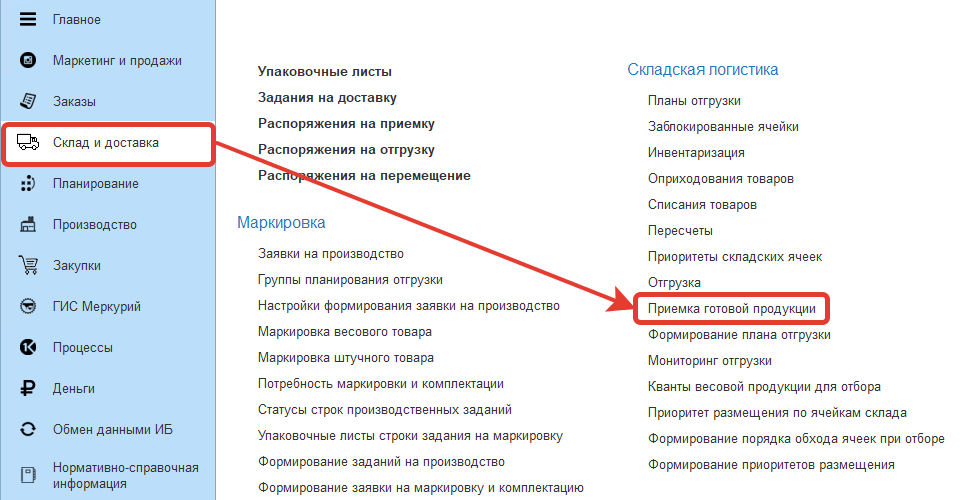

После открытия обработки заполняются или изменяются следующие поля в верхней части рабочей области:

- Период
- Организация
- Склад
- Рабочий центр

Установим следующие параметры:

- Период: 01.05.20 - 31.05.20
- Организация: Молочный мир
- Склад: Склад готовой продукции
- Рабочий центр: Приемка на склад готовой продукции

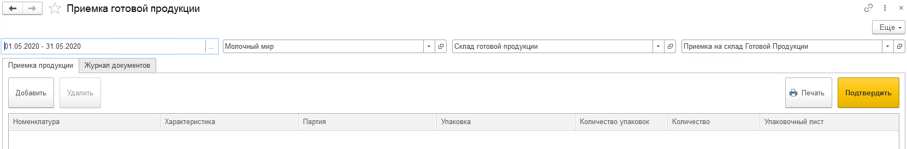

Далее вводятся поступившие позиции номенклатуры.
Ввод осуществляется с помощью сканера штрих-кодов либо интерактивно.

В случае ввода сканером, все реквизиты заполняются автоматически.

В случае интерактивного ввода на вкладке **"Приемка продукции"** надо кликнуть по кнопке **"Добавить"**.

В открывшемся окне нажимаем на кнопку **"Номенклатуры"** или **"Выбрать из справочника"**.

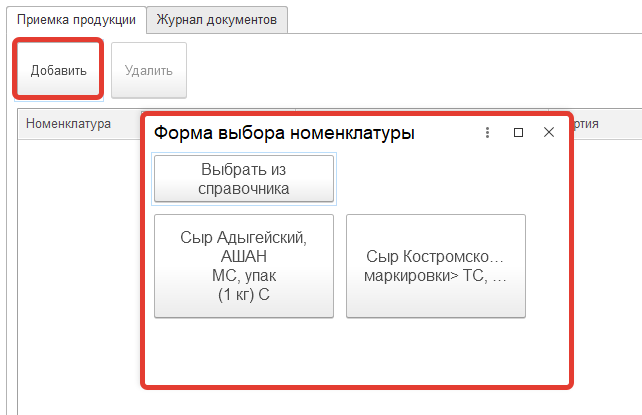

В случае выбора **кнопки номенклатуры** (Настройку кнопок смотри в разделе [Настройка кнопок номенклатуры](http://konstanta-it.github.io/erp4food/commoninformation/NastroikaKnopokNomenklature/). Нажимаем на кнопку номенклатуры

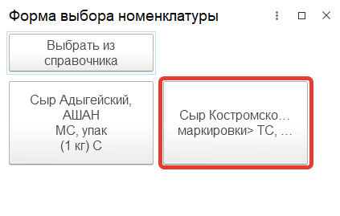

На форме выбора серий номенклатуры выбираем серию. В верхней части формы можно заполнить "номер", "дату выпуска" и поле "годен до" для наиболее быстрого поиска нужной серии. 
Поле номенклатура будет заполнено автоматически при открытии формы.

Используя только виртуальную клавиатуру открывшегося диалогового окна вводим количество поступившей продукции и кликаем по кнопке **"Готово"**.

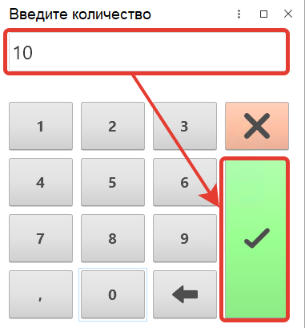

В случае выбора **"Выбрать из справочника"** нажимаем на кнопку:

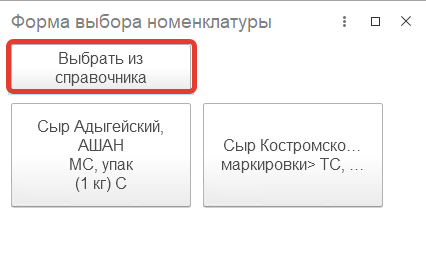

Откроется форма выбора номенклатуры, выбираем номенклатуру из справочника **"Номенклатура"**.

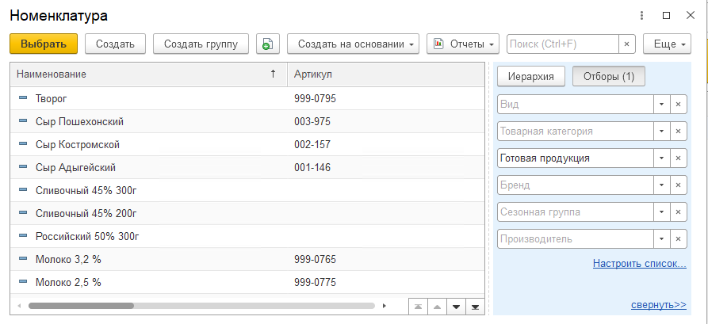

Далее открывается форма выбора характеристики, выбираем **характеристику**:

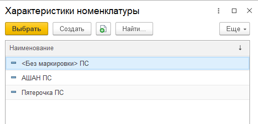

На открывшейся форме выбираем **единицу измерения/упаковку**.

Затем на форме выбора серий номенклатуры выбираем **серию**.

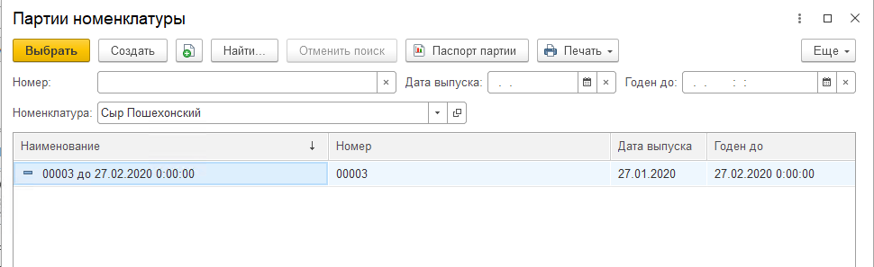

Используя виртуальную клавиатуру открывшегося диалогового окна вводим количество поступившей продукции и кликаем по кнопке **"Готово"**.

Таким образом будет создана запись в табличной части на вкладке **"Приемка продукции"**

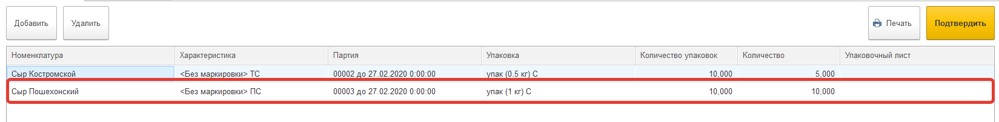

Аналогичным образом добавляются оставшиеся позиции.

После добавления всех позиций, которые будут помещены на складе на одну паллету, необходимо нажать на команду **"Печать"**. В результате сформируется паспорт паллеты. Ссылка на него появится в колонке **"Упаковочный лист"**

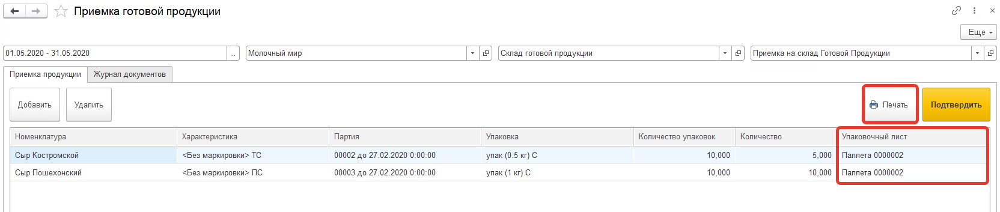

Печатная форма **"Упаковочного листа"**

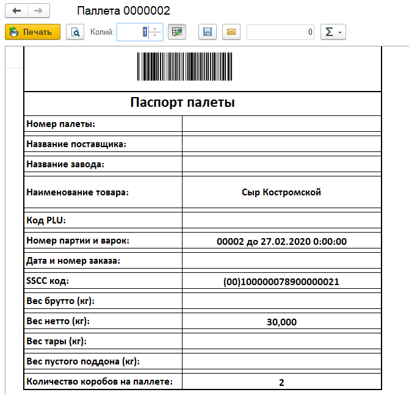

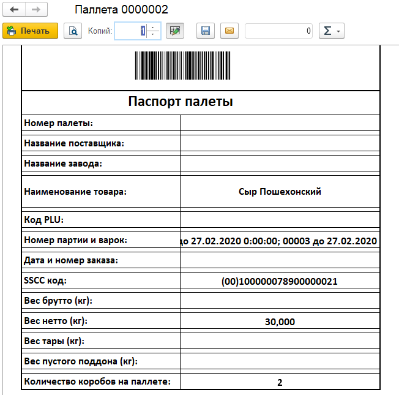

Для удаления записи в табличной части необходимо активизировать нужную строку и кликнуть по кнопке **"Удалить"**.

Далее нажимаем команду **"Подтвердить"**.

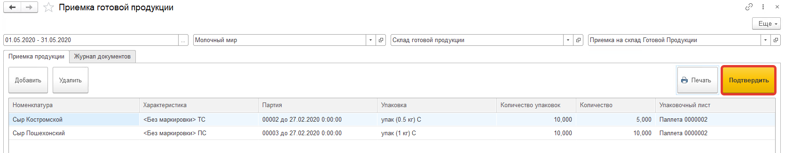

В результате на вкладке **"Журнал документов"** появится новое **"Распоряжение на приемку"**. На данной вкладке отображаются все распоряжения, созданные за указанный период:

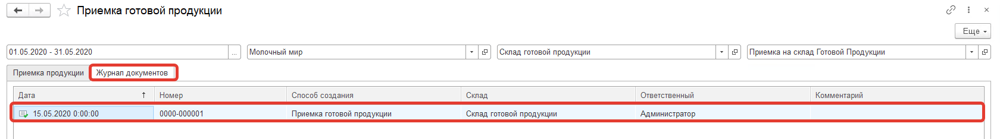
