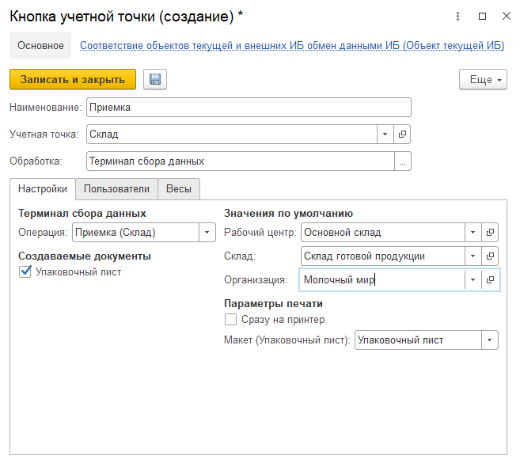

Кнопка **"Приемка"** используется для приема на склад готовой продукции.

При создании кнопки учетной точки **"Приемка"** указываются:

- Наименование
  
- Учетная точка
  
- Обработка -Терминал сбора данных

На вкладке **"Настройки"** заполняются:

- Операция - Приемка (Склад)

- Рабочий центр
  
- Склад
  
- Возможность создания упаковочного листа, в случае создания заполняются поля организация и макет для печати
  

На вкладке **"Пользователи"** можно настроить индивидуальные права доступа на данную команду.

