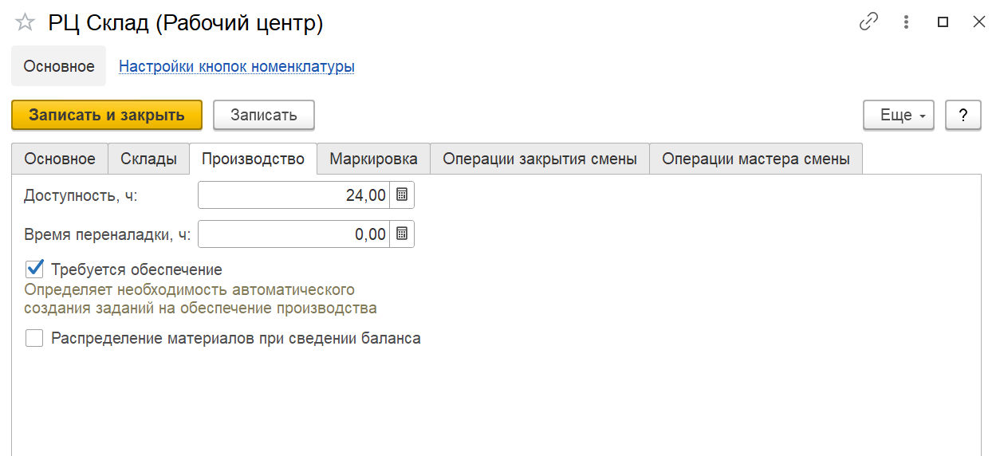

# Рабочие центры

Справочник **"Рабочие центры"** предназначен для ведения списка доступного оборудования. Справочник рабочие центры расположен в подсистеме **"Нормативно-справочная информация"**.

<h2> Вкладка "Основное" </h2>

- Наименование;
- Вид рабочего центра;
- Группа в которую входит рабочий центр - позволяет объединить рабочие центры в группы (например сгруппировать по складу);
- Подразделение - указывается Подразделение организации к которому относится данный РЦ;
- График работы.

<h2> Вкладка "Склады" </h2>

- Использование одного склада или нескольких;
- Склад - на котором функционирует данный РЦ. 
- Склад вспомогательных материалов;
- Склад выпуска (склад выпуска со вкладки Маркировка);
- Признак необходимости обеспчения по складам

Если есть потребность в перемещении номенклатур со склада материалов на склад выпуска, то необходимо включить флаг «Требуется обеспечение по складам»  

<h2> Вкладка "Производство" </h2>

- Доступность;
- Время переналадки;
- Создание дополнительного производственного задания при создании задания на этот участок;
- Распределение материалов в рамках сведения баланса в закрытии смены.

<h2> Вкладка "Маркировка" </h2>

- Создание серии в момент выпуска маркировки;
- Склад сырья;
- Ячейка сырья - поле доступно, если на складе сырья используется адресное хранение;
- Склад выпуска;
- Ячейка выпуска - поле доступно, если на складе выпуска используется адресное хранение.

<h2> Операции закрытия смены </h2>

- Необходимые операции при закрытии смены.

<h2> Операции мастера смены </h2>

- Действия, доступные для использования мастером смены.

