# Поступление без плана

Для операции приемки поступления сырья без планового документа необходимо использовать обработку **"Поступление без плана"**. Для этого необходимо создать Кнопку учетной точки, для которой могут быть заданы следующие настройки:

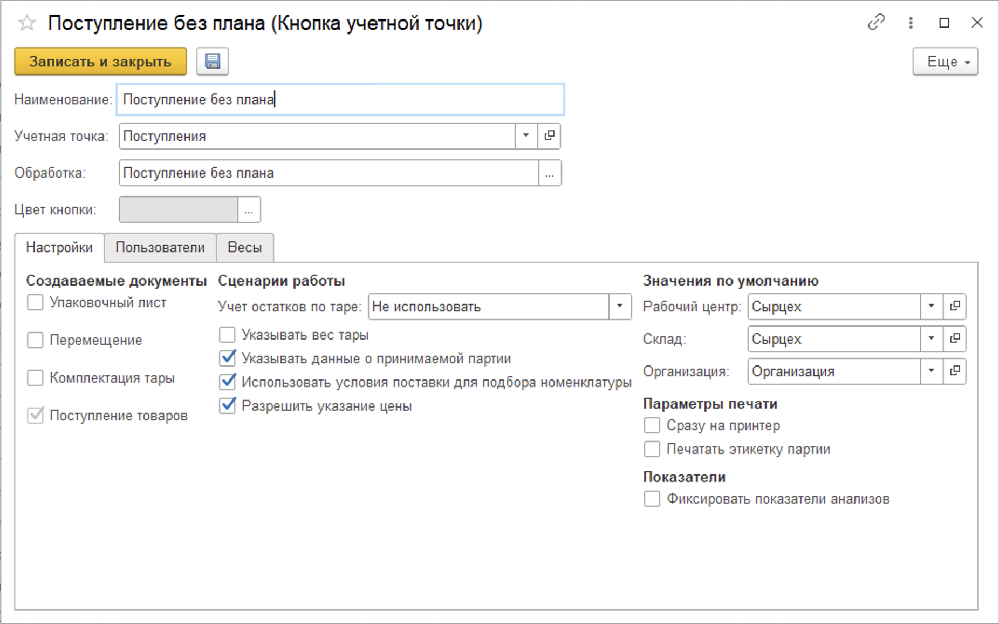

- Настройки создания документов: Упаковочный лист, Перемещение, Комплектация тары,
- Ведение учета остатков по таре,
- Опция указания веса тары,
- Опция указания данных принимаемой
 партии,
- Опция подбора номенклатуры для приемки на основании условий поставки в соглашении с контрагентом,
- Опция указания цен номенклатуры в документе,
- Рабочий центр, Склад, Организация,
- Параметры печати,
- Опция фиксирования показателей анализов.
 
## Работа в КУТ

- Открываем **"Меню учетных точек"**.

- Указываем дату планового поступления, смену и рабочий участок, на котором производится приемка. Нажимаем кнопку **"Поступление без плана"**:

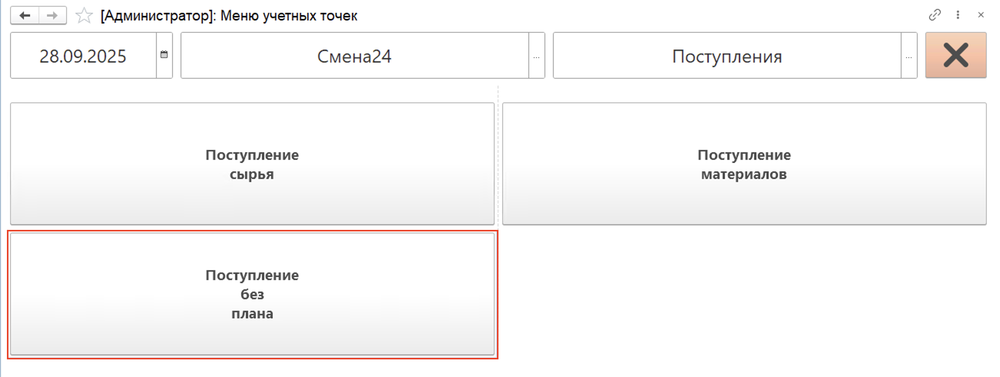

- Далее необходимо создать документ для приемки по кнопке "Создать". Либо же выбрать для работы уже ранее созданный документ из списока плановых поступлений. По умолчанию отображаются только не принятые позиции (переключатель отображения установлен в значении **"К приемке"**).
При создании необходимо выбрать поставщика и соглашение:

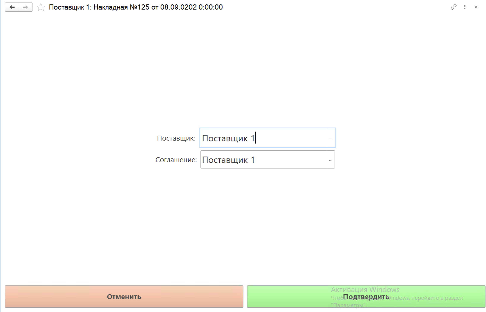

- Выбираем документ планового поступления, по которому необходимо осуществить приемку, нажимаем кнопку **"Данные документа"**:

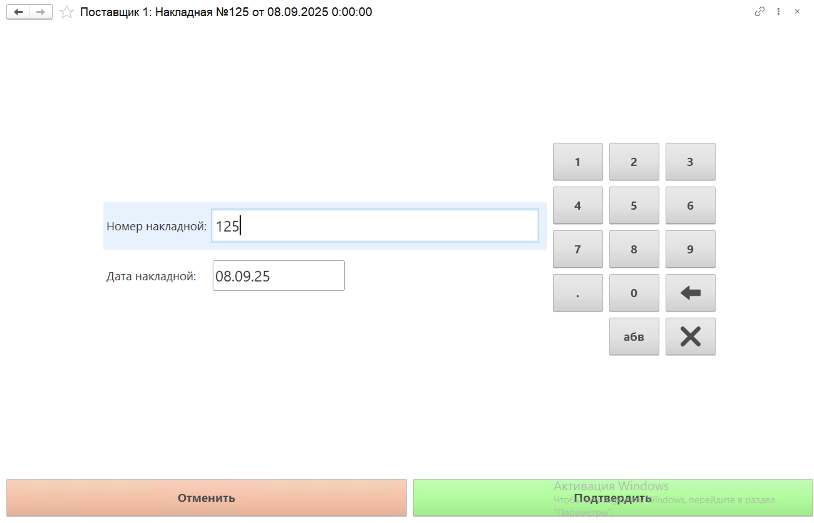

- Нажимаем на кнопку **"Подтвердить"**. Открывается окно с данными о плановом поступлении. Далее необходимо добавить номенклатуру, которую собираемся принимать. Для этого нажимаем кнопку "Добавить":

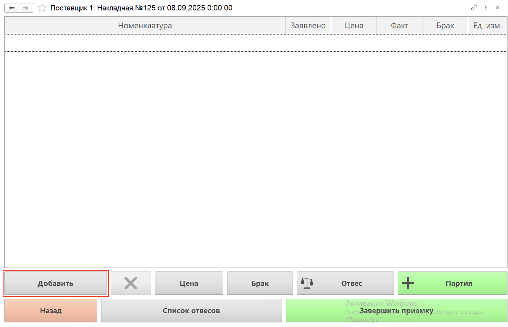

- После открываются Кнопки номенклатуры для выбора. Если в НКУТ включена опция "Использовать условия поставки для подбора номенклатур", то список номенклатур будет ограничен для выбора на основании соглашения с клиентом. Выбираем необходимую нам номенклатуру:

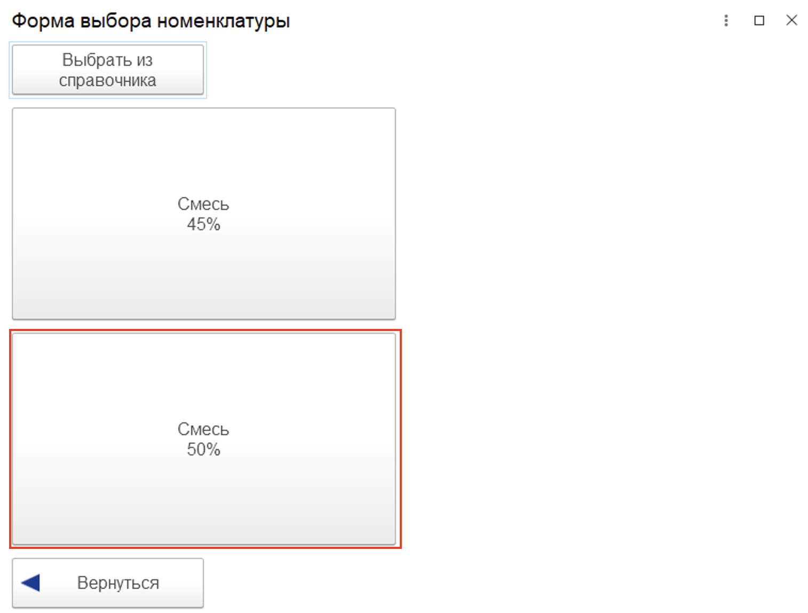

- Открывается окно для заполнения данных о принимаемой позиции по накладной поставщика. Вводим количество номенклатуры, срок годности в днях, дату изготовления и номер партии:

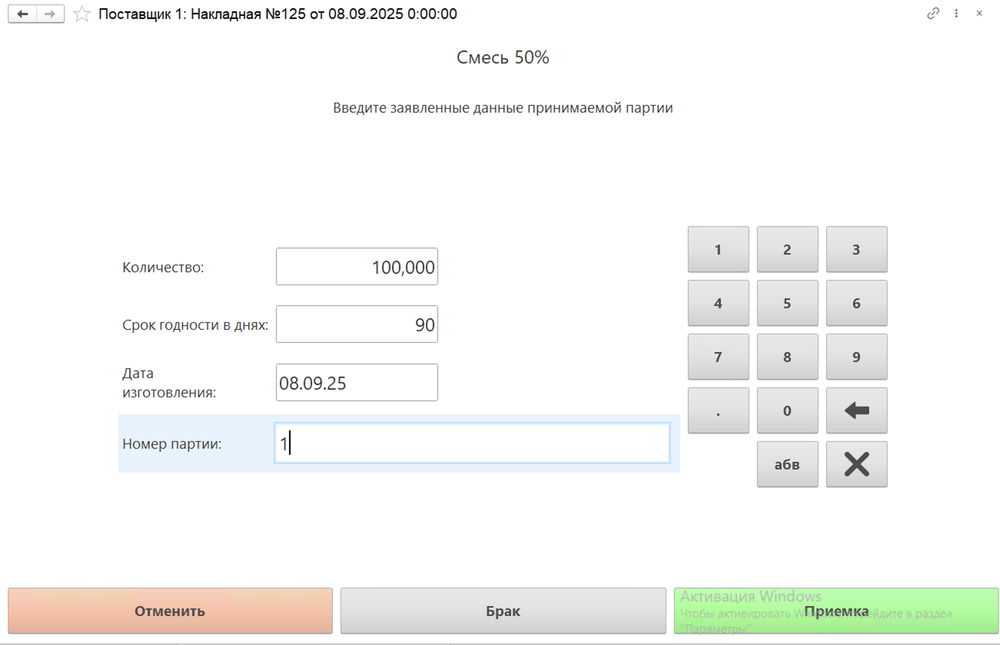

- Нажимаем кнопку **"Приемка"** для приемки. Открывается окно для учета данных принимаемой позиции. В левом верхнем углу отображается информация о номенклатуре и количестве, которое осталось принять.

- Указываем фактический вес принимаемой партии и нажимаем на кнопку **"Подтвердить"**:

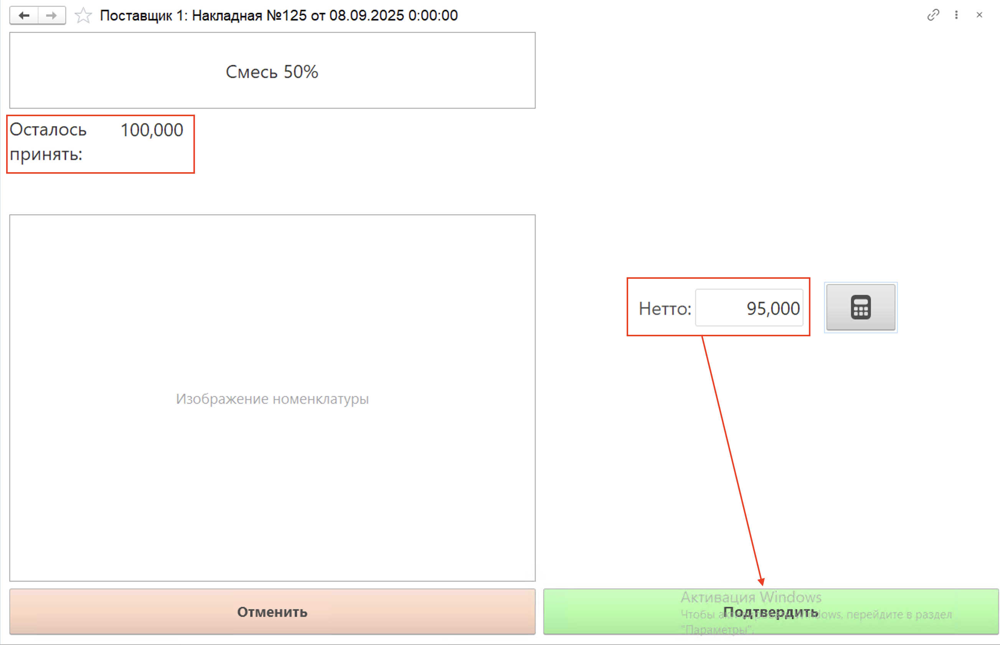

- Открывается окно со списком отвесов. В колонке **"Факт"** отображается количество в килограммах, которое уже взвешено при приемке. 

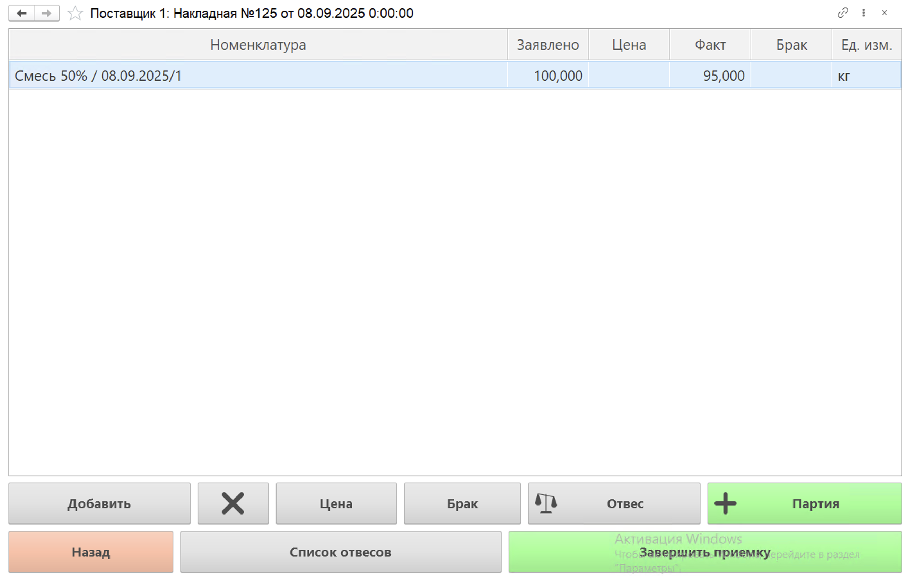

- Цена подтягивается из соглашения с поставщиком. Если цена не указана, но включена опция указания цен в документе, то необходимо это сделать по кнопке **"Цена"**:

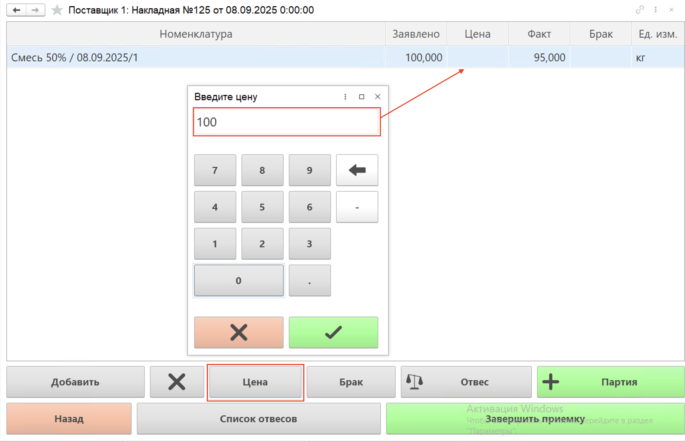

- Чтобы принять еще один отвес сырья, нажимаем кнопку **"Новый отвес"**. 

- Если в партии обнаружен брак, необходимо взвесить его, нажав соответствующую кнопку. Подробнее о приемке брака читайте в разделе ["Отбраковка"](../../../Meat/Boning/Rejection.md)

Открывается окно со списком партий. Колонка **"Факт"** заполнилась по введенным данным.

В данном окне есть несколько кнопок для работы с учетом сырья:

- **"Назад"** - возвращает к списку документов Поступлений;
- **"Удалить"** - удаляет из табличной части документа выбранный отвес. Используется в случае, если взвешивание произведено некорректно и данные по отвесу уже зафиксированы в документе (появились в табличной части);
- **"Цена"** - указание и корректировка цены номенклатуры в документе;
- **"Брак"** - открывает окно для приемки брака;
- **"Список отвесов"** - открывает список отвесов по выбранной партии сырья;
- **"Отвес"** - открывает окно для взвешивания нового отвеса по выбранной партии сырья;
- **"Партия"** - открывает окно для ввода данных, заявленных поставщиком, по партии сырья, которая еще не была введена в систему.
- **"Завершить приемку"** - завершение заполнения документа Поступление товаров и услуг, дальнейшее его проведение в системе.

- Для завершения операций по учету приемки нажимаем кнопку **"Завершить приемку"**. Откроется окно подтверждения приемки:

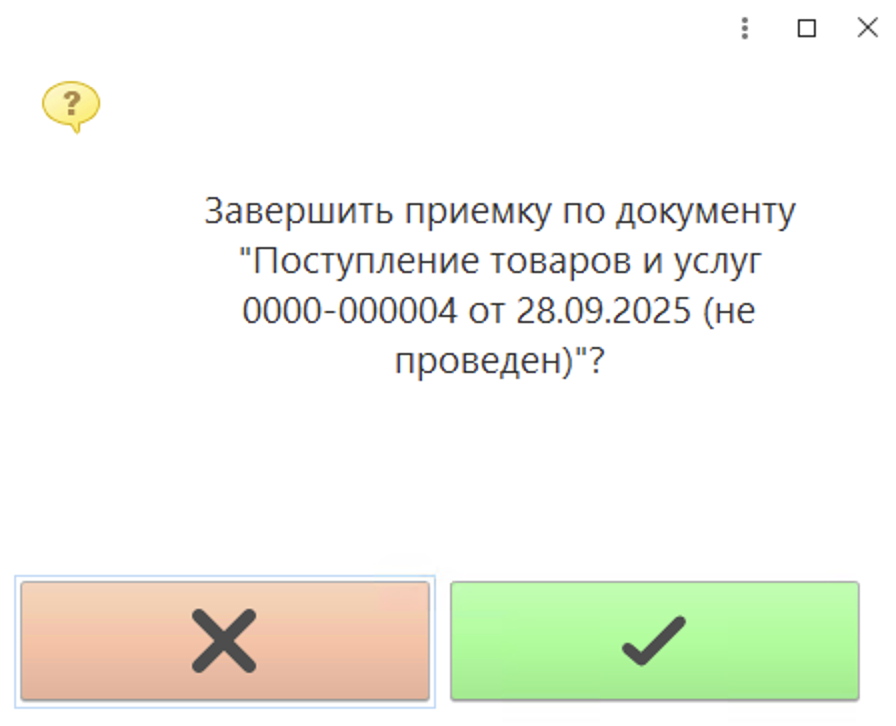

Если по документу выявлены расхождения фактического количества сырья с запланированным, система предложит создать акт расхождений. Если по мнению пользователя, отклонение от нормы в пределах допустимого, он может отказаться от создания акта. 

Чтобы увидеть список документов **"Поступление товаров"**, которые были обработаны за текущую смену, в основном окне АРМ переключаем отображение документов в значение **"Все"**. Обработанные документы отобразятся в списке со статусом **"Принято"**:

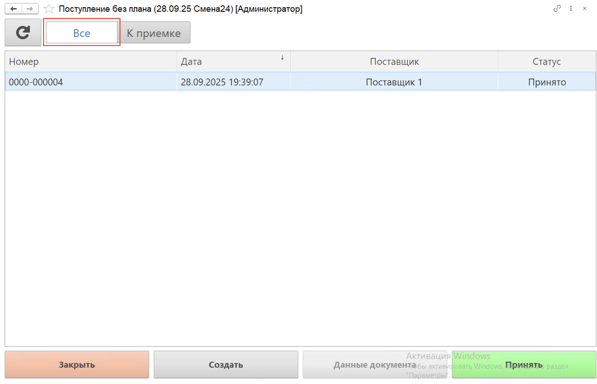
