**Контроль результатов производства**
==========================================
Для обеспечения контроля за производственными процессами мастер смены активно участвует в операциях цеха. Поэтому было решено выделить отдельное рабочее место, где будут объединены все необходимые действия.
В подсистеме **"Производство"** открываем **"Контроль результатов производства"**:

<h2> Сценарии работы контроль результатов производства </h2>

Сценарий работы контроль результатов производства используется для хранения настроек в АРМе "Контроль результатов производства". Данный справочник расположен в разделе **"Производство"** в подсистеме **"Учет производства"**.

При создании сценария в справочнике заполняются:

- Наименование;
- Дата смены;
- Признак *"Один мастер"* (если признак выключен, то необходимо выбрать конкретные РЦ для работы в АРМе);
- Признак *"Отображать количественные показатели складов"*;
- Признак *"Отображать приход и расход по складам"*.

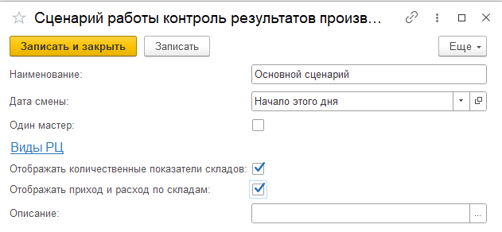

После выбора сценария нажимаем кнопку **"Обновить"** и в табличной части ниже появится информация о рабочем участке и рабочих центрах, закрепленных за ним. Выбираем нужный вид рабочего центра, а затем рабочий центр:

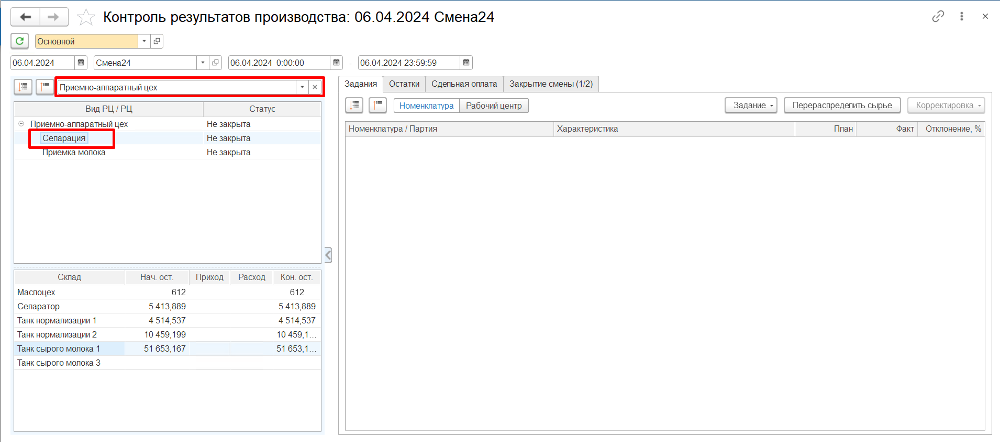

<h2> Вкладка "Задания" </h2>

На вкладке "Задания" можно увидеть информацию о выпущенных продуктах за текущую смену.
В табличной части указана номенклатура произведенных продуктов, количество, которое планировалось произвести, фактически произведенное количество и процент отклонения от плана.

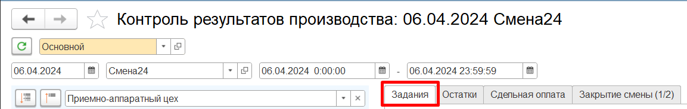

<h3> Задание </h3>

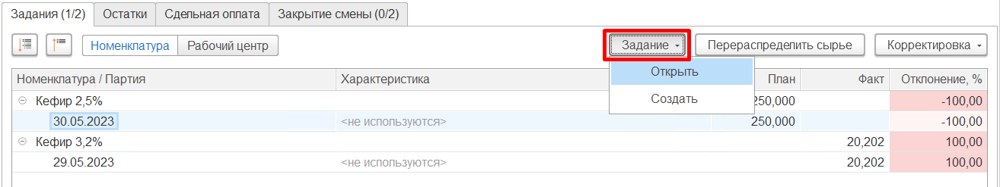

- *Открыть задание* - открывает ранее созданный документ **"Производственное задание"** на указанную смену и выбранный рабочий центр;

- *Создать задание* - открывает форму создания задания на указанную смену и выбранный рабочий центр.

<h3> Корректировка </h3>

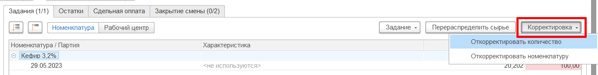

- *Откорректировать количество* - позволяет внести правки в количество выпуска по выбранной партии в таблице "Выпуск";
- *Откорректировать номенклатуру* - позволяет изменить вид продукции у выбранной партии в таблице "Выпуск".

<h3> Перераспределить сырье </h3>

В случае, если за смену были выпуски побочной продукции, на которую обычно не списывается основной ингредиент (Сыворотка, Обрат и тп), а на основные выпуски списание идет, этой кнопкой делается "минус" по расходу на основные выпуски и "плюс" по расходу на вторичные выпуски.  
*Распределение требует учтенных в системе показателей жира и белка по каждой партии выпуска и каждой партии основных материалов, т.к. разделение идет именно на основании этих показателей.*

<h2> Вкладка "Остатки" </h2>

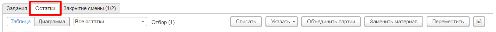

На текущей вкладке отображаются приход/расход/остатки по полуфабрикатам, продукции, материалам и сырью на складах РЦ.

Выбрав вид отображения **"Диаграмма"**, можно смотреть остатки в более наглядной форме. Такое обычно удобнее для участков, где происходит переработка "жидких" материалов.

<h3> Объединить партии </h3>

Позволяет объединить несколько партий одной продукции в одну.  
Часто применяется при выпуске производственной партии молока. На входе есть много партий от разных поставщиков, на выходе - одна партия (накопился танк сырого молока - берется контрольный анализ, и молоко переходит в производственную партию).

1. Выбрать партию (партии, склад) - нажать **"Объединить партии"**, подтвердить количество выхода (автоматически - сумма всех выделенных партий).  
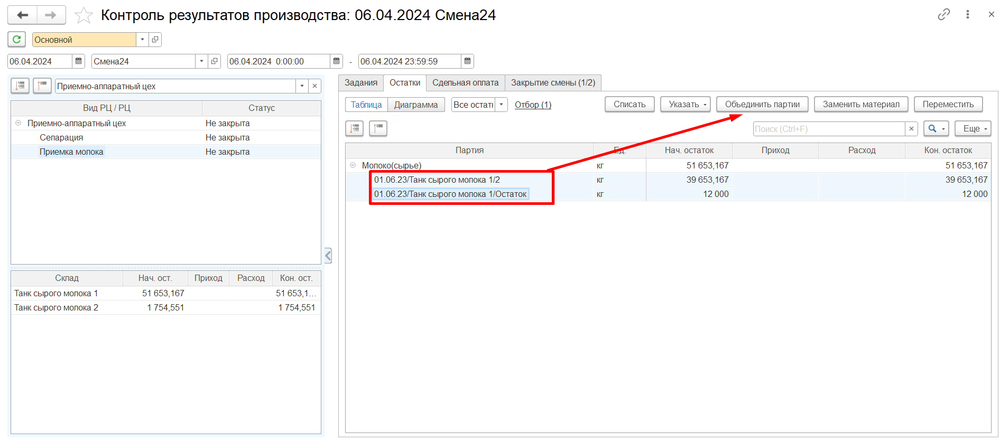  
2. Создается документ **"Переработка"**, где в выпуске молоко с новой партией, а в материалах - все партии, которые были выделены (или все серии в танке, если позиционирование было на складе и если там была одна номенклатура). *В режиме диаграммы объединяются все партии склада, независимо от количества выделенных.*

<h3> Указать выпуск </h3>

Позволяет указать выпуск на какой-либо из складов РЦ.

1. Выбрать в таблице склад выпуска - нажать **"Указать выпуск"**. Указать, что и в каком количестве выпускается. При этом можно выбрать один из трех вариантов списания материалов для основных и дополнительных материалов:
    1. не распределять;
    2. по норме - указывается склад (склады), с которого берется основной материал (по спецификации);
    3. целиком по спецификации - все остатки (по рецептуре) на указанном складе (складах) будут списаны на этот выпуск.  
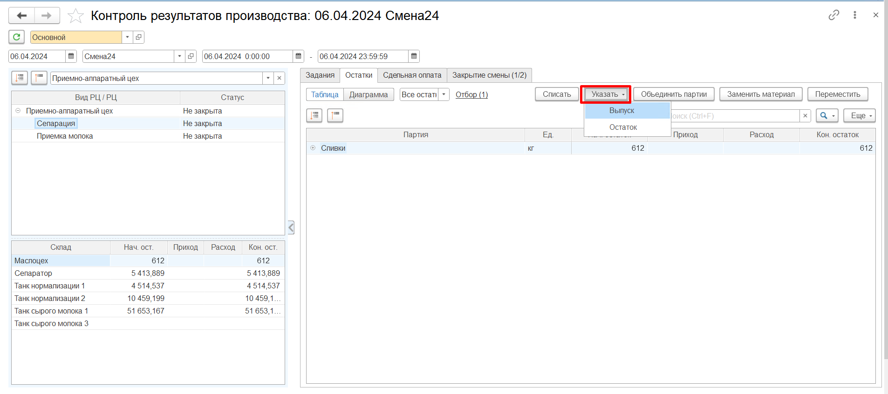  
2. При этом, если выпускаемая продукция имеет одну единицу измерения (не литры), то количество можно получить, как сумму всех материалов по основной спецификации, чья единица измерения совпадает с единицей измерения выпуска.  
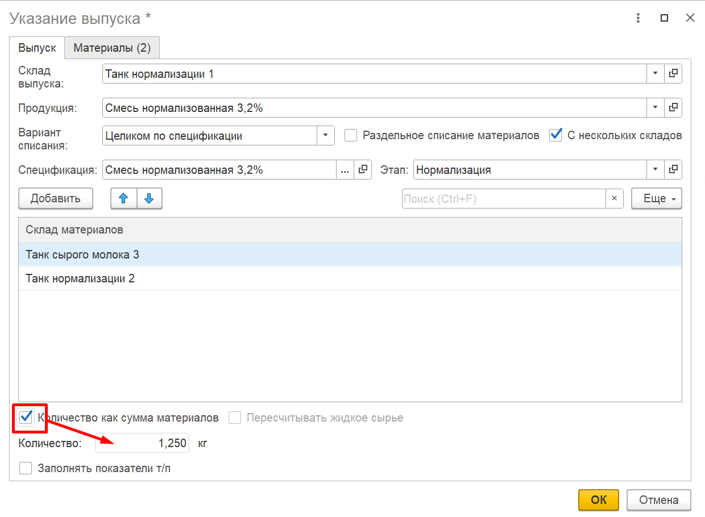  
3. Если выпускаемая продукция принималась в литрах, то есть возможность использовать пересчет литров в килограммы, указывая плотность жидкости (количество как сумма материалов недоступно).
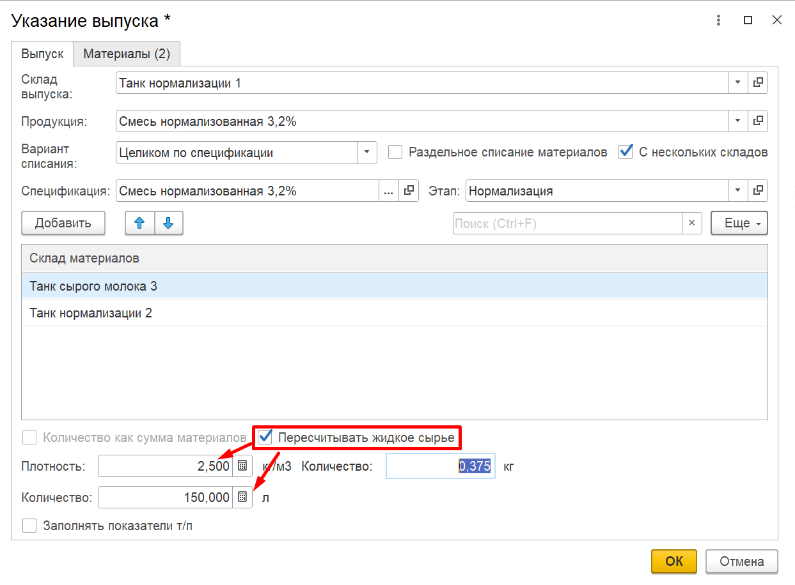
4. Создается документ **"Переработка"**, где в выпуске указанная номенклатура и количество, материалы заполняются согласно указанным правилам и корректировкам.

<h3> Переместить </h3>

Позволяет перемещать партии продукции между складами.

1. Выбрать в таблице партию (партии) - нажать **"Переместить"**.  
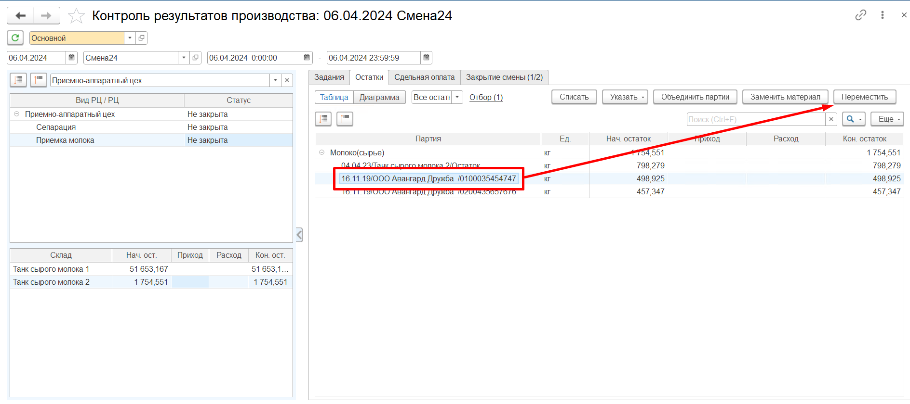  
2. Указать куда и сколько перемещается.

3. Создается документ **"Распоряжение на перемещение"**.

<h3> Списать </h3>
Если за текущую смену физически был потрачен материал, а в системе числятся остатки на складе, следует списать остатки с отнесением на потери при производстве. Есть возможность выбора конкретных выпусков для распределения материала. В результате формируется документ **"Распределение материалов"**.

Также существует возможность списания продукции-аналога, такое списание используется в основном на выпуск ГП. Эта опция доступна только для варианта распределения "Согласно спецификации" и включенного параметра "Выбирать из выпуска".

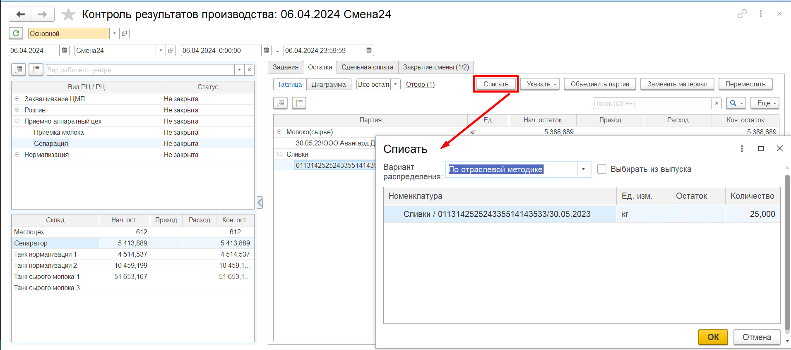

- **Согласно спецификации** - требует наличие выпуска по спецификации, где выбранный остаток конфигурирует, как материал. Списание идет на все выпуски, по которым выбранный остаток мог бы быть потрачен.  
Например, есть пакет красный. С его использованием упаковывают несколько варок сыра "Российский 3\\19", "Пошехонский 5\\19". В каждой спецификации этот пакет указан в материалах. При распределении этот пакет списывается и на Российский, и на Пошехонский.  
    -   Выбрать материал (и серию) - нажать **"Списать"**. Указать вариант списания "Согласно спецификации", если включена опция "Выбирать из выпуска"- выбрать конкретные выпуски для распределения, и указать списываемое количество.

- **Пропорционально списанному** - требует наличие выпуска, где материал, по которому есть остаток, уже был потрачен.
Например, так же пакеты красные. Потратились на упаковке на сыр "Российский" и на сыр "Пошехонский". Но при этом, на пошехонский сыр не стоит в спецификации. В варианте **a.** пакеты списались бы только на российский сыр, а в текущем - на оба. 
    -   Выбрать материал (и серию) - нажать **"Списать"**. Указать вариант списания "Пропорционально списанному".

- **По отраслевой методике** - не требует расхода материала, но требует наличие выпусков, на которые этот материал может быть потрачен. Также требует наличия анализов по жиру и белку. Списывается на выпуски, пропорционально содержанию жира и белка в них.  
Например, применяется на переделе, когда есть выпуски смесей, сливки и обрат. Все молоко списывают на выпуски согласно содержанию жира и белка в них.  
    -   Выбрать партию молока - нажать **"Списать"**. Указать вариант списания "По отраслевой методике", указать количество и, если включена опция "Выбирать из выпуска" - выбрать конкретные выпуски для распределения.

- **Брак**- требует расхода материала. В текущем функционале виден только для номенклатуры с типом "Короб" или "Пакет". Предполагает списание бракованных коробов или пакетов, выявленных в процессе их использования за смену. Указанный материал списывается со статьей брака на уже имеющиеся выпуски пропорционально потраченному.
    -   Выбрать короб или пакет (и серию) - нажать **"Списать"**. Указать вариант списания "Брак", указать количество и статью затрат для брака.

 
<h3> Заменить материал </h3>

Требует наличие расхода заменяемого материала. Указанное количество заменяемого материала приходуется, а чем заменяем – расходуется на ту продукцию, на которую тратился заменяемый.  

1. Перейти на вкладку "Остатки" -\> "Материалы" (или "Прочее"), найти заменяемый материал (и его серию) - нажать **"Заменить материал"**.
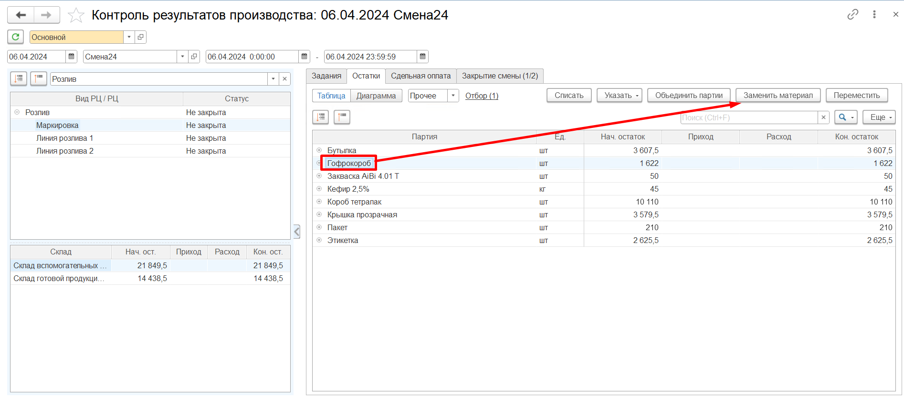
2. Указать, чем заменяется (и серию), количество для замены.

3. Создается документ **"Распределение материалов"**.

 
<h3> Отчет "Ведомость о перемещениях" </h3>

Данный отчет содержит в себе информацию о всех перемещениях товаров за дату смены на конкретном складе с возможностью выбора склада-получателя на основании Распоряжений на перемещение с типом Перемещение.

1. Отчет открывается по кнопке , которая находится на вкладке "Остатки" при выборе ВРЦ/РЦ.

2. При нажатии на кнопку появляется окно с выбором склада-отправителя (принадлежащий ВРЦ/РЦ) и склада-получателя (множественный выбор).
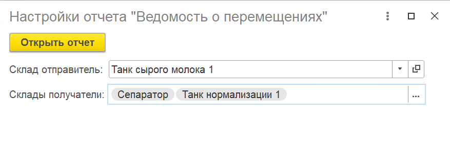

3. Отчет строится на продукцию, которая была перемещена с выбранного склада-отправителя на выбранные склады на дату смены.

<h2> Вкладка "Закрытие смены" </h2>

Когда мастер смены удостоверился, что за текущую смену в систему введена корректная информация о выходах и остатках, следует закрыть смену на рабочем центре.

Переходим к вкладке "Закрытие смены" и нажимаем кнопку **"Закрыть смену"**.

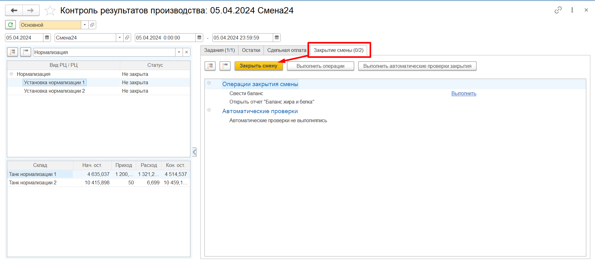

Откроется оповещение об успешном/не успешном закрытии смены.

- Если при закрытии смены система выявит некорректные данные, статус смены в табличной части слева изменится на *"Есть ошибки"*. Также в заголовке вкладки "Остатки" отобразится наличие расхождений, а на вкладке "Закрытие смены" - количество успешных операций и информация о некорректных данных, которые не позволяют закрыть смену.
- Если все данные за смену верны, статус смены на рабочем центре изменится на *"Закрыта"*.

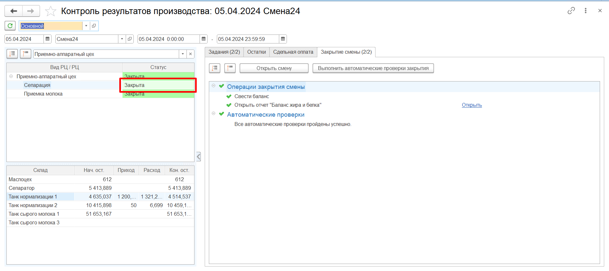

Также на данной вкладке есть возможность печати информации в конце смены о передаваемой продукции из одного цеха в другие.

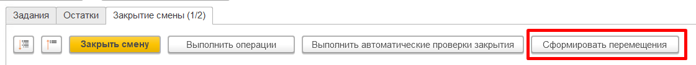

1. При нажатии на кнопку "Сформировать перемещения" открывается форма для выбора склада-отправителя (принадлежащий ВРЦ/РЦ, на котором стоит пользователь) и склада-получателя (множественный выбор). После подтверждения на основании всех собранных Распоряжений на перемещение (тип Перемещение, статус "Выполнено") за смену для каждой пары складов (отправитель и получатель) формируется документ "Перемещение товаров".

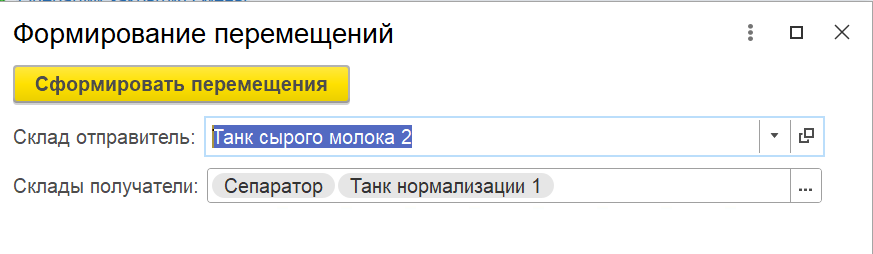

2.Затем система предлагает напечатать "Накладную на внутреннее перемещение (ТОРГ-13)" на основании созданных Перемещений товаров.

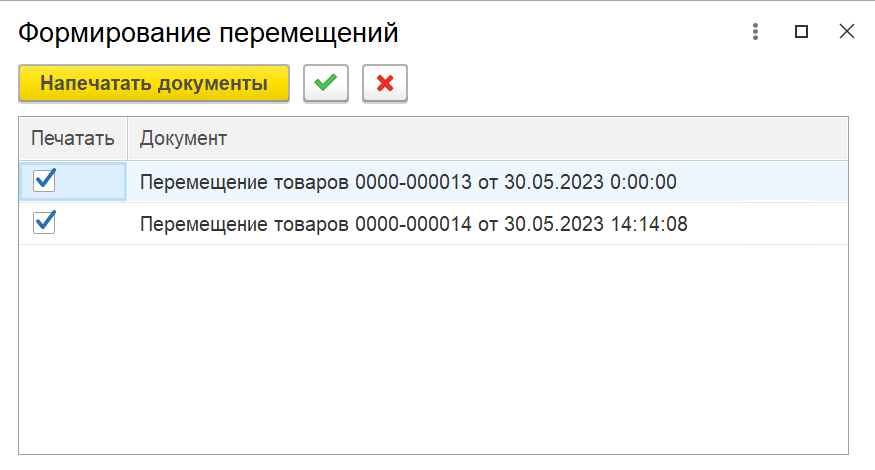