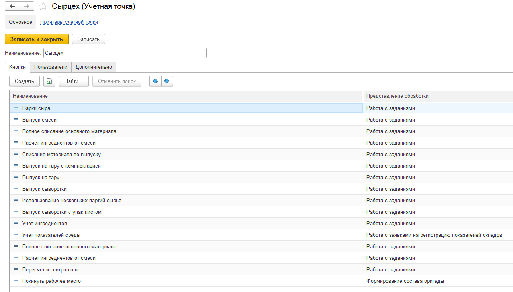
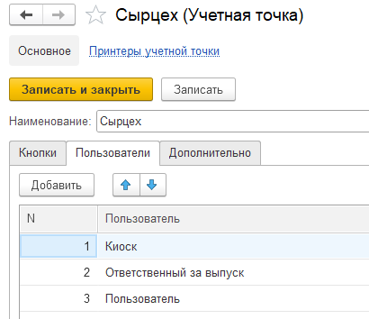
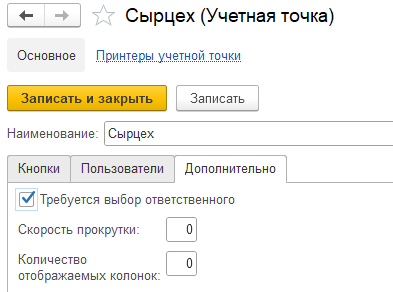

# Содержание
Справочник "Учетные точки" используется для того, чтобы отделить наборы операций, выполняемых на разных участках производства для работы в системе через сенсорные
киоски, ТСД и подобные устройства.

<h2> Создание/Настройка УТ </h2>

В окне настройки УТ можно:

- Указать Наименование, которое будет указано в меню УТ
- Создать Кнопки, которые будут принадлежать данной УТ
- Настроить порядок отображения кнопок в учётной точке (Нужно нажать на созданную кнопку в таблице и далее переместить её вверх или вниз с помощью стрелочек)

- Выбрать Пользователей, которые смогут работать с данной УТ (Изначально может работать только Администратор)

- Задать Дополнительные настройки:
    - Сканирование бейджа работника для доступа к работе с УТ
    - Скорость прокрутки
    - Количество отображаемых колонок
    

<h2> Создание учетных точек </h2>

**Сырное производство**

- [Сепарация](../../../Cheese/SemiHardCheese/Separation/DataFilling/AccountPoints/AccountPoints.md)
- [Нормализация](../../../Cheese/SemiHardCheese/Normalization/DataFilling/AccountPoints/AccountPoints.md)
- [Варка сыра](../../../Cheese/SemiHardCheese/CookingCheese/DataFilling/AccountPoints/AccountPoints.md)
- [Упаковка после солилки](../../../Cheese/SemiHardCheese/SaltingAndGoToMaturation/DataFilling/AccountPoints/AccountPoints.md)
- [Выпуск созревшего сыра](../../../Cheese/SemiHardCheese/Maturation/DataFilling/AccountPoints/AccountPoints.md)
- [Нарезка сыра](../../../Cheese/SemiHardCheese/AccountingSlicingCheese/DataFilling/AccountPoints/AccountPoints.md)

**Молочное производство**

- [Сепарация](../../../Milk/Separation/DataFilling/AccountPoints/AccountPoints.md)
- [Нормализация](../../../Milk/Normalization/DataFilling/AccountPoints/AccountPoints.md)
- [Заквашивание](../../../Milk/Fermentation/DataFilling/AccountPoints/AccountPoints.md)
- [Розлив](../../../Milk/Bottling/DataFilling/AccountPoints/AccountPoints.md)
- [Маркировка](../../../Milk/Marking/DataFilling/AccountPoints/AccountPoints.md)

**Межцеховой учет**

- [Перемещение между цехами](../../../IntershopAccounting/CommonInformation.md)
