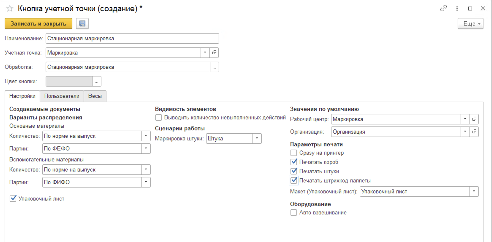

# Стационарная маркировка

Обработка **"Стационарная маркировка"** предназначена для маркировки весового и штучного товаров. В ней выполняются следующие функции:

- Приемка сырья
- Выпуск маркировки (маркировка ед. продукции и/или короба)
- Возврат излишков сырья
- Взвешивание результата маркировки

Для работы с обработкой **"Стационарная маркировка"** необходимо создать учетную точку и настроить кнопку:

- Наименование;
- Учетная точка;
- Обработка - **Стационарная маркировка**.

На вкладке **"Настройки"** заполняются:

- Рабочий центр;
- Указывается будут ли создаваться Упаковочные листы в результате работы (если да то еще заполняется поле *Макет* (Упаковочный лист) и *Организация*);
- Варианты распределения для основного и вспомогательного материалов (вариант "Не распределять" у основных материалов включает возможность приемки и возврата в обработке);
- Опция "Выводить количество невыполненных действий";
- Сценарий работы: маркировка штуки или короба;
- Указывается сразу ли печатать на принтере;
- Печать этикетки штуки;
- Печать этикетки короба;
- Печать штрихкод паллеты;
- Опция автоматического взвешивания при маркировке.

