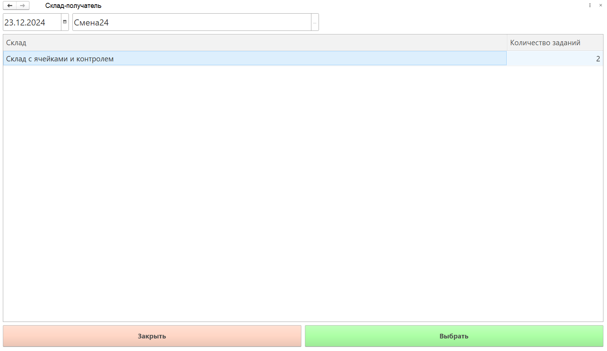
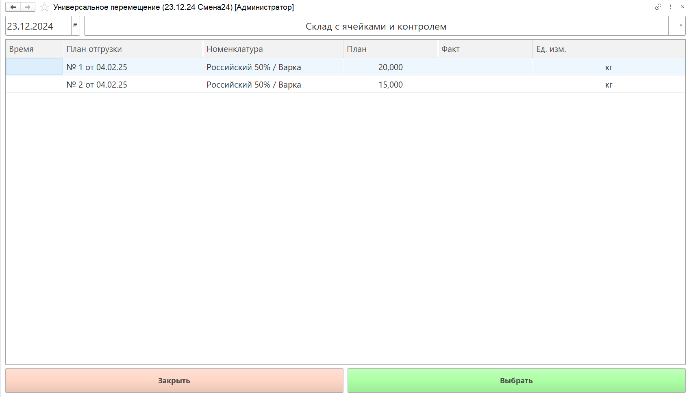
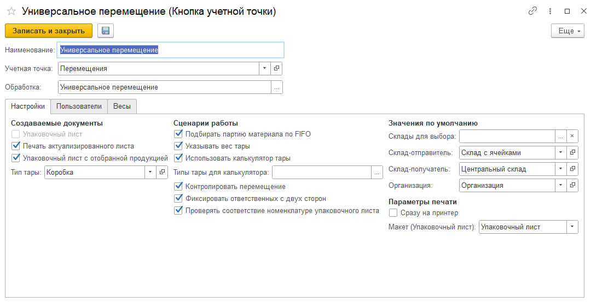
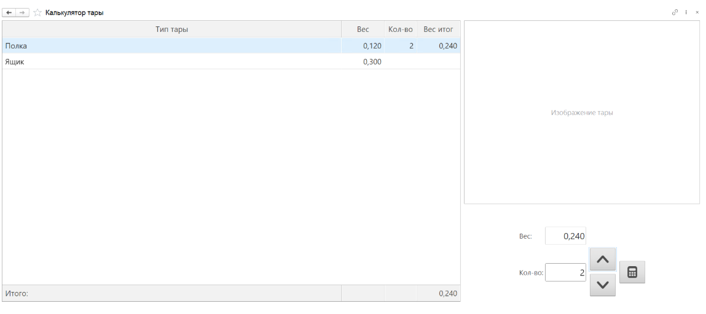

# Универсальное перемещение

Обработка **"Универсальное перемещение"** используется для перемещения части продукции из паллеты, сохраняя при этом актуальность паспортов паллет. 

<h2> Сценарий работы в АРМе </h2>

1. Кладовщик заходит в КУТ "Универсальное перемещение";
2. Видит список складов-получателей и количество невыполненных заданий;
3. Выбирает склад, план отгрузки;
4. Подбирает партии (без плана) / (не)меняет партию (с планом);
5. Снимает вес / вводит кол-во;
6. Формируется Распоряжение на перемещение (факт/план);
7. План отгрузки в статусе "Погружено".

В АРМ попадают Планы отгрузок только с типом доставки "Не требуется" и статусом "Запланировано". 

При работе сначала нужно выбрать Склад-получатель, который указан в Плане отгрузок:

Затем сам план и номенклатуру в нём:

<h2> Создание и настройка кнопки </h2>

При создании кнопки учетной точки с использованием данной обработки указывается:

- Наименование;
- Учетная точка;
- Обработка - Перемещение с делением.

На вкладке **"Настройки"** заполняются:

**Создаваемые документы**:

- **Упаковочный лист с отобранной продукцией** – по итогу работы будет формироваться документ **“Упаковочный лист”** для учета перемещения всей паллеты или части продукции на ней и её идентификации (Склад и доставка -> Упаковочные листы)

    - **Тип тары** – тара, под которую будет формироваться упаковочный лист
	
- **Печать актуализированного листа** (При выборе **Контролировать перемещение**)– Печать упаковочного листа для изначальной паллеты с актуальным остатком после перемещения.

**Сценарии работы**:

- **Подбирать партию материалов по FIFO** – партия материалов на складе-отправителе будет подбираться по принципу правила FIFO.

- **Указывать вес тары** – позволяет указывать вес тары. Может быть необходимо, чтобы получить точный вес продукции (Из общего веса вычесть вес тары).

    - **Использовать калькулятор тары** – Можно указать вес тары в виде составных частей с заданным в системе фиксированным весом или вводя вес вручную из обработки.
    
    - **Типы тары для калькулятора** – ограничивает список типов тар в калькуляторе.
    

- **Контролировать перемещение** – В документе Распоряжение на перемещение заполняется только план перемещения. Для подтверждения факта необходимо подтверждение с принимающей стороны.

- **Фиксировать ответственных с двух сторон** – при перемещении между складами будет необходимо подтверждение от ответственных пользователей со стороны отправителя и со стороны получателя.

- **Проверять соответствие номенклатуре упаковочного листа** – при несоответствии номенклатуры тому, что указано в упаковочном листе будет показано уведомление об ошибке.

**Значения по умолчанию**:

Заданные значения выбираются  по умолчанию при использовании кнопки и при необходимости их можно будет поменять вручную.

- **Склады для выбора** – можно подобрать определенные склады, с которыми собираемся работать;

- **Склад-отправитель** – склад, с которого будет списан основные и вспомогательные материалы;

- **Склад-получатель** – склад, на который продукция передается после выпуска для хранения или отгрузки;

- **Ячейка** – ячейка на которую отправляем продукцию, когда выбран склад с адресным хранением.

- **Организация** – для данной организации формируется документ “Упаковочный лист”

**"Параметры печати"**:

- **Сразу на принтер** – печать идет сразу на принтер, без предварительного просмотра.

- **Макет (Упаковочный лист)** – нужно подобрать шаблон для печати упаковочного листа.
