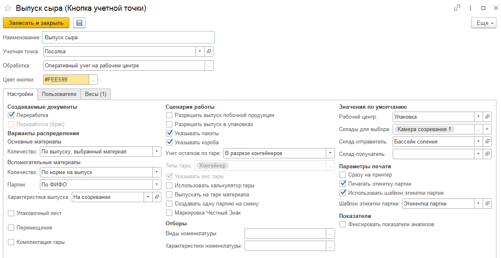
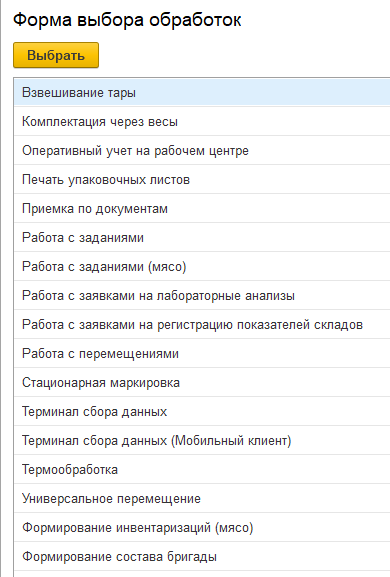

# Содержание
Кнопки учетных точек настраиваются для работы в системе через сенсорные
киоски, ТСД и подобные устройства.

<h2> Создание/Настройка КУТ </h2>

В окне настройки КУТ можно:

- Указать Наименование, которое будет указано на УТ
- Выбрать Учетную точку, к которой будет принадлежать данная кнопка
- Выбрать Обработку, в зависимости от требуемой функциональности кнопки
- Выбрать Цвет кнопки, чтобы добавить контрастности в меню учётных точек 
- Заполнить Настройки, в зависимости от выбранной обработки и требуемой функциональности
- Выбрать Пользователей, если нужно настроить права доступа к КУТ
- Выбрать Весы, если есть необходимость работать с ними при использовании кнопки

<h2> Определение обработки для кнопки </h2>

При открытии списка выбора реквизита "Обработка":

 

Параметры обработок описаны в соответствующих разделах.

- [Взвешивание тары](ContainerWeighing/ContainerWeighing.md)
- [Комплектация через весы](PackagingWithScales/PackagingWithScales.md)
- [Оперативный учет на рабочем центре](OperationalAccountingOnWorkCenter/OperationalAccountingOnWorkCenter.md)
- [Универсальное перемещение](UniversalPeremeshenie/UniversalPeremeshenie.md)
- [Работа с заданиями](WorkWithTasks/WorkWithTasks.md)
- [Работа с заявками на лабораторные анализы](WorkWithLabAnalyzes/WorkWithLabAnalyzes.md)
- [Работа с заявками на регистрацию показателей складов](WorkWithRequestToRegistrationIndicatorsOfWarehouses/WorkWithRequestToRegistrationIndicatorsOfWarehouses.md)
- [Стационарная маркировка](StacMark/StacMark.md)
- [Терминал сбора данных](DataCollectionTerminal/DataCollectionTerminal.md)
