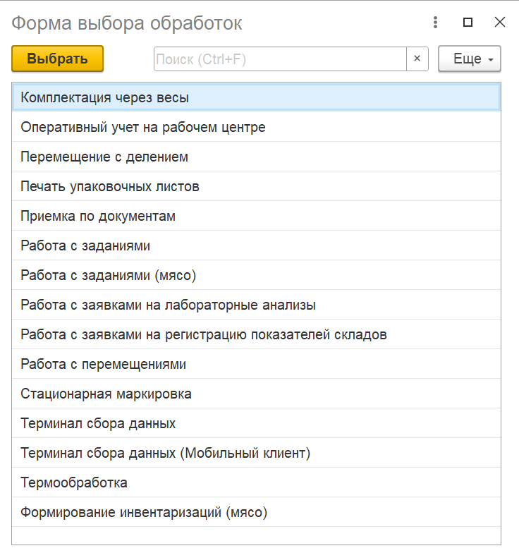

# Содержание
Кнопки учетных точек настраиваются для работы в системе через сенсорные
киоски, ТСД и подобные устройства.

 

 

**Определение обработки для кнопки**

 

При открытии списка выбора реквизита "Обработка":

 

Параметры обработок описаны в соответствующих разделах.

- [Взвешивание тары](ContainerWeighing/ContainerWeighing.md)
- [Комплектация через весы](PackagingWithScales/PackagingWithScales.md)
- [Оперативный учет на рабочем центре](OperationalAccountingOnWorkCenter/OperationalAccountingOnWorkCenter.md)
- [Универсальное перемещение](UniversalPeremeshenie/UniversalPeremeshenie.md)
- [Работа с заданиями](WorkWithTasks/WorkWithTasks.md)
- [Работа с заявками на лабораторные анализы](WorkWithLabAnalyzes/WorkWithLabAnalyzes.md)
- [Работа с заявками на регистрацию показателей складов](WorkWithRequestToRegistrationIndicatorsOfWarehouses/WorkWithRequestToRegistrationIndicatorsOfWarehouses.md)
- [Стационарная маркировка](StacMark/StacMark.md)
- [Терминал сбора данных](DataCollectionTerminal/DataCollectionTerminal.md)
