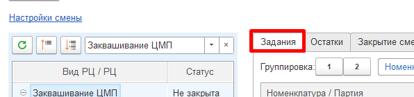
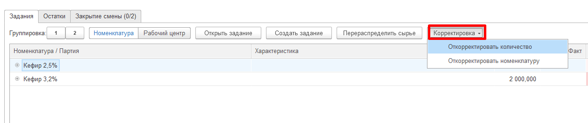
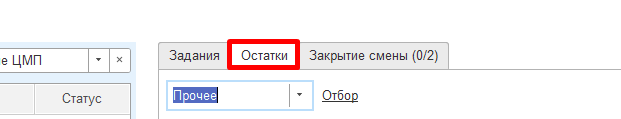
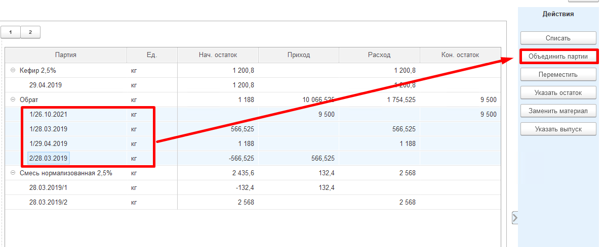
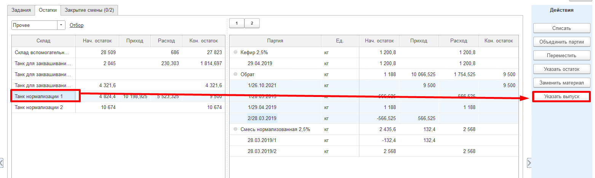
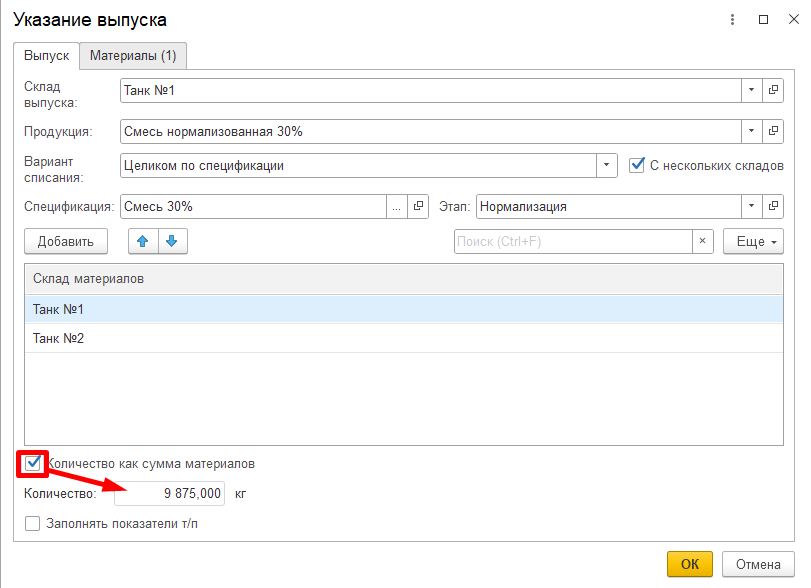
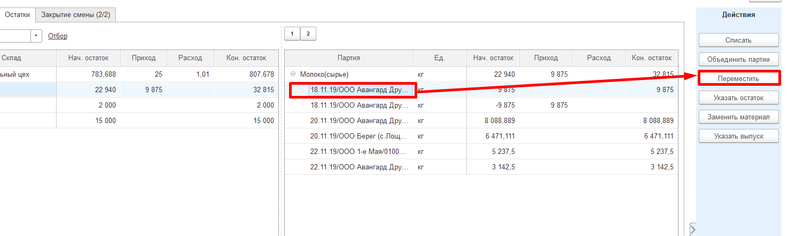
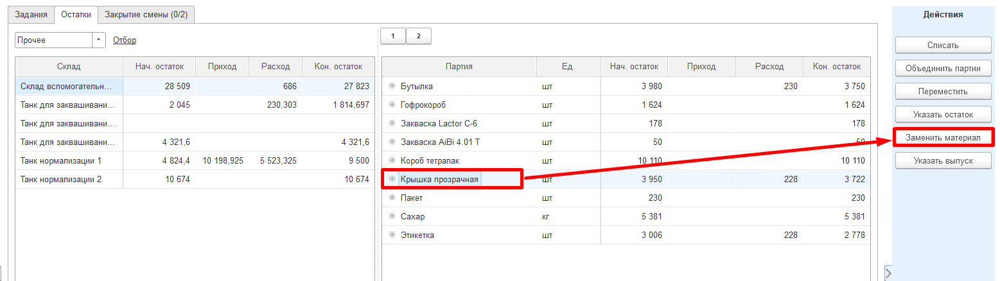

**Действия в Рабочем месте мастера смены**
==========================================

В рабочем месте мастера смены присутствует довольно много операций, что
объясняется вовлечением мастера смены во все процессы цеха. Потому и
было решено все эти действия объединить в одном месте.

 <h2> Вкладка "Задания" </h2>

<h3> Открыть задание </h3>

Открывает ранее созданный документ "Производственное задание" на указанную смену на выбранный рабочий центр.

<h3> Создать задание </h3>

Открывает форму создания задания на эту смену и выбранный рабочий центр.

<h3> Корректировка </h3>

- Откорректировать количество - позволяет внести правки в количество выпуска по выбранной партии в таблице "Выпуск";
- Откорректировать номенклатура - позволяет изменить вид продукции у выбранной в таблице "Выпуск" партии.

<h3> Перераспределить сырье </h3>

В случае, если за смену были выпуски побочной продукции, на которую обычно не списывается основной ингредиент (смешанная фаза, Обрат и тп), а на основные выпуски списание идет, этой кнопкой делается "минус" по расходу на основные выпуски и "плюс" по расходу на вторичные выпуски.  
Распределение требует учтенных в системе показателей жира и белка по каждой партии выпуска и каждой партии основных материалов, т.к. разделение идет именно на основании этих показателей.

<h2> Вкладка "Остатки" </h2>

На текущей вкладке можно смотреть приход/расход/остатки по полуфабрикатам, продукции и материалам и сырью.

При этом, выбрав "Диаграмма", можно смотреть только остатки, однако, в более наглядной форме. Такое обычно удобнее для участков, где происходит переработка "жидких" материалов.

<h3> Объединить партии </h3>

Позволяет объединить несколько серий одной продукции в одну.  
Применяется при выпуске производственной партии молока. На входе есть много партий от разных поставщиков, на выходе - одна партия (накопился танк сырого молока - берется контрольный анализ, и молоко переходит в производственную партию).
     

1. Выбрать партию (партии, склад) - нажать "Объединить партии",
    подтвердить количество выхода (автоматически - сумма всех выделенных
    партий).    

2.   Создается документ "Переработка", где в выпуске молоко с новой
    партией, а в материалах - все партии, которые были выделены (или все
    серии в танке, если позиционирование было на складе и если там была
    одна номенклатура)

??? Info "В режиме диаграммы объединяются все партии склада, независимо от количества выделенных"

<h3> Указать выпуск </h3> 

Позволяет указать на какой-либо из складов РЦ выпуск.  
Предполагает учет выпусков сливок, обрата и других полуфабрикатов приемно-аппаратного цеха.

1. Выбрать в таблице склад выпуска - нажать "Указать выпуск". Указать,
    что и в каком количестве выпускается. При этом можно выбрать один из
    трех вариантов списания материалов (не распределять, по норме -
    указывается склад (склады), с которого берется основной материал (по
    спецификации), целиком - все остатки (по спецификации) на указанном складе (складах)
    будут списаны на этот выпуск).  

2. При этом, если выпускаемая продукция имеет одну единицу измерения, то количество можно получить, как сумму всех материалов по основной спецификации, чья единица измерения совпадает с единицей измерения выпуска.  
  
3. Создается документ "Переработка", где в выпуске указанная
    номенклатура и количество, материалы заполняются по указанному
    правилу.
    
<h3> Переместить </h3> 

Позволяет перемещать партии продукции между складами.  
Предполагает учет передач сливок, обрата в другие цеха или склады цеха.

1. Выбрать в таблице партию (партии) - нажать "Переместить". Указать
    куда и сколько перемещается.      

2.  Создается документ "Распоряжение на перемещение".

<h3> Списать </h3>

Формируется документ "Распределение материалов".

- **Согласно спецификации** - требует наличие выпуска по
    спецификации, где выбранный остаток конфигурирует, как материал.  
    Списание идет на все выпуски, по которым выбранный остаток мог бы
    быть потрачен.  
    Например, списание полуфабрикатов на розлив.  
    -   Выбрать материал (и серию) - нажать "Списать". Указать вариант
    списания "Согласно спецификации" и указать списываемое количество.    

- **Пропорционально списанному** - требует наличие выпуска, где
    материал, по которому есть остаток, уже был потрачен.
    -   Выбрать материал (и серию) - нажать "Списать". Указать вариант
    списания "Пропорционально списанному". 

- **По отраслевой методике** - не требует расхода материала, но
    требует наличие выпусков, на которые этот материал может быть
    потрачен. Также требует наличия анализов по жиру и белку.  
    Списывается на все выпуски, пропорционально содержанию жира и белка
    в них.    
    Например, применяется на переделе, когда есть выпуски смесей, сливки
    и обрат. Все молоко списывают на все выпуски согласно содержанию
    жира и белка в них.  
    -   Выбрать партию молока - нажать "Списать". Указать вариант списания
    "По отраслевой методике" и указать количество.

- **Брак**- требует расхода материала. В текущем функционале виден
    только для номенклатуры с типом "Короб" или "Пакет".  
    Предполагает списание бракованных коробов или пакетов, выявленных в
    процессе их использования за смену. Указанный материал списывается
    со статьей брака на уже имеющиеся выпуски пропорционально
    потраченному.  
    -   Выбрать короб или пакет (и серию) - нажать "Списать". Указать
    вариант списания "Брак", указать количество и статью затрат для
    брака.

<h3> Заменить материал </h3>

Требует наличие расхода заменяемого материала.  
Указанное количество заменяемого материала приходуется, а чем заменяем – расходуется на ту продукцию, на которую тратился заменяемый.

1. Перейти на вкладку "Остатки" -\> "Материалы" (или "Прочее"), найти
    заменяемый материал (и его серию) - нажать "Заменить материал".  
    Указать, чем заменяется (и серию), количество для замены.  

2. Формируется документ "Распределение материалов".

 

 
