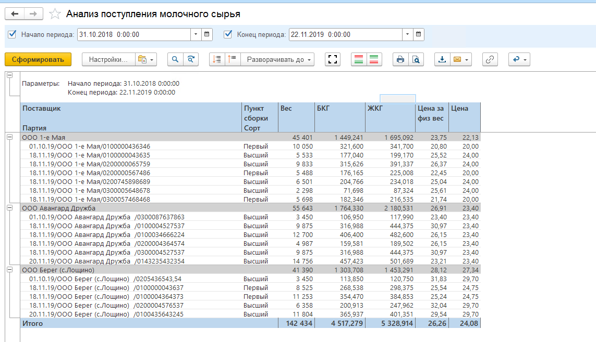

# Мониторинг поступления сырья

Информацию по принятому молоку можно посмотреть в отчете **"Анализ поступления сырья"**.

- Открыть все отчеты подсистемы **"Производство"**;
- Открыть отчет **"Анализ поступления молочного сырья"**;
- Указать интересующий период аналитики и нажать **"Сформировать"**;
- За указанный период в отчете предоставляется следующая информация:
    - Куда, когда и от кого было принято молоко;
    - Сколько было принято в килограммах, жирокилограммах и белкокилограммах;
    - Цена и итоговая стоимость.

