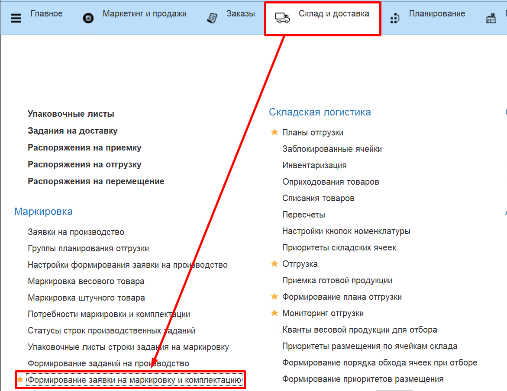
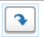

# Формирование заявки на маркировку

Обработка **"Формирование заявки на маркировку и комплектацию"** используется для установления каким рабочим центром номенклатура будет маркироваться и создания в результате документа "Заявка ". Обработка расположена в разделе "Склад и доставка" в подсистеме "Маркировка".

В верхней части формы обработки заполняются поля:

- Дата заявки;

- Период потребности.

На вкладке **"Настройки"** заполняются:

- Настройки формирования заявки на производство;

- Параметр "Обеспечить без учета остатка";

- Склад маркированной продукции;

- Склад немаркированной продукции.

На вкладке **"Маркировка и комплектация"** в левой части формы выведены строки номенклатур из **"Заказа клиента"**. Для обеспечения заказа маркированной продукцией необходимо выбрать конкретную строку с продукцией, в правой части подтянется соответствующая действующая спецификация для маркировки данной продукции. Нажимая на кнопку  заполняются материалы по потребности из спецификации. Нажимаем на "Обеспечить потребность сырьем" и в левой таблице заполнилось "количество обеспечено". Далее сохраняем обеспечение, в результате создается документ **"Заявка на маркировку и комплектацию"**.
