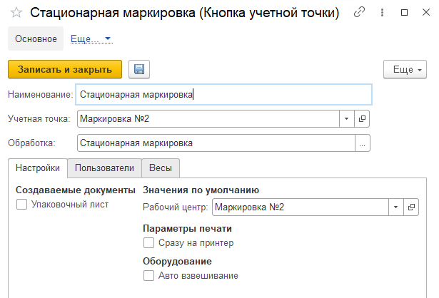
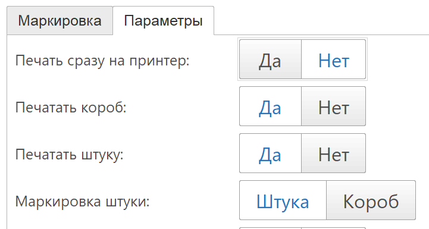
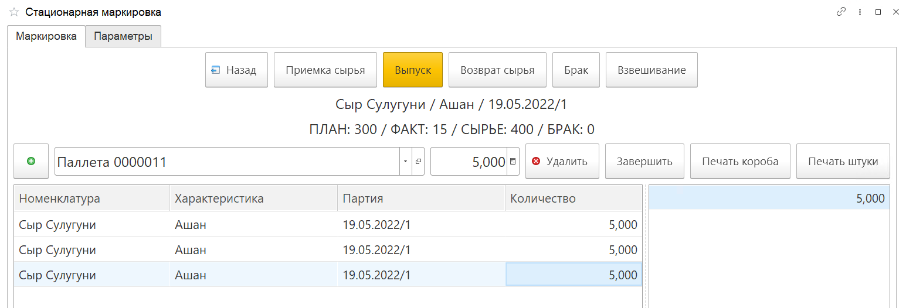

# Стационарная маркировка

Обработка **"Стационарная маркировка"** предназначена для маркировки весового и штучного товаров. В ней выполняются следующие функции:

- Приемка сырья
- Выпуск маркировки (маркировка ед. продукции и/или короба)
- Возврат излишков сырья
- Взвешивание результата маркировки

Для работы с обработкой **"Стационарная маркировка"** необходимо создать учетную точку и настроить кнопку:

- Наименование
- Учетная точка
- Обработка - **Стационарная маркировка**

На вкладке **"Настройки"** заполняются:

- Рабочий центр
- Указывается сразу ли печатать
- Указывается будут ли создаваться Упаковочные листы в результате работы, если да то еще заполняется поле *Макет* (Упаковочный лист)
- Варианты распределения для основного и вспомогательного материалов
- Опция "Выводить количество невыполненных действий"

Далее в разделе **"Нормативно-справочная информация"** в подсистеме **"Производство"** в **Меню учетных точек** заполняются:

- Дата
- Смена (если включена опция "Вести учет по сменам" в Настройках производства)
- Учетная точка

На форме обработки появятся кнопки выбранной учетной точки, выбираем кнопку **"Стационарная маркировка**

На вкладке **"Параметры"** заполняются:

- Организация
- Печать сразу на принтер: да/нет
- Печатать короб/штуку: да/нет
- Маркировка штуки: штука/короб

На вкладке **"Маркировка"** отображаются строки **Производственного задания**. Каждая строка это номенклатура с выбранными параметрами для маркировки.

После выбора нужной строки нажимаем команду **"Выбрать"**

На открывшейся форме по кнопке **"Приемка сырья"** принимаем сырье, сканируем штрихкод принимаемой номенклатуры, информация о ней появится в табличной части формы. После того как все принимаемое сырье будет отсканировано, нажимаем на кнопку **"Завершить"**. Будет сформирован документ **"Распределение материалов"**.

По кнопке **"Выпуск"** производится маркировка продукции. Маркировка делится на маркировку короба и штуки.

## Для маркировки короба

1. Создаем упаковку
2. Вводим вес. Введенная информация отразится в табличной части формы.

    

3. После того как будет введена информация по всей выпускаемой продукции, нажимаем на кнопку **"Завершить"**. Будет сформирован документ **"Переработка"**.

С помощью кнопки **"Печать короба"** можно распечатать этикетку короба.

## Для маркировки штуки и короба

1. Создаем упаковку
2. Вводим вес ед. продукции. Введенная информация отразится в табличной части формы. В левой части отображается информация по всему коробу, в правой по единицам данного короба. После наборки всего короба автоматически сформируется код короба и начнется наборка следующего.
3. После того как будет введена информация по всей выпускаемой продукции, нажимаем на кнопку **"Завершить"**. Будет сформирован документ **"Переработка"**.

По кнопке **"Возврат сырья"** возвращаются излишки сырья.
Из выпадающего списка выбираем строку возвращаемого сырья, вводим вес, информация о возвращаемом сырье отразится в табличной части формы. После того как будет введена информация по всему возвращаемому сырью, нажимаем на кнопку **"Завершить"**. Будет сформирован документ **"Распределение материалов"**.

Кнопка **"Взвешивание"** используется для взвешивания. Сканируется взвешиваемая номенклатура и заполняется вес, в табличной части отражаются заполненные данные.

В конце работы нужно нажать кнопку **"Назад**. В открывшемся окне по выполненному заданию нажимаем кнопку **"Завершить строку"**.

