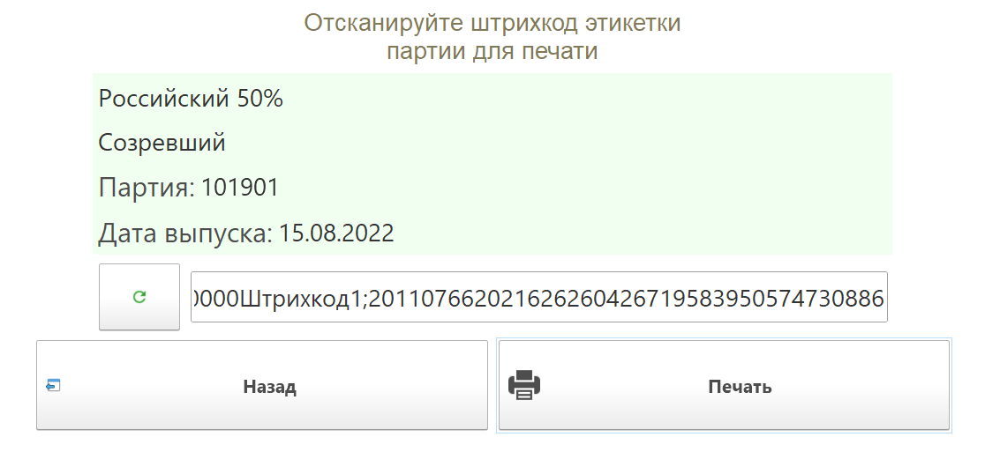
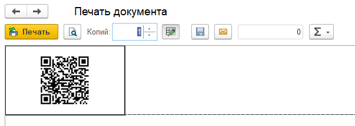
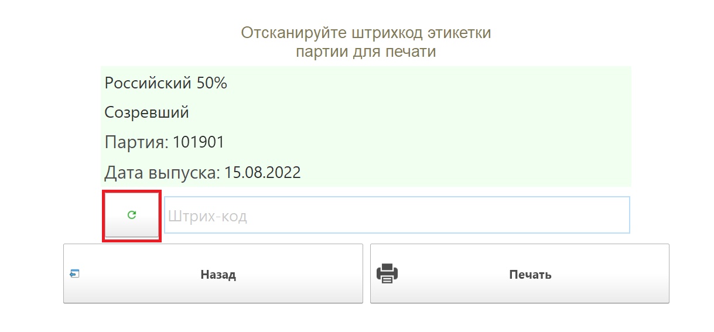
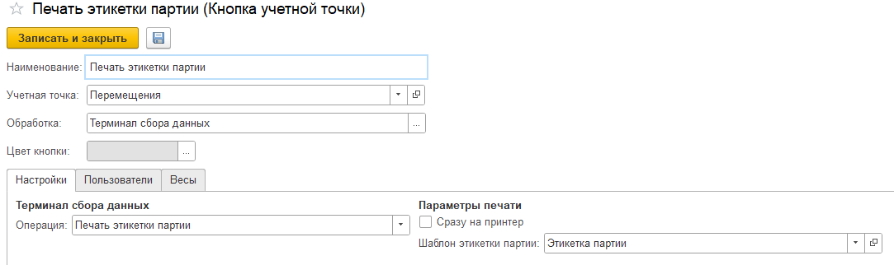
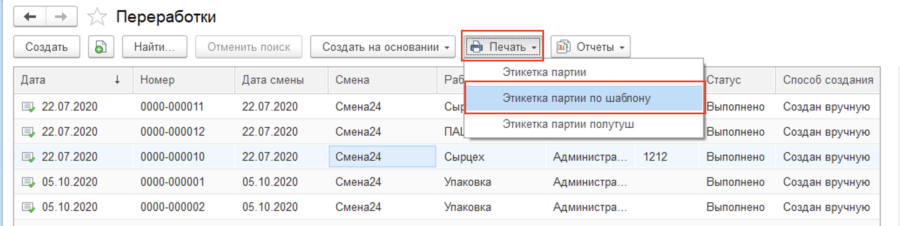

# Печать этикетки партии

Обработка используется для печати сканируемой этикетки партии.

**Сценарий работы**

При включении операции «Печать этикетки партии», на ТСД/киоске открывается форма сканирования этикетки, после сканирования открывается окно с информацией о продукции (подтягивается из этикетки) с выбором "Печать", "Назад", "Обновить".

При выборе "Печать" печатается этикетка на принтер:

Чтобы использовать следующий код, можно сразу ввести его, либо обновить окно с помощью кнопки "Обновить":

<h2> Настройки КУТ </h2>

- Обработка: Терминал сбора данных
- Операция: Печать этикетки партии

**Параметры печати**

- Сразу на принтер – печать идет сразу на принтер, без предварительного просмотра.
- Шаблон этикетки партии – нужно подобрать шаблон для печати этикетки партии.

## Печать этикетки партии из документа формирования

Альтернативным методом печати этикетки партии является печать по шаблону из документа формирования: "Переработка" и "Поступление товаров и услуг".

Для этого достаточно открыть форму списка или сам документ, выбрать "Печать" и вариант "Этикетка партии по шаблону". После откроется окно выбора шаблона, а затем произойдет печать этикетки партии.

Для случая печати по шаблону на основании документа "Поступление товаров и услуг" доступна опция "Раздельная печать этикеток партии". Если в документе содержится несколько строк номенклатуры, тогда каждая этикетка откроется в отдельном окне печати.
