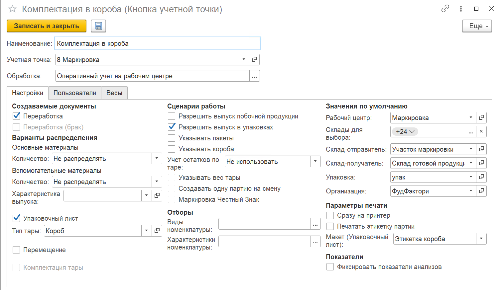

# Комплектация в короба

## Настройка кнопки учетной точки "Комплектация в короба"

Для агрегирования номенклатуры в короба на складе используется обработка **"Оперативный учет на рабочем центре"**. При создании кнопки учетной точки с использованием данной обработки указывается:

- Наименование;
- Учетная точка;
- Обработка - Оперативный учет на рабочем центре.

На вкладке **"Настройки"** заполняются:

Создаваемые документы:

- Переработка;
- Упаковочный лист;
- Тип тары для упаковочного листа - Короб.

Сценарии работы:

- Разрешить выпуск в упаковках - указывается объем выпуска в упаковках.

