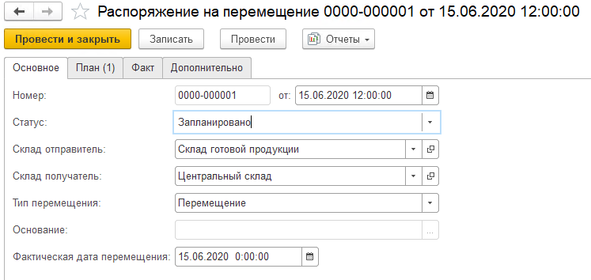
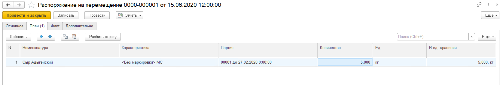

# Создание документа "Распоряжение на перемещение"

Для отражения перемещений товаров между двумя разными складами используется документ **"Распоряжение на перемещение"**.
 
При создании документа указываются:
 
На вкладке **"Основное"**:

- Номер - заполняется автоматически
- Дата
- Статус: 
    - запланировано: доступен при создании распоряжения вручную; 
    - к выполнению: доступен при работе на ТСД;
    - выполняется: доступен при работе на ТСД;
    - выполнено.
- Склад-отправитель
- Склад-получатель
- Тип перемещения: Перемещение
- Фактическая дата перемещения

На вкладке **"План"** табличная часть заполняется информацией о том какую номенклатуру планируется перемещать данным распоряжением.

На вкладке **"Факт"** табличная часть заполняется информацией о том какую номенклатуру данным распоряжением переместили. Заполняется автоматически при перемещении на ТСД.

Автоматическое формирование распоряжений на перемещение на основании заказов на перемещение возможно с помощью регламентного задания **"Автоматическое формирование распоряжений на перемещение"**  

Регламентное задание создаст распоряжения для всех заказов на перемещение в периоде сегодня + количество дней для формирования распоряжений на перемещение (находится в настройках склада и доставки), у которых у склада отправителя стоитв настройке склада вариант автоматического формирования распоряжений на перемещение - По заказам